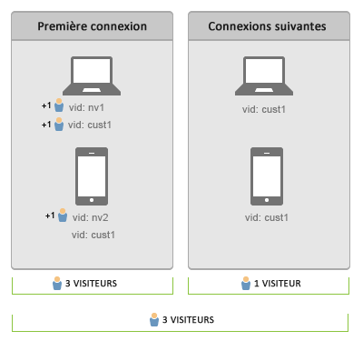

# Connecter les utilisateurs à l'ensemble des périphériques

>[!IMPORTANT]
>
>Cette méthode d'identification des visiteurs sur l'ensemble des périphériques n'est plus recommandée. Please refer to the [Adobe Experience Cloud Device Co-op Documentation](https://marketing.adobe.com/resources/help/en_US/mcdc/).

L’identification des visiteurs sur plusieurs appareils vous aide à connecter des visiteurs sur plusieurs appareils. La fonction d’identification des visiteurs sur plusieurs périphériques utilise la variable d’identifiant visiteur, s.visitorID, pour associer des visiteurs. 

Lorsque vous fournissez une telle variable avec un accès, le système recherche d’autres profils du visiteur ayant un [!UICONTROL identifiant visiteur] correspondant. Le cas échéant, le profil du visiteur qui figure déjà dans le système est utilisé à partir de ce moment et le profil précédent est abandonné.

[!UICONTROL En règle générale, l’identifiant visiteur est défini après l’authentification ou après qu’un visiteur a effectué une autre action vous permettant de l’identifier de manière unique, indépendamment du périphérique utilisé.] Il est conseillé de créer un hachage du nom d’utilisateur ou un ID interne ne contenant aucune information d’identification personnelle.

Dans l’  [exemple précédent](../../../implement/js-implementation/xdevice-visid/xdevice-connecting.md), dès que le client s’est connecté à partir de chacun des appareils, tous se voient associés au même profil. [!UICONTROL Si, par la suite, le visiteur se déconnecte à partir d’un appareil, l’assemblage continue de fonctionner, dans la mesure où les identifiants visiteur stockés dans un cookie sont déjà associés au même profil du visiteur.] Il est conseillé de renseigner la variable [!UICONTROL s.visitorID] lorsque cela s’avère possible, au cas où le cookie [!UICONTROL identifiant visiteur ]serait supprimé.

## Comptabilisation des visiteurs uniques et des visites {#section_70330AB6724C4E419A4BD0BDD54641AC}

Etudiez la séquence de connexion suivantes pour deux périphériques :

**Lors de la première connexion de données**

* La déduplication de visiteurs n’est pas rétroactive.

Après une authentification sur l’ordinateur portable, les accès avec identifiant visiteur (`nv1` ou `cust1`) seront considérés comme le fait d’un même individu par Adobe Analytics. Néanmoins, la déduplication de visiteurs n’est pas rétroactive, donc 2 visiteurs sont comptabilisés.

Lors de la première connexion de données sur le périphérique mobile, le client n’est pas reconnu, donc un nouveau visiteur unique est comptabilisé. Une fois l’utilisateur authentifié (`cust1`) sur le périphérique mobile, Adobe Analytics met en correspondance `cust1` à nouveau avec l’identifiant visiteur sur le site principal afin qu’aucune visite unique supplémentaire ne soit incrémentée.

Chaque nouveau périphérique ou navigateur authentifié ajoutera 1 visiteur unique.

**Lors des connexions de données suivantes**

Lors des connexions de données suivantes à des périphériques authentifiés, les visiteurs uniques ne sont pas incrémentés.
