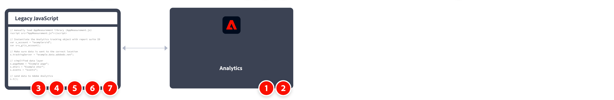

# Mise en oeuvre d’Adobe Analytics avec AppMeasurement pour JavaScript

AppMeasurement pour JavaScript a toujours été une méthode courante de mise en œuvre d’Adobe Analytics. Toutefois, avec la popularité croissante des systèmes de Tag Management, il est recommandé d’utiliser les [balises dans Adobe Experience Platform](../launch/overview.md).

Présentation générale des tâches d’implémentation :



<table>

<tr>
<th style="width:5%"></th><th style="width:75%"><b>Tâche</b></th><th style="width:20%"><b>Informations supplémentaires</b></th>
</tr>

<tr>
<td>1</td><td>Vérifiez que vous avez <b>défini une suite de rapports</b></td><td><a href="../../admin/admin/c-manage-report-suites/report-suites-admin.md">Gestionnaire de suites de rapports</a></td>
</tr>

<tr>
<td>2</td><td><b>Téléchargez le code JavaScript requis pour AppMeasurement</b> à partir du Gestionnaire de code. Décompressez le fichier.</td><td><a href="../../admin/admin/code-manager-admin.md">Gestionnaire de code</a></td>
</tr>

<tr>
<td>3</td><td><b>Ajouter <code>AppMeasurement.js</code> au fichier de modèle de votre site web.</b>. Le code contient les bibliothèques requises pour envoyer des données à Adobe.

```html
<head>
  <script src="AppMeasurement.js"></script>
  …
</head>
```

</td><td></td>
</tr>

<tr>
<td>4</td><td><b>Définition de variables de configuration dans <code>AppMeasurement.js</code></b>. Lorsque l’objet Analytics est appelé, ces variables garantissent que les paramètres de collecte de données sont corrects.

```JavaScript
// Instantiate the Analytics tracking object with report suite ID
var s_account = "examplersid";
var s=s_gi(s_account);
 
// Make sure data is sent to the correct tracking server
s.trackingServer = "example.data.adobedc.net";
```

</td><td><a href="../vars/config-vars/configuration-variables.md">Variables de configuration</a></td>
</tr>

<tr>
<td>5</td><td><b>Définition de variables de niveau page dans le code de page de votre site</b>. Ces variables déterminent des dimensions et des mesures spécifiques envoyées à Adobe.

```js
s.pageName = "Example page";
s.eVar1 = "Example eVar";
s.events = "event1";
```

</td><td><a href="../vars/page-vars/page-variables.md">Variables de page</a></td>
</tr>

<tr>
<td>6</td><td><b>Envoyez les données à Adobe à l’aide du <code>t()</code> method</b>, lorsque toutes les variables de page sont définies.

```js
s.t();
```

</td><td><a href="../vars/functions/t-method.md">méthode t()</a></td>
</tr>

<tr>
<td>7</td><td><b>Étendez et validez votre implémentation</b> avant de la diffuser en production.</b></td><td></td>
</tr>

</table>

## Ressources supplémentaires

- [Présentation des variables, fonctions, méthodes et plug-ins](../vars/overview.md)
