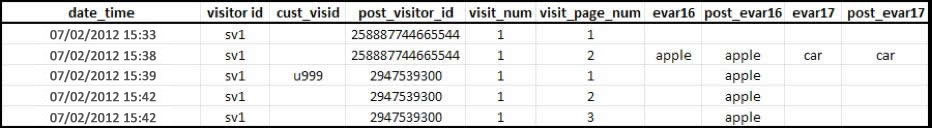
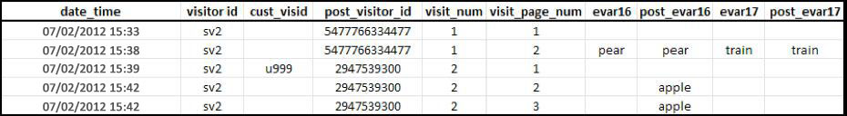

# Attribution et persistance

> [!IMPORTANT] Cette méthode d’identification des visiteurs sur plusieurs appareils n’est plus recommandée. Reportez-vous à la section Analyses  sur plusieurs périphériques dans le guide de l’utilisateur Composants.

Lorsque des profils du visiteur sont fusionnés après avoir été associés à la même variable d’identifiant visiteur, l’attribution n’est pas modifiée dans l’ensemble de données historiques.

* When the variable `s.visitorID` is set and sent on a hit, Adobe checks for any other visitor profiles that have a matching visitor ID.
* Si un profil existe, le profil du visiteur qui figure déjà dans le système est utilisé à partir de ce moment et le profil précédent est abandonné.
* Si aucun identifiant visiteur correspondant n’est trouvé, un nouveau profil est créé.

Lorsqu’un client non authentifié arrive pour la première fois sur votre site, Adobe Analytics lui affecte un profil du visiteur. Lorsque le nouveau profil est créé, une visite se termine et une autre visite commence.

## Exemple 1

L’exemple ci-dessous illustre la manière dont les données sont envoyées à Adobe Analytics lorsqu’un client s’authentifie pour la première fois, sur le premier périphérique :

* `eVar16` expire au bout d’1 jour et `evar17` expire à la fin de la visite.
* La colonne `post_visitor_id` représente le profil stocké par Adobe Analytics. Les colonnes de publication sont généralement affichées dans les flux de données. Voir Flux [de](/help/export/analytics-data-feed/data-feed-overview.md) données dans le guide de l’utilisateur Exportation.
* Les colonnes `post_evar16` et `post_evar17` affichent la persistance des eVars.
* `cust_visid` représente un jeu de valeurs dans `s.visitorID`.
* Chaque ligne correspond à un « accès », une seule demande envoyée aux serveurs de collecte de données d’Adobe Analytics.

On the first data connection containing a previously unrecognized `s.visitorID` value (`u999` above), a new profile is created. Les valeurs persistantes du profil précédent sont transférées vers le nouveau profil.

* Les eVars définies pour expirer à la fin de la visite ne sont pas copiées vers le profil authentifié. Notez que la valeur `car` ci-dessus n’est pas conservée.
* Les eVars définies pour expirer selon d’autres mesures sont copiées vers le profil authentifié. Notez que la valeur `apple` n’est pas conservée.
* Pour les eVars persistantes, aucune mesure d’instance n’est enregistrée. Cela signifie que lors de l’utilisation de l’identification des visiteurs sur plusieurs périphériques, il est possible d’afficher des rapports pour lesquels la mesure Visites uniques d’une valeur eVar est supérieure à la mesure d’instance.

> [!NOTE] Si un utilisateur est nouveau sur votre site (n’a jamais visité ce périphérique auparavant) et s’authentifie dans les 3 minutes qui suivent son arrivée, aucune valeur n’est conservée dans le profil authentifié.

## Exemple 2

L’exemple ci-dessous illustre la manière dont les données sont envoyées à Adobe Analytics lorsqu’un client s’authentifie sur un nouveau périphérique, après s’être précédemment authentifié sur un autre périphérique.

Lorsque le client s’authentifie, il est mis en correspondance avec le profil &quot;authentifié&quot; précédent - `2947539300`. Le profil utilisé au début de cette visite (`5477766334477`) n’est plus utilisé et aucune donnée du fichier n’est conservée.

* Les données de géosegmentation sont enregistrées selon le premier accès de la visite. Elles ne changent pas pour une même visite, quel que soit le périphérique utilisé. Cela signifie que, lors d’une connexion de données suivante sur un nouveau périphérique, la géosegmentation n’est généralement pas incluse.
* Les colonnes relatives aux technologies, par exemple, le navigateur, le système d’exploitation, l’intensité de couleur, sont enregistrées lors du premier accès d’une visite. Comme les valeurs de géosegmentation, elles ne sont pas copiées dans le profil assemblé.
* Les canaux marketing remplacent d’autres canaux lors d’une connexion de données ultérieure contenant une première authentification pour ce périphérique.
