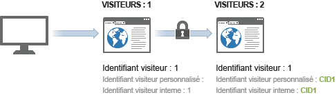
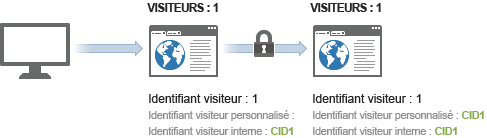

# Exemple d’identification des visiteurs sur plusieurs appareils

> [!IMPORTANT] Cette méthode d’identification des visiteurs sur plusieurs appareils n’est plus recommandée. Reportez-vous à la section [Analytics sur l’ensemble des appareils](/help/components/cda/cda-home.md) dans le guide d’utilisation Composants.

L’exemple suivant illustre le fonctionnement de l’identification des visiteurs sur plusieurs appareils à l’aide d’un exemple d’appels serveur envoyés dans le cadre d’une interaction client commune.

| Appel au serveur | Action | Cookie identifiant visiteur | Variable d’identifiant visiteur | Identifiant visiteur effectif | Numéro de page de la visite | Nombre de visites |
|--- |--- |--- |--- |--- |--- |--- |
| 1 | Un visiteur clique sur un lien contenu dans un courrier électronique marketing et consulte votre site à partir de son ordinateur personnel. Ce visiteur a déjà visité votre site 7 fois auparavant. | 1 | - | 1 | 1 | 8 |
| 2-8 | Consulte 7 autres pages de votre site. | 1 | - | 1 | 2-8 | 8 |
| 9 | Authentifie un ordinateur de bureau. | 1 | CID1 | CID1 | 9  (Il s’agit du tout premier accès de CID1, qui prend donc le contrôle et continue sur le profil du visiteur portant l’identifiant 1.) | 8 |
| 10 | Visite 1 page supplémentaire. | 1 | CID1 | CID1 | 10 | 8 |
| 11 | Ouvre un site à partir d’un ordinateur portable sur son lieu de travail. Ce visiteur n’a pas visité votre site avant d’utiliser cet appareil. | 2 | - | 2 | 1 | 1 |
| 12 | Authentifie un ordinateur portable. | 2 | CID1 | CID1 | 1 | 9 |
| 13 | Affiche 1 page supplémentaire. | 2 | CID1 | CID1 | 2 | 9 |

## Comptabilisation des visites

Analytics comptabilise une visite chaque fois qu’il observe un accès avec un numéro de page de la visite égal à 1.

Dans le tableau ci-dessus, une nouvelle visite a été comptée 4 fois : sur les accès 1, 9, 11 et 12.

## Comptabilisation des visiteurs

Analytics comptabilise chaque identifiant visiteur effectif unique comme un visiteur unique.

Dans le tableau ci-dessus, un nouveau visiteur a été compté 3 fois : sur les accès 1, 9 et 10.

Lorsque vous utilisez l’identification des visiteurs sur plusieurs appareils, le nombre de visiteurs uniques que vous voyez peut augmenter. Le visiteur peut ainsi être comptabilisé deux fois pour la même visite : une fois pour la visite initiale et une autre fois après son authentification.

Après l’association initiale, le nombre de visites revient à la normale, car le visiteur est associé par le biais du cookie navigateur. Si, par la suite, le visiteur consulte votre site, puis s’authentifie, le nombre de visites n’augmente pas, car l’identifiant visiteur effectif reste inchangé après l’authentification.

Veillez à être aussi cohérent que possible lors de l’identification des visiteurs uniques. Par exemple, utilisez toujours la variable `visitorID` lorsque l’utilisateur est authentifié.
