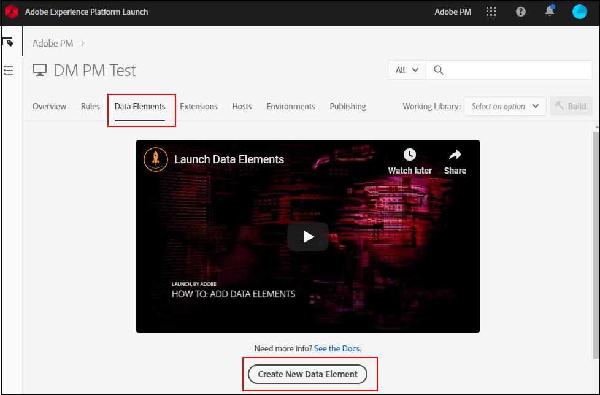

# Mise en correspondance des objets de couche de données avec les éléments de données

Une fois que votre organisation a établi et implémenté une couche de données sur votre site, vous pouvez mapper des objets de couche de données à des éléments de données au sein des balises.

## Conditions préalables

[Créer une couche de données](../prepare/data-layer.md) : Assurez-vous qu’une couche de données existe sur votre site. Techniquement, vous pouvez mettre en correspondance n’importe quel objet JavaScript ou récupérer des éléments CSS directement à partir de la page, mais Adobe recommande cette pratique en dernier recours. Si la mise en page de votre site change, les sélecteurs CSS utilisés dans les balises cessent de fonctionner, ce qui entraîne une perte de données.

## Utilisation de balises pour créer des éléments de données

Les [éléments de données](https://experienceleague.adobe.com/docs/experience-platform/tags/ui/data-elements.html?lang=fr) sont des composants dans la collecte de données Adobe Experience Platform que vous pouvez utiliser dans l’ensemble de l’outil. Vous pouvez attribuer des valeurs de variable dans l’extension Adobe Analytics à l’aide d’éléments de données.

1. Connectez-vous à [la collecte de données Adobe Experience Platform](https://experience.adobe.com/data-collection) à l’aide de vos identifiants Adobe ID.
1. Cliquez sur la propriété de balise de votre choix.
1. Cliquez sur l’onglet **[!UICONTROL Éléments de données]**, puis sur **[!UICONTROL Ajouter un élément de données]**.

   

1. Saisissez un nom pour votre élément de données. Il peut s’agir d’un libellé simple qui correspond à une variable JavaScript dans la couche de données dont vous souhaitez effectuer le suivi.
1. Dans la liste déroulante **[!UICONTROL Extension]**, sélectionnez **[!UICONTROL Core]**.
1. Dans la liste déroulante **[!UICONTROL Type d’élément de données]**, sélectionnez **[!UICONTROL Variable JavaScript]**. Un champ de texte s’affiche à droite et vous permet de saisir la variable JavaScript à faire correspondre à cet élément de données.
1. Saisissez la variable JavaScript souhaitée, généralement dans votre couche de données. Par exemple, si la couche de données de votre entreprise correspond étroitement à la pratique recommandée par Adobe, une valeur `digitalData.page.pageInfo.pageName` peut être indiquée. Vous pouvez utiliser la console de votre navigateur pour valider la syntaxe et les valeurs des variables JavaScript.
1. Cliquez sur **[!UICONTROL Enregistrer]**.

## Étapes suivantes

[Mise en correspondance d’éléments de données aux variables Analytics](elements-to-variable.md) : Affectez des éléments de données à des variables Analytics afin de les utiliser comme dimensions dans Analysis Workspace.
