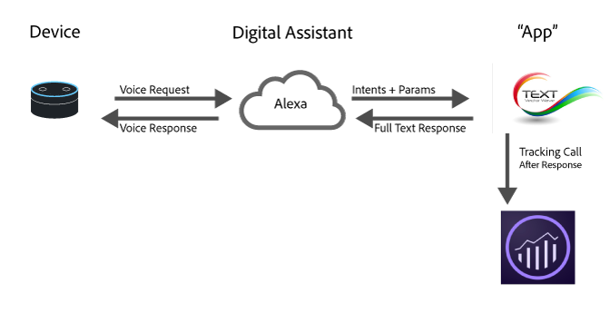

# Mise en œuvre d’Analytics pour les assistants numériques

Avec les progrès de l&#39;informatique en nuage, de l&#39;apprentissage machine et du traitement du langage naturel, les assistants numériques font partie de la vie quotidienne. Les consommateurs parlent à leurs appareils et s&#39;attendent à des réponses humaines, et les marques peuvent présenter leurs services à travers ces mêmes expériences. Par exemple, les consommateurs peuvent demander :

* « Alexa, demande à ma voiture quand il faut changer son huile. »
* « Hey Google, quel est le solde de mon compte-chèques ? »
* « Siri, envoie 20 $ à John pour le dîner d’hier soir avec mon application bancaire. »

Cette page présente un aperçu de l’utilisation d’Adobe Analytics pour mesurer et optimiser ces types d’expériences.

## Vue d’ensemble de l’architecture de l’expérience digitale



La plupart des assistants numériques suivent une architecture de haut niveau similaire :

1. **Appareil** : appareil (tel qu’un haut-parleur intelligent ou un téléphone) doté d’un microphone qui permet à l’utilisateur de poser une question.
1. **Assistant numérique** : service qui alimente l’assistant. Il convertit la parole en intentions compréhensibles par la machine et analyse les détails de la requête. Une fois l’intention comprise, l’assistant transmet l’intention et les détails à l’application qui gère la requête.
1. **« App »** : application sur le téléphone ou application vocale qui répond à la demande. Il répond à l’assistant numérique, qui répond ensuite à l’utilisateur.

## Envoi des données à Adobe Analytics

Une application d’assistant numérique s’exécute généralement sur un serveur ou une plateforme qui ne dispose pas de bibliothèque côté client Adobe (AppMeasurement ou Web SDK). Envoyez les accès **côté serveur) à l’aide de l’API [Data Insertion](https://developer.adobe.com/analytics-collection-apis/methods/data-insertion/)**. Chaque interaction que vous souhaitez mesurer devient une requête de l’API d’insertion de données dont la chaîne de requête (ou le corps XML) transporte les variables décrites sur cette page, le plus souvent [variables de données contextuelles](/help/implement/vars/page-vars/contextdata.md) que vous mappez à des eVars, des props et des événements avec des [règles de traitement](/help/admin/tools/manage-rs/edit-settings/general/processing-rules/pr-overview.md).

Cette page se concentre sur *quoi* mesurer et comment le modéliser dans Analytics. Pour le point d’entrée, les encodages de chaîne de requête et XML, les composants requis et les types de réponse, consultez la [documentation de l’API Data Insertion](https://developer.adobe.com/analytics-collection-apis/methods/data-insertion/). Chaque variable nommée ci-dessous correspond à un paramètre de chaîne de requête et à une balise XML dans la [référence de variable](https://developer.adobe.com/analytics-collection-apis/methods/data-insertion/variable-reference).

## Où mettre en œuvre Analytics

L’un des meilleurs endroits pour implémenter Analytics est dans l’application, qui reçoit l’intention et les détails de l’assistant numérique et détermine comment répondre. Deux moments au cours d’une requête sont utiles pour envoyer des données à Adobe Analytics :

1. Lorsque la demande est envoyée à l’application
1. Une fois que la réponse a été renvoyée par l’application.

Si vous souhaitez enregistrer ce qui s’est passé en vue d’une optimisation ultérieure, envoyez l’accès une fois la réponse renvoyée. Vous disposez alors du contexte complet de la requête et de la manière dont le système a répondu.

## Éléments à mesurer

### Nouvelles installations

Pour les assistants qui vous avertissent lorsqu’une personne installe la compétence (en particulier lorsqu’il s’agit d’une authentification), envoyez un événement d’installation en définissant la variable de données contextuelles `a.InstallEvent=1`, ainsi que la `a.InstallDate` et l’ID d’application (`a.AppID`). Cette option n’est pas disponible sur toutes les plateformes, mais elle est utile pour l’analyse de la rétention, le cas échéant.

### Plusieurs assistants ou applications

Les entreprises créent souvent des applications pour plusieurs plateformes. Incluez un ID d’application sur chaque requête dans la variable de données contextuelles `a.AppID`, à l’aide du `[AppName] [BundleVersion]` de format (par exemple, `Spoofify 1.0`). Ajoutez une plateforme ou une variable de données contextuelles du système d’exploitation (telle que `OSType`) afin de pouvoir distinguer Alexa, l’assistant Google et d’autres plateformes dans les rapports.

### Identification des visiteurs et visiteuses

Adobe Analytics utilise le [service d’identification des visiteurs d’Adobe](https://experienceleague.adobe.com/fr/docs/id-service/using/home) pour lier les interactions au fil du temps à la même personne. La plupart des assistants numériques renvoient un `userID` que vous pouvez utiliser comme identifiant unique — transmettez-le comme remplacement de l’identifiant visiteur (`vid`). Certaines plateformes renvoient un identifiant plus long que les 100 caractères autorisés ; dans ces cas, hachez-le à une valeur de longueur fixe avec un algorithme standard tel que MD5 ou SHA-1.

L’utilisation du service d’identification des visiteurs offre une valeur maximale lorsque vous mappez des ECID sur plusieurs appareils (par exemple, l’assistant web vers numérique). Si votre application est une application mobile, utilisez le SDK Mobile Experience Platform et envoyez l’identifiant utilisateur avec la méthode `setCustomerID`. Si votre application est un service, utilisez l’ID utilisateur fourni par le service comme ID de visiteur et définissez-le également avec `setCustomerID`. Pour savoir comment définir des identifiants sur une requête côté serveur, consultez [Identification des visiteurs à l’aide de l’API Data Insertion](../id/data-insertion.md).

### Sessions

Les assistants numériques étant conversationnels, ils ont souvent le concept d’une session (un échange multi-tours). Lorsqu’une nouvelle session démarre, Adobe recommande deux choses :

1. **Contactez Audience Manager** pour obtenir les segments auxquels l’utilisateur appartient afin de personnaliser la réponse.
1. **Envoyez un événement de lancement** avec la première réponse en définissant la variable de données contextuelles `a.LaunchEvent=1`.

### Intentions

Chaque assistant détecte les intentions et les transmet à l’application. Une intention est une représentation succincte de la demande — par exemple, « Siri, envoie à John 20 $ pour le dîner d&#39;hier soir à partir de mon application bancaire » pourrait résoudre l&#39;intention *sendMoney*. Envoyez chaque intention dans une variable de données contextuelles que vous mappez à une eVar afin de pouvoir exécuter des rapports de cheminement entre les intentions. Assurez-vous que votre application gère également les requêtes sans intention ; Adobe recommande d’envoyer des `No Intent Specified` plutôt que d’omettre la variable .

### Paramètres, emplacements et entités

En plus de l’intention, les assistants fournissent souvent des détails de clé/valeur de la requête (appelés emplacements, entités ou paramètres). Pour « Siri, envoie 20 $ à John pour le dîner d&#39;hier soir », les paramètres pourraient être :

* Qui = John
* Montant = 20
* Pourquoi = dîner

Il existe généralement un ensemble fini de ces éléments par application. Envoyez-les dans des variables de données contextuelles et mappez-les à une eVar.

### États d’erreur

Parfois, l’assistant transmet des entrées que votre application ne peut pas gérer (par exemple, « Siri, envoie 20 sacs de charbon à John à partir de mon application bancaire »). Dans ce cas, demandez à votre application de demander des clarifications et d’envoyer des données indiquant un état d’erreur — définissez `a.Error=1` avec une eVar qui spécifie le type d’erreur. Incluez à la fois les erreurs où les entrées ne sont pas valides et les erreurs où l’application elle-même a rencontré un problème.

### Fonctionnalités des appareils

Bien que la plupart des plateformes n’exposent pas exactement l’appareil, elles exposent ses fonctionnalités (audio, écran ou vidéo, par exemple), qui définissent les types de contenu que vous pouvez utiliser. Lorsque vous mesurez les caractéristiques d’un appareil, concaténez-les par ordre alphabétique avec les deux points de début et de fin (par exemple, `":Audio:Camera:Screen:Video:"`) afin de pouvoir créer des segments du type « tous les accès avec des caractéristiques `:Audio:` ».

* [Référence de l’interface Amazon Alexa](https://developer.amazon.com/public/solutions/alexa/alexa-skills-kit/docs/alexa-skills-kit-interface-reference)
* [Fonctionnalités de surface de l’assistant Google](https://developers.google.com/actions/assistant/surface-capabilities)

## Exemple de requête

La requête GET de l’API d’insertion de données suivante enregistre une intention *SendPayment* pour une application bancaire, en définissant l’identifiant de l’application, un événement de lancement, l’intention et les valeurs d’emplacement comme données contextuelles :

```text
GET /b/ss/examplersid1,examplersid2/1?vid=[UserID]&c.a.AppID=Penmo%201.0&c.a.LaunchEvent=1&c.Intent=SendPayment&c.Amount=20.00&c.Reason=Dinner&c.ReceivingPerson=John&pageName=SendPayment HTTP/1.1
Host: example.data.adobedc.net
```

Pour le format complet de la requête, les points d’entrée et les types de réponse, consultez la [documentation de l’API Data Insertion](https://developer.adobe.com/analytics-collection-apis/methods/data-insertion/request).

## Exemple de modèle de mesure

Le tableau suivant montre comment les actions courantes d’une application musicale sont mappées à des variables Analytics. Définissez-les comme des variables de données contextuelles sur chaque requête de l’API Data Insertion, puis mappez-les à des eVars et à des événements avec des règles de traitement.

| Action de personne | Intention/événement | Données contextuelles à définir |
| --- | --- | --- |
| Installation de l’application | Install | `a.InstallEvent=1`, `a.InstallDate`, `a.AppID`, `OSType` |
| Lancement de l’application | Launch | `a.LaunchEvent=1`, `a.AppID`, `Intent=Play` |
| Demander à changer la chanson | ChangeSong | `a.AppID`, `Intent=ChangeSong` |
| Jouer un morceau spécifique | ChangeSong | `a.AppID`, `Intent=ChangeSong`, `SongID` |
| Modification de la liste de lecture | ChangePlaylist | `a.AppID`, `Intent=ChangePlaylist`, `Playlist` |
| Rencontrer une entrée non valide | (erreur) | `a.Error=1`, `ErrorName` |
