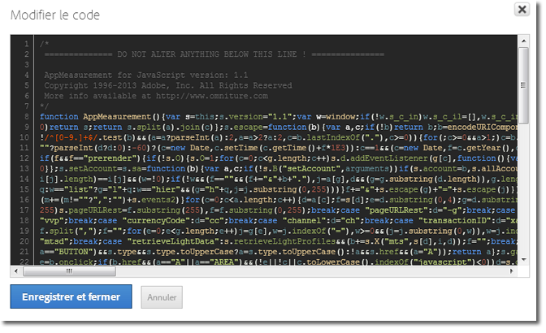

# Insertion du code AppMeasurement de base

Insérez du code AppMeasurement lors du déploiement manuel de Dynamic Tag Management dans Adobe Analytics.

1. Dans la page d’outils [!DNL Adobe Analytics], développez la section **[!UICONTROL Général]**, puis cliquez sur **[!UICONTROL Ouvrir l’éditeur]**.
1. Décompressez le fichier [!DNL AppMeasurement_JavaScript*.zip] que vous avez téléchargé dans la section [Déploiement d’Adobe Analytics](/help/implement/other/dtm/t-analytics-deploy.md).

   Si vous avez choisi l’option de bibliothèque personnalisée, la fenêtre contient déjà la version de code la plus récente lorsque vous l’ouvrez. Il n’est pas nécessaire de télécharger le fichier zip à partir d’Admin Console.
1. Ouvrez le fichier [!DNL AppMeasurement.js] dans un éditeur de texte.
1. Copiez le contenu et collez-le dans la fenêtre **[!UICONTROL Modifier le code]**.

   

1. Adobe recommande que vous ajoutiez le code suivant au-dessus de *`Do Not Alter Anything Below This Line`* :

   ```
   var s_account="INSERT-RSID-HERE"
   var s=s_gi(s_account)
   ```

   >[!IMPORTANT]
   >
   >Si vous ajoutez ce code, il est conseillé de cocher la case **[!UICONTROL Définir les suites de rapports avec le code personnalisé ci-dessous]** dans les paramètres de bibliothèque globaux.

1. Cliquez sur **[!UICONTROL Enregistrer et fermer]**.

   Si vous utilisez le module Media, le module Integrate ou des plug-ins de mise en œuvre, vous pouvez également les copier dans la section de code. Dans Dynamic Tag Management, le code géré peut être configuré tout comme le fichier JavaScript dans une mise en œuvre standard.

