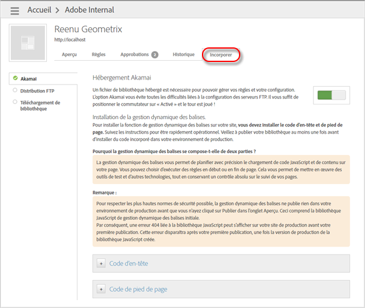

# Ajout de code d’en-tête et de pied de page

Utilisez Dynamic Tag Management pour ajouter du code d’en-tête et de pied de page qui détermine le chargement de code JavaScript et de contenu de page sur votre site. Vous devez placer le code d’en-tête et de pied de page dans chaque page de votre site, quelle que soit l’option d’hébergement utilisée.

Comme Dynamic Tag Management inclut un fragment de code dans l’en-tête et le pied de page, vous pouvez exécuter des règles au début ou à la fin d’une page. Vous pouvez ainsi mettre en œuvre des outils de test et d’autres technologies, tout en conservant un contrôle total sur le suivi de vos pages.

Dynamic Tag Management crée du code incorporé d’évaluation et de production afin que vous puissiez tester vos modifications dans votre environnement d’évaluation avant de les appliquer dans votre environnement de production.

>[!IMPORTANT]
>
>Pour une implémentation réussie, il est essentiel que vous suiviez les instructions telles qu’elles apparaissent dans l’aide d’Adobe. Plus précisément, vous devez placer le code d’en-tête dans la section `<head>` de vos modèles de document. Vous devez également placer le code de pied de page juste avant la balise fermante `</body>`. Le placement de ce code incorporé à un autre emplacement de vos balises, l’utilisation de méthodes asynchrones pour modifier le code incorporé, ou l’encapsulation du code incorporé *ne constitue pas* une mise en œuvre prise en charge par Dynamic Tag Management. Le code incorporé doit être implémenté exactement tel qu’il a été fourni.
>
>Une mise en œuvre non prise en charge provoquera des résultats inattendus et empêchera le service à la clientèle et l’ingénierie de vous aider.

1. Dans l’interface de Dynamic Tag Management, ouvrez l’onglet [!UICONTROL Incorporer], sélectionnez votre option d’hébergement (telle qu’Akamai), puis activez le sélecteur.

   Résultat de l’étape 1. Copiez le code d’en-tête de production fourni dans l’onglet Incorporer de Dynamic Tag Management et placez-le au sein de la section [!DNL HEAD] de votre site HTML.

   

   Placez le code aussi près que possible de la balise [!DNL <head><meta http-equiv="Content-Type" content="text/html; charset=UTF-8">] d’ouverture. Ce fragment de code doit être ajouté à chaque page de votre site de production actif.

   >[!NOTE]
   >
   >Le code incorporé de production ne reflète que les éléments publiés dans cette [propriété](/help/implement/other/dtm/t-create-web-property.md). Néanmoins, le code incorporé pour l’évaluation reflète tous les éléments de la propriété associée, que l’état soit Publié ou Annuler la publication. Pour tester les éléments Annuler la publication sur votre site de production, activez localement l’évaluation dans la console en suivant les instructions du [Test des règles Annuler la publication pour l’hébergement Akamai](/help/implement/other/dtm/c-rules/t-test-rules-akamai.md).

1. Copiez le code de pied de page de production et collez-le dans la section [!DNL BODY] du code HTML de votre site.

   Placez le code aussi près que possible de la balise [!DNL </body>] d’ouverture.
1. Copiez le code d’en-tête et de pied de page d’évaluation, puis répétez les étapes précédentes pour votre site d’évaluation.

   >[!NOTE]
   >
   >L’ajout du suffixe [!DNL -staging] au nom de fichier du fragment de code d’évaluation permet de le distinguer du fragment de code de production. Le code de pied de page est identique dans les versions d’évaluation et de production.

