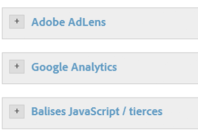
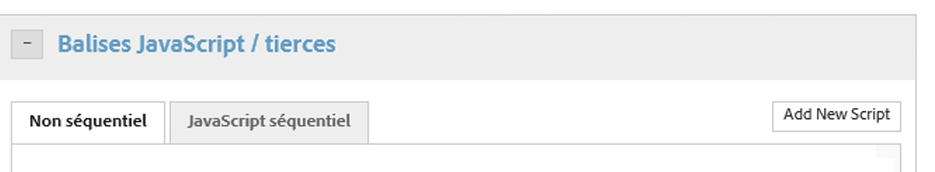
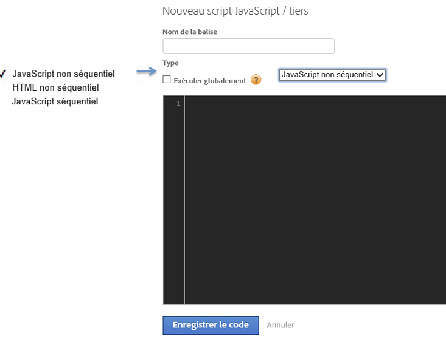
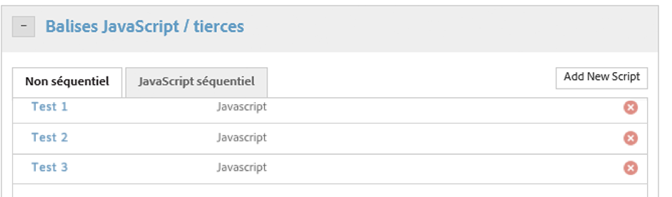

# Configuration des actions que la condition doit déclencher

Configuration des actions que la condition doit déclencher.

Une fois la condition configurée, vous devez définir les actions qui doivent être déclenchées par celle-ci. Ces actions peuvent comprendre des événements [!DNL Analytics], des balises ces et des scripts personnalisés. Cet exemple illustre comment configurer des scripts ou des balises ces.

Outre les outils intégrés tels qu’[!DNL Adobe Analytics] et Google Analytics, Dynamic Tag Management peut déclencher tout type de script JavaScript ou injecter du code HTML dans votre site, dans les pages sélectionnées ou des scénarios spécifiques.

Chaque règle peut déclencher autant de scripts ou d’injections HTML que vous le souhaitez.

> [!NOTE] Etant donné que la gestion dynamique des balises vous permet d’injecter du code personnalisé dans votre page, veillez à ne pas créer de vulnérabilités de script intersite (XSS) (voir le guide ) OWASP pour plus d’informations). L’utilisation d’éléments de données dans un script demande une attention toute particulière. Vous devez toujours supposer que les valeurs des éléments de données proviennent d’une source non fiable.

**Pour configurer les actions que la condition doit déclencher**

1. Cliquez sur **[!UICONTROL Balises JavaScript / tierces]**pour ajouter un nouveau script à la règle.

   

1. Cliquez sur **[!UICONTROL Ajouter un nouveau script]**.

   

1. Attribuez un nom au script.
1. Indiquez le mode de déclenchement du script, puis collez le contenu souhaité dans la zone de texte. 

1. Cliquez sur **[!UICONTROL Enregistrer le code]**. Le script est alors ajouté à la file d’attente de la règle.

