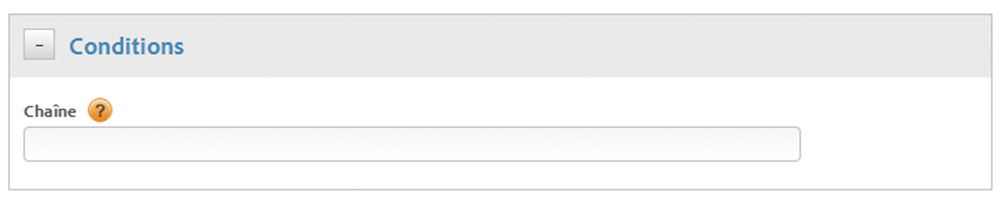

# Création de conditions pour les règles d’appel direct

Création de conditions pour les règles d’appel direct.

1. Dans la boîte de dialogue **[!UICONTROL Conditions]**, spécifiez la chaîne à transmettre à `_satellite.track()` dans l’appel direct, sans guillemets.

   

   >[!NOTE]
   >
   >Si vous indiquez la chaîne qui sera transmise à `_satellite.track()` dans l’appel direct à l’aide de l’interface utilisateur, comme cela a été décrit plus haut, n’utilisez pas de guillemets. Si vous insérez du [code de page personnalisé](/help/implement/other/dtm/c-aa-tool/customize-page-code.md) à l’aide de l’éditeur, vous devez utiliser des guillemets.

