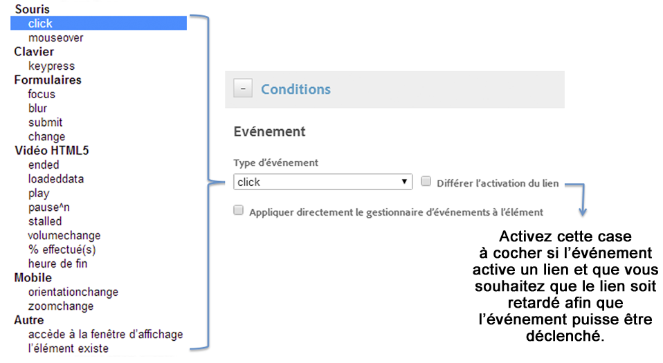
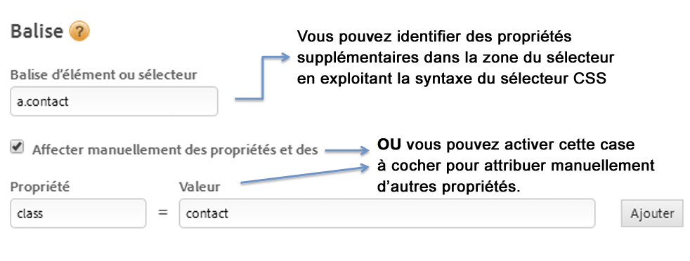
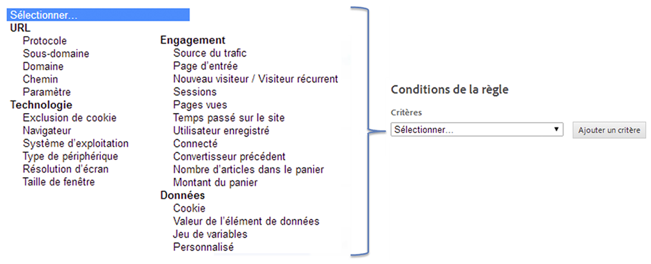

# Création de conditions pour les règles basées sur un événement

Les conditions déterminent à quel moment une règle basée sur un événement est déclenchée.

1. Sélectionnez le type d’interaction dont vous souhaitez effectuer le suivi (clics de souris ou envois de formulaire, par exemple).

   

   Pour plus d’informations, voir [Types d’événements](https://marketing.adobe.com/resources/help/en_US/dtm/event_types.html) dans la documentation du produit Tag Management d’Adobe.

1. Activez les options suivantes si besoin est :

   | Élément | Description |
   |--- |--- |
   | Différer l’activation du lien | Activez cette option si l’événement active un lien et si vous souhaitez retarder le lien afin que l’événement ait suffisamment de temps pour se déclencher. |
   | Appliquer directement le gestionnaire d’événements à l’élément | Permet d’appliquer le gestionnaire d’événements à l’élément spécifique qui est ciblé. Ce paramètre est lié au concept de propagation d’événements et de couche dans un navigateur. |

   Par exemple, si vous cliquez sur une image à l’intérieur d’une balise d’ancrage telle que ``, vous pouvez vous attendre à ce que le clic soit associé à la balise d’ancrage, car celle-ci se trouve dans le flux de la propagation d’événements. Lorsque vous examinez toutefois le clic dans les outils de développement, celui-ci peut affecter uniquement la balise ``. Pour que l’événement soit géré correctement, vous devez associer le clic à la balise `` et ne pas dépendre du navigateur pour que le clic soit propagé vers un élément parent. Un événement tel qu’un clic peut éventuellement être propagé vers la balise `<body>`. Il est important de comprendre la liaison actuelle de l’événement et de cibler spécifiquement ce dernier pour s’assurer du déclenchement correct de la règle.

   La *propation d’événements* signifie que l’événement est d’abord capturé et géré par l’élément interne puis propagé vers les éléments externes.

1. Indiquez le nom de la balise dont vous souhaitez effectuer le suivi et les autres propriétés de la balise que vous souhaitez faire correspondre.

   

   Voir [Utilisation du sélecteur CSS](https://marketing.adobe.com/resources/help/en_US/dtm/css-selector.html) dans la documentation du produit Dynamic Tag Management pour plus d’informations sur la détermination de la balise d’élément appropriée.

1. Sélectionnez d’autres types de condition ou de critère à lier à la règle, puis configurez-les.

   

1. Indiquez vos préférences concernant la propagation d’événements.

   La propagation d’événements est un moyen de propager les événements dans le modèle DOM HTML.

   | Si vous... | Activez cette option |
   |--- |--- |
   | Vous souhaitez que les interactions liées sur les éléments enfants du sélecteur de règles que vous avez identifié déclenchent la règle. | Autoriser la propagation des événements sur les éléments enfants. |
   | Vous souhaitez empêcher la propagation d’événements lorsque l’élément enfant déclenche déjà son propre événement. | Ne pas autoriser si l’élément enfant déclenche déjà un événement. |
   | Vous ne souhaitez pas que les événements du sélecteur de règles que vous avez identifié dépassent l’élément dans la hiérarchie des événements. | Ne pas autoriser la propagation des événements vers les parents. |
