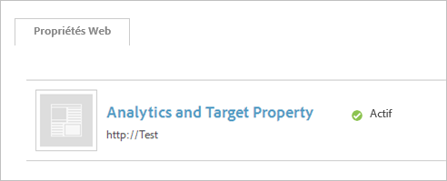
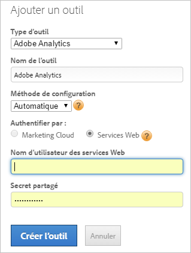

# Mise en œuvre manuelle d’Adobe Analytics (héritée)

Créez un outil Adobe Analytics pour le déploiement à l’aide de [!UICONTROL Dynamic Tag Management]. Cette procédure décrit une mise en œuvre (héritée) manuelle.

Pour plus d’informations sur la gestion de la mise en œuvre automatique, voir [Ajout de l’outil Adobe Analytics](/help/implement/other/dtm/c-aa-tool/analytics-dtm.md).

Si vous souhaitez passer une configuration manuelle sur automatique, modifiez un outil et cliquez sur **[!UICONTROL Activer la configuration automatique]**.

1. Téléchargez le code de mesure Analytics :
   1. Dans Analytics, cliquez sur **[!UICONTROL Administration]** > **[!UICONTROL Gestionnaire de code]**.
   1. Cliquez sur **[!UICONTROL JavaScript (nouveau)]** pour télécharger le code localement.
1. Dans [!UICONTROL Dynamic Tag Management], [créez une propriété web](/help/implement/other/dtm/t-create-web-property.md).

   

   Une fois la propriété web créée, elle peut être modifiée sous l’onglet [!UICONTROL Propriétés web] du [!UICONTROL tableau de bord]. Il n’est pas nécessaire d’activer la propriété web..

1. Ajoutez un outil Analytics à la propriété :
   1. Sous l’onglet **[!UICONTROL Propriétés web]**, cliquez sur la propriété.
   1. Sous l’onglet **[!UICONTROL Aperçu]**, cliquez sur **[!UICONTROL Ajouter un outil]**.
   1. Dans le menu **[!UICONTROL Type d’outil]**, sélectionnez **[!UICONTROL Adobe Analytics]**.

      

   1. Renseignez les champs suivants :

      | Élément | Description |
      |---|---|
      | Type d’outil | Solution Experience Cloud telle qu’Analytics, Target, Social, etc. |
      | Nom de l’outil | Nom de cet outil. Ce nom apparaît dans la section [!UICONTROL Outils installés] de l’onglet [!UICONTROL Aperçu]. |
      | ID du compte de production | Numéro de votre compte de production pour la collecte de données. Dynamic Tag Management installe automatiquement le compte correct dans l’environnement de production et d’évaluation. |
      | ID du compte d’évaluation | Numéro utilisé dans votre environnement de développement ou de test. Un compte d’évaluation permet de séparer les données de test de la production. |

1. Cliquez sur **[!UICONTROL Créer l’outil]**.

   L’outil installé s’affiche sous l’onglet [!UICONTROL Aperçu].

1. Pour configurer le code, cliquez sur **[!UICONTROL Paramètres]** .

   Cliquez sur **[!UICONTROL Cookies]**, puis configurez le serveur de suivi et le serveur de suivi SSL au minimum.

1. Cliquez sur **[!UICONTROL Général]** et [insérez le code AppMeasurement principal](/help/implement/other/dtm/c-aa-tool/t-appmeasurement-code.md).
1. Définissez une règle [de chargement de page](/help/implement/other/dtm/c-rules/t-rules-create.md) pour collecter [!DNL Analytics]des données.

   Vous pouvez à présent définir des règles pour collecter les données d’analyse. Il est possible que vous souhaitiez définir d’abord quelques éléments de données. Les éléments de données permettent d’extraire les données de la page que vous pouvez utiliser pour configurer une règle. Pour commencer, vous pouvez définir une règle de chargement de page sans conditions pour collecter les données [!DNL Analytics] de chaque page.
1. [Ajoutez le code d’en-tête et de pied de page](/help/implement/other/dtm/c-headers-footers/t-header-footer-code.md) sous l’onglet Incorporer.

   Pour un déploiement d’évaluation, vous pouvez conserver l’option d’hébergement Amazon par défaut. Vous pouvez la modifier, si nécessaire, avant le déploiement en production.
1. (Facultatif) Cliquez sur **[!UICONTROL Paramètres]** sous l’onglet Options, puis configurez le code Adobe Analytics.

   >[!NOTE]
   >
   >Les paramètres de la page [!UICONTROL Adobe Analytics] (Général, Cookies, etc.) remplacent ceux de votre `s_code`. Si ces paramètres existent dans le `s_code`, il n’est pas nécessaire de les réitérer.

