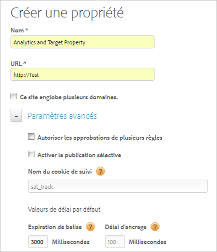

# Création d’une propriété web

Une propriété web peut être n’importe quel regroupement d’un ou de plusieurs domaines et sous-domaines avec une bibliothèque de règles, inclus dans un code intégré.

>[!NOTE] Seul un utilisateur disposant des droits d’administrateur peut créer une propriété. Pour plus d’informations sur les rôles, voir [Création et gestion de groupes dans DTM](https://marketing.adobe.com/resources/help/fr_FR/dtm/groups.html) dans la documentation du produit Dynamic Tag Management.

Vous pouvez gérer ces ressources et en effectuer le suivi au moyen de la gestion dynamique des balises. Par exemple, supposons que vous disposez de plusieurs sites web reposant sur un modèle et que vous souhaitez effectuer le suivi des mêmes ressources sur tous les sites. Vous pouvez appliquer une propriété Web à plusieurs domaines.

Pour obtenir des informations générales sur les propriétés web et les bonnes pratiques, voir [Propriétés web](https://marketing.adobe.com/resources/help/fr_FR/dtm/web_property.html) dans la documentation du produit Dynamic Tag Management.

1. Navigate to your company page, then click **[!UICONTROL Add Property]**.

   

1. Renseignez les champs suivants :

   <table id="table_376D72251C4D4C4CA878D10C18D2532C"> 
    <thead> 
    <tr> 
    <th colname="col1" class="entry"> Elément </th> 
    <th colname="col2" class="entry"> Description </th> 
    </tr> 
    </thead>
    <tbody> 
    <tr> 
    <td colname="col1">  Nom </td> 
    <td colname="col2"> 
Nom de la propriété. 
 </td> 
    </tr> 
    <tr> 
    <td colname="col1">  URL </td> 
    <td colname="col2"> 
URL de base de la propriété. 
 </td> 
    </tr> 
    <tr> 
    <td colname="col1">  Ce site englobe plusieurs domaines  </td> 
    <td colname="col2"> 
Vous pouvez ajouter et supprimer des domaines si vous souhaitez que les données de persistent entre les domaines. Si cette option est sélectionnée, les données de la visite persistent dans les sous-domaines. 
 
Ce paramètre vous permet de spécifier le mode de suivi du trafic entre les sous-domaines ou domaines associés. Les liens vers les sous-domaines sont traités comme des liens sortants. Le suivi des visites des sous-domaines s’effectue de manière séparée. 
 </td> 
    </tr> 
    </tbody> 
    </table>

1. (Facultatif) Configurez [!UICONTROL Advanced Settings].

   <table id="table_6E687FBE6ACC4301BCCD837F4DCBB9C9"> 
    <thead> 
    <tr> 
    <th colname="col1" class="entry"> Elément </th> 
    <th colname="col2" class="entry"> Description </th> 
    </tr> 
    </thead>
    <tbody> 
    <tr> 
    <td colname="col1">  Autoriser les approbations de plusieurs règles </td> 
    <td colname="col2"> 
Permet d’approuver simultanément plusieurs règles pour cette propriété. L’approbation par défaut autorise uniquement l’approbation d’une règle unique. 
 </td> 
    </tr> 
    <tr> 
    <td colname="col1">  Activer la publication sélective </td> 
    <td colname="col2"> 
Spécifie si les utilisateurs sont autorisés à sélectionner les règles approuvées à publier. Il s’agit de l’option par défaut. 
 </td> 
    </tr> 
    <tr> 
    <td colname="col1">  Nom du cookie de suivi </td> 
    <td colname="col2"> 
Permet de remplacer le nom par défaut du cookie de suivi. Vous pouvez personnaliser le nom utilisé par la gestion dynamique des balises pour effectuer le suivi de votre état d’exclusion pour la réception d’autres cookies. 
 </td> 
    </tr> 
    <tr> 
    <td colname="col1">  Expiration de balise </td> 
    <td colname="col2"> 
Indique la durée pendant laquelle la gestion dynamique des balises attend qu’une balise se déclenche avant d’expirer et d’annuler la demande de balise. 
 
 Compte tenu de la façon dont fonctionne Dynamic Tag Management, ne vous inquiétez pas si ce nombre est élevé. La gestion dynamique des balises propose des méthodes efficaces pour s’assurer que les balises lentes n’affectent pas l’expérience utilisateur. 
 </td> 
    </tr> 
    <tr> 
    <td colname="col1">  Délai d’ancrage </td> 
    <td colname="col2"> 
Permet d’indiquer le délai d’attente du déclenchement d’une balise lorsque des liens font l’objet d’un clic avant de passer à la page suivante. La valeur par défaut est de 100 millisecondes. 
 
Des délais supérieurs améliorent la précision du suivi. Adobe recommande un délai de 500 millisecondes ou moins, qui ne sera pas ressenti par l’utilisateur. 
 
La gestion dynamique des balises patiente jusqu’à l’heure spécifiée, mais si la balise se déclenche plus tôt, le délai est réduit. (Cela signifie que l’utilisateur ne patientera pas toujours pendant toute la durée spécifiée.) 
 </td> 
    </tr> 
    </tbody> 
    </table>

1. Cliquez sur **[!UICONTROL Create Property]**.
