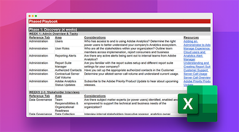

# Prise en charge d’une implémentation Adobe Analytics existante

Vous prenez la main sur une implémentation Adobe Analytics gérée par le précédent propriétaire technique ? Notre manuel relatif à l’implémentation héritée vous aidera à endosser le rôle de nouveau propriétaire technique d’une implémentation existante. Dans la feuille de calcul téléchargeable, nous vous guidons à travers les activités de découverte, d’audit et de documentation que vous devriez effectuer au cours des 10 premières semaines de prise en charge de l’implémentation existante.

**Téléchargez le [manuel relatif à l’implémentation héritée](assets/adobe_analytics_inherited_implementation_playbook.xlsx).**

Consultez les conseils de Sarah Owen, qui est également propriétaire technique. Sarah est championne d’Adobe Analytics et partage des idées sur l’utilisation du manuel Hérité de l’implémentation pour prendre en charge une implémentation existante :

>[!BEGINSHADEBOX]

Voir  [Utilisation du manuel d’implémentation hérité](https://video.tv.adobe.com/v/327314?quality=12&learn=on){target="_blank"} pour une vidéo de démonstration.

>[!ENDSHADEBOX]

Voir également :

* [Liste de contrôle de la « Révision ciblée » pour une révision de votre implémentation après chaque publication de site web](/help/implement/review/focused-review.md)
* [Liste de contrôle « Révision complète » pour une révision de votre implémentation tous les 6 mois](/help/implement/review/full-review.md)
* [Définition des 5 principaux indicateurs clés de performance](/help/implement/review/define-kpis.md)
