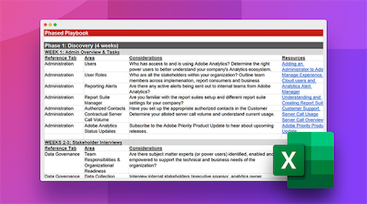

# Prendre en charge une implémentation Adobe Analytics existante

Vous reprenez une implémentation Adobe Analytics qui était gérée précédemment par un autre responsable technique ? Notre playbook relatif à une implémentation héritée vous aidera à prendre en charge une implémentation existante en tant que nouveau responsable technique. Dans la feuille de calcul téléchargeable, nous vous guiderons à travers les activités de découverte, d’audit et de documentation à réaliser au cours de vos 10 premières semaines dans cette fonction lorsque vous reprenez une implémentation existante.

**Téléchargez le [manuel relatif à l’implémentation héritée](assets/adobe_analytics_inherited_implementation_playbook.xlsx).**

Consultez les conseils de Sarah Owen, qui est également propriétaire technique. Sarah est championne d’Adobe Analytics et partage des idées sur l’utilisation du manuel Hérité de l’implémentation pour prendre en charge une implémentation existante :

>[!BEGINSHADEBOX]

Voir  [Utilisation du manuel d’implémentation hérité](https://video.tv.adobe.com/v/3438738?captions=fre_fr&quality=12&learn=on){target="_blank"} pour une vidéo de démonstration.

>[!ENDSHADEBOX]

Voir également :

* [Liste de contrôle de la « Révision ciblée » pour une révision de votre implémentation après chaque publication de site web](/help/implement/review/focused-review.md)
* [Liste de contrôle « Révision complète » pour une révision de votre implémentation tous les 6 mois](/help/implement/review/full-review.md)
* [Définition des 5 principaux indicateurs clés de performance](/help/implement/review/define-kpis.md)
