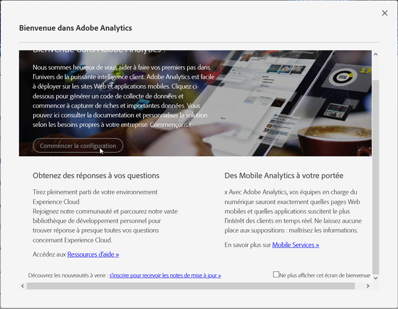

# Mode de mise en oeuvre

<!-- https://activation.adobedtm.com/index.php?redirected=1 -->

La fenêtre modale &quot;Bienvenue dans Adobe Analytics&quot; simplifie le processus de création d’une suite de rapports. Adobe conseille d’utiliser ce flux de travail chaque fois que davantage de suites de rapports sont nécessaires dans votre entreprise.

## Conditions préalables

Votre Adobe ID doit avoir accès à Adobe Analytics et au lancement d’Adobe Experience Platform. Si vous n’avez pas accès à Lancer, vous pouvez être placé dans une boucle d’authentification où il vous est demandé de vérifier vos informations d’identification indéfiniment. Contactez un administrateur système de votre entreprise pour obtenir l’accès au lancement.

## Accès au module

Accédez au module modal pour créer une suite de rapports à l’aide des étapes suivantes.

1. Connectez-vous à [experiencecloud.adobe.com](https://experiencecloud.adobe.com) à l’aide de vos identifiants Adobe ID.
2. Click the 9-grid icon at the top, then click [!UICONTROL Adobe Analytics].
3. Si vous n’avez pas encore créé de suite de rapports, le module modal s’affiche automatiquement. S’il existe une suite de rapports pour cette société de connexion, cliquez sur l’icône Aide en haut à droite, puis sur [!UICONTROL Bienvenue dans Adobe Analytics].

> [!NOTE] L’option [!UICONTROL Bienvenue dans Adobe Analytics] s’affiche uniquement si vous vous connectez via Adobe Experience Cloud. Si vous vous connectez par le biais de domaines hérités, le module modal n’est pas disponible.

## Création d’une suite de rapports

Cliquez sur le bouton [!UICONTROL Démarrer la configuration] pour lancer le processus de création de la suite de rapports.

### Type de propriété

Le type de propriété permet à Adobe de déterminer certains paramètres d’arrière-plan en fonction de l’emplacement de mise en oeuvre d’Analytics.

* **Site Web**: Si vous avez l’intention d’implémenter Adobe Analytics uniquement pour un site Web.
* **Application** mobile native : Si vous avez l’intention de mettre en oeuvre Adobe Analytics uniquement pour une application mobile.
* **Les deux**: Si cette suite de rapports contient des données pour un site Web et une application mobile.

### Secteurs d’activité

Spécifiez votre modèle d’entreprise principal. Ce paramètre permet à Adobe de préconfigurer certains noms de variable et paramètres en fonction de votre modèle commercial principal.

### Couche de données

Une couche [de](data-layer.md) données est un objet JavaScript qui classe toutes les variables utilisées dans votre implémentation dans un seul emplacement utile. See [Data layers](data-layer.md) for more information.

### Référentiel de données

Donnez un nom convivial à votre suite de rapports. L’identifiant de votre suite de rapports (RSID) est généré automatiquement en fonction du nom convivial et du nom de la société de connexion.

### Fuseau horaire

Vérifiez qu’Adobe a détecté le fuseau horaire correct pour la suite de rapports.

### Estimation du nombre de pages vues par jour

Estimez le volume de trafic de votre site Web ou de votre application par jour. Ces informations permettent à Adobe d’allouer le montant correct des ressources de traitement à votre suite de rapports.

### Devise de base

Déterminez dans quelle devise la suite de rapports stocke les valeurs monétaires.

> [!IMPORTANT] Veillez à indiquer la devise appropriée, en particulier si vous avez des exigences de création de rapports concernant les recettes. Il est difficile de modifier la devise de base une fois la collecte des données commencée.

## Ressources de mise en œuvre

Une fois la suite de rapports créée, vous disposez de l’une des deux options pour poursuivre votre implémentation :

* **Accédez à Adobe Experience Platform Launch**: Vous associe à [launch.adobe.com](https://launch.adobe.com) pour configurer votre mise en oeuvre et télécharger le code de déploiement. Voir [Mise en œuvre avec Launch](../launch/overview.md). Dans la plupart des cas, Adobe recommande d’utiliser le lancement.
* **Télécharger le code** de mise en oeuvre : Fournit un lien direct pour télécharger des fichiers JavaScript pour une implémentation manuelle de JavaScript. Voir [AppMeasurement pour JavaScript](../js/overview.md).
