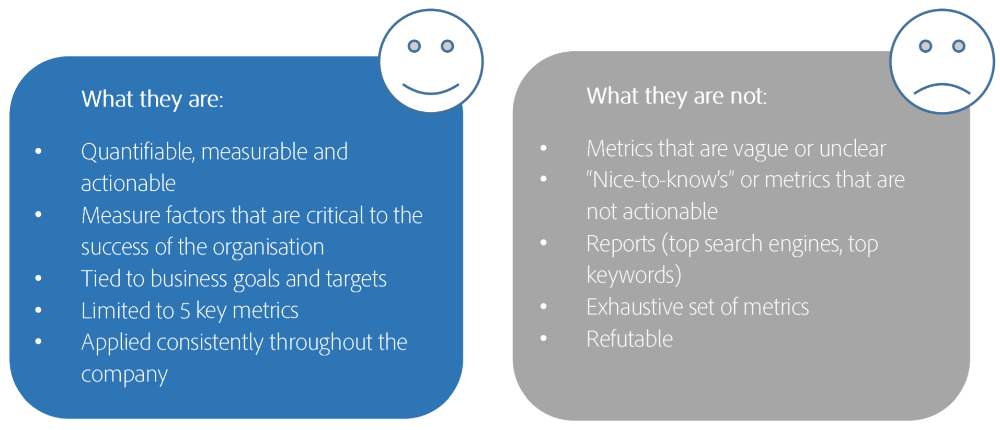

# Définir vos 5 principaux KPI

Vous ne pouvez tout simplement pas tout mesurer. En outre, votre implémentation d’Adobe Analytics sera la plus réussie si vous donnez la priorité à la mesure de ce qui est le plus important pour l’entreprise. Collaborez avec les responsables de votre entreprise pour définir les KPI qui ont le plus d’impact sur votre activité. Ensuite, concentrez vos efforts sur les mesures et les variables qui prennent en charge ces KPI.

## &#x200B;1. Comprendre les objectifs de votre entreprise

Commencez par vous familiariser avec les objectifs de l’entreprise afin de sélectionner les 5 KPI les plus importants pour celle-ci. Ces KPI peuvent être des mesures comme le chiffre d’affaires ou des mesures calculées comme les revenus par visite. Les mesures peuvent également comporter des variables. NE copiez PAS de KPI aléatoires provenant d’autres entreprises ou normes du secteur ; il est peu probable qu’ils correspondent aux objectifs de VOTRE entreprise.

## &#x200B;2. Posez la question cruciale

Posez-vous la question suivante : si ma PDG était coincée sur une île et que vous ne pouviez lui communiquer que 5 informations sur la santé de l’entreprise, quelles seraient-elles ? Si vous lui disiez que le temps moyen passé sur une page était de 1 h 30, cela ne l&#39;aiderait pas du tout. En revanche, si vous lui indiquiez que votre chiffre d’affaires moyen par visite s’élève à 2,00 $ et que vous avez enregistré 2 millions de visites, elle disposerait alors d’une véritable indication du succès de l’entreprise.

## &#x200B;3. N’oubliez pas ce que sont les KPI et ce qu’ils ne sont pas

## &#x200B;4. Définition des indicateurs de performance clés

Renseignez votre propre graphique, comme celui-ci :

| Objectif commercial | Mesures et dimensions |
| --- | --- |
| Augmenter les ventes grâce aux canaux numériques | Recettes par visite |
| Augmenter la notoriété de la marque | Visiteurs |
| Favoriser des relations client plus étroites et durables | Connexions, clics |
| Conversion du site | Clics sur les appels à l’action / Nombre total de pages vues |
| Engagement sur le site | Pages vues par visiteur unique, temps moyen passé sur le site par visiteur |

## &#x200B;5. Examinez régulièrement vos KPI

Actualisez vos KPI au moins tous les 6 mois : gardez en tête que les besoins de l’entreprise changeront fréquemment !
