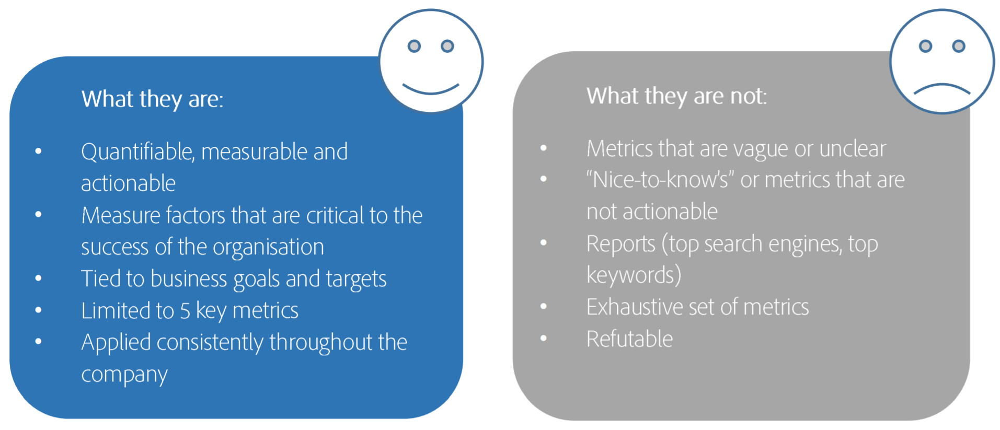

# Définition des 5 principaux indicateurs de performance clés

Vous ne pouvez tout simplement pas tout mesurer et votre mise en oeuvre Adobe Analytics sera la plus performante si vous définissez les priorités de mesure de ce qui est le plus important pour l’entreprise. Contactez vos dirigeants d&#39;entreprise pour définir les indicateurs de performances clés (IPC) qui ont le plus d&#39;impact sur votre activité. Ensuite, concentrez vos efforts sur les mesures et les variables qui prennent en charge ces IPC.

## 1. Comprendre vos objectifs commerciaux

Début en comprenant les objectifs commerciaux, vous pouvez ainsi choisir les 5 IPC les plus importants pour l&#39;entreprise. Ces indicateurs de performance clés peuvent être des mesures telles que les recettes, des mesures calculées telles que les recettes par visite et des variables. NE copiez PAS les indicateurs de performance clés aléatoires d&#39;autres sociétés ou normes du secteur ; ils ne correspondent probablement pas à VOS objectifs commerciaux.

## 2. Poser la question cruciale

Demandez-vous : Si mon PDG était coincé sur une île et que vous ne pouviez lui dire que 5 choses sur la santé de l&#39;entreprise, qu&#39;est-ce que ce serait ? Si vous lui disiez que le temps moyen passé sur une page était de 1:30, cela ne l&#39;aiderait pas du tout. Cependant, si vous lui avez dit que votre revenu moyen par visite était de 2,00 $ et que vous aviez 2 millions de visites, cela lui donnera une vraie indication du succès de l&#39;entreprise.

## 3. Rappelez-vous quels sont les IPC et ce qu&#39;ils ne sont pas.

## 4. Définissez vos IPC

Renseignez votre propre graphique, comme celui-ci :

| Objectif commercial | Mesures et dimensions |
| --- | --- |
| Augmenter les ventes grâce aux canaux numériques | Recettes par visite |
| Sensibilisation à la marque | Visiteurs |
| Favoriser des relations client plus étroites et durables | Connexions, clics |
| Conversion du site | Clics DEC / Nombre total de vues de page |
| Engagement sur le site | Vues de page par visiteur unique, temps visiteur moyen sur le site |

## 5. Examinez régulièrement vos IPC.

Actualisez vos IPC au moins tous les 6 mois - n&#39;oubliez pas que les besoins de l&#39;entreprise changeront fréquemment !