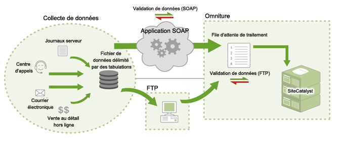

# Fonctionnement des sources de données

Informations sur la façon dont Adobe fournit l’accès aux sources de données.

> [!NOTE] Une fois envoyées par l'intermédiaire de la fonctionnalité Sources de données, les données importées ne peuvent plus être distinguées des données de rapport collectées à l'aide d'autres méthodes (balise JavaScript, ActionSource, API d'insertion de données, etc.). Vous ne pouvez plus supprimer les données une fois qu’elles ont été importées.

Vous pouvez envoyer des données de deux façons :

* [FTP](/help/import/c-data-sources/datasrc-how-data-sources-works.md#section_0E70022648F94061AF5B4AD6C7145243)
* [API](/help/import/c-data-sources/datasrc-how-data-sources-works.md#section_65DACC9CE00C437BBFDD02D19C25A4BD)

## FTP {#section_0E70022648F94061AF5B4AD6C7145243}

Vous pouvez créer et gérer des sources de données FTP au moyen de rapports marketing ; le transfert de fichier FTP est alors mis à profit pour importer des fichiers de données dans la fonctionnalité Sources de données. Après avoir créé une source de données, Adobe vous fournit un emplacement FTP que vous pouvez utiliser pour transférer les fichiers de source de données. Une fois ces fichiers transférés, ils sont automatiquement localisés et traités. Une fois le traitement terminé, les données sont disponibles pour les rapports marketing.

## API {#section_65DACC9CE00C437BBFDD02D19C25A4BD}

Adobe propose une API Sources de données qui permet de lier par programmation les applications dans les sources de données. Vous n’avez ainsi plus besoin d’un serveur FTP intermédiaire ; les données sont transférées par HTTP, SOAP et REST.

Voir la [documentation sur l’API Sources de données](https://github.com/AdobeDocs/analytics-1.4-apis/tree/master/docs/data-sources-api).
