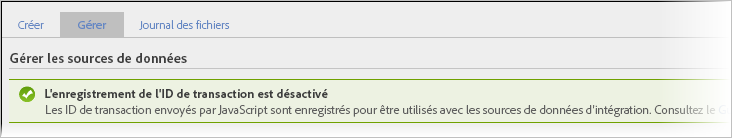

# Intégration des transactions et des clients

La fonctionnalité Sources de données fournit deux moyens supplémentaires d’intégrer à vos données en ligne des événements qui surviennent hors ligne.

* [Activation de l’enregistrement des identifiants de transaction](/help/import/c-data-sources/datasrc-integrating-offline-data.md#section_30D6D47AEC0F4A36B87EBFE4C858F20C)
* [Intégration de transactions](/help/import/c-data-sources/datasrc-integrating-offline-data.md#section_B3F281CEFF9B47E9A07F9851D61D415D)
* [Intégration de clients](/help/import/c-data-sources/datasrc-integrating-offline-data.md#section_9F4AAD710D2543BDA834090A98115FBF)

Ces intégrations associent les données hors ligne à une transaction en ligne spécifique ou à un visiteur en ligne.

## Activation de l’enregistrement des identifiants de transaction {#section_30D6D47AEC0F4A36B87EBFE4C858F20C}

L’identifiant de transaction peut être activé/désactivé depuis l’interface utilisateur sans l’intervention de ClientCare :

Accédez à **[!UICONTROL Administration]** > **[!UICONTROL Suites de rapports]** > **[!UICONTROL [Sélectionner une suite de rapports]]** > **[!UICONTROL Modifier les paramètres]** > **[!UICONTROL Général]** > **[!UICONTROL Paramètres du compte général]**.

<!-- 

When contacting Customer Care, be prepared to provide the following information: 
 
<ul id="ul_C425C7A074484650AFCCF0425E8E3F47"> 
 <li id="li_7640C0C4DF0C49749A3C37E5461DC22F">Report Suite ID of the data source for which you need transaction ID recording enabled. 
In Data Sources, the report suite ID is the first part of the login appended by a random number that identifies the specific data source that was set up. For example, <code> RSID-drmossdev5 Login-drmossdev5_0001343430</code>. 
 </li> 
 <li id="li_4FB0E3EC7BE94A2DBEE9063365A71C9C">The Transaction ID expiration window (described in <a href="/help/import/c-data-sources/datasrc-tid-visitor-profile.md"  > Transaction ID and Visitor Profiles</a>). By default this is 90 days, but it can be extended to up to 2 years. </li> 
</ul>

 -->

Pour vérifier si l’enregistrement des identifiants de transaction est activé, sélectionnez **[!UICONTROL Analytics]** > **[!UICONTROL Administration]** > **[!UICONTROL Sources de données]**.

L’onglet [!UICONTROL Gérer] présente l’état de l’enregistrement des identifiants de transaction.

## Intégration de clients {#section_9F4AAD710D2543BDA834090A98115FBF}

Les ID de client permettent de préciser une activité hors ligne du client et de l’associer à une activité en ligne. Ils doivent être utilisés dans les cas suivants :

* Un ID de client est renseigné dans la variable Variable *`visitorID`*.
* Il n’y a pas de point désigné où l’activité des clients passe hors ligne, par exemple l’envoi d’un prospect ou un achat.

Pour configurer ce type de source de données, voir : [Identifiant visiteur](/help/import/c-data-sources/c-datasrc-types/datasrc-visitorid.md)

## Intégration de transactions {#section_B3F281CEFF9B47E9A07F9851D61D415D}

Les ID de transaction permettent d’enregistrer l’état d’un visiteur à un moment donné. Ils doivent être utilisés lorsqu’il existe un moment particulier où les clients passent généralement d’une expérience en ligne à une expérience hors ligne, par exemple :

* envoi d’un prospect pour qu’un représentant de commerce contacte le client ;
* réalisation d’un achat en ligne qui peut être plus tard renvoyé au magasin ;
* achat d’un produit pour lequel le client peut ensuite appeler pour obtenir de l’aide.

Le client est souvent anonyme lorsqu’il passe d’en ligne à hors ligne.

Les événements d’ID de transaction ne sont pas inclus dans les mesures Participation de visite (qui sont affichées dans les rapports marketing), mais ils sont inclus dans les mesures Participation des visiteurs (disponibles uniquement dans les analyses ad hoc).

Ceci est dû au fait que les données d’ID de transaction ne sont pas associées à une visite (car l’événement hors ligne ne fait habituellement pas partie de l’événement en ligne), mais elles sont associées au visiteur.

Reportez-vous à la section [ID de transaction](/help/import/c-data-sources/c-datasrc-types/datasrc-transactionid.md).
