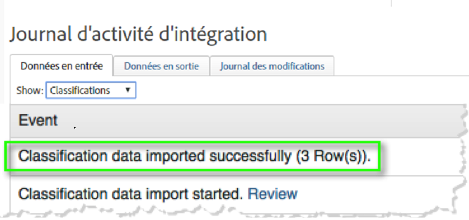
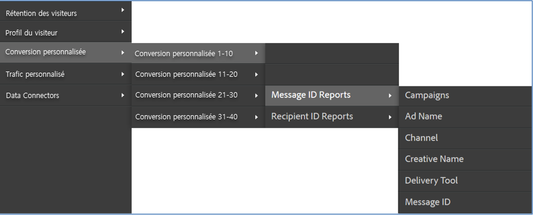

# Déploiement de l’intégration{#deploying-the-integration}

Le déploiement de cette intégration est un processus simple qui nécessite les actions suivantes :

## Fin de l’assistant d’intégration Adobe{#completing-the-adobe-integration-wizard}

Cette section décrit la procédure à suivre pour exécuter l’assistant d’intégration dans l’interface des connecteurs de données.

1. Accédez à la zone Connecteurs de données (anciennement Genesis) dans Adobe Experience Cloud.
1. Lancez l'assistant d'intégration ContactLab.
1. Choisissez une suite de rapports et nommez l’intégration.
1. Configurez les éléments suivants :

   | Élément | Description |
   |---|---|
   | Adresse électronique | Adresse électronique du contact principal |
   | Description | (Facultatif) Description de cette configuration d’intégration |

1. Configurez les éléments **[!UICONTROL de mappage]** de variables suivants :

   | Élément | Description |
   |---|---|
   | ID de lien | Sélectionnez une eVar pour la collecte des ID de lien en temps réel. |
   | ID du message | Sélectionnez une eVar pour la collecte des ID de message en temps réel. |
   | Recipient ID | Sélectionnez une eVar pour la collecte des ID de destinataire en temps réel. |
   | Retours | Sélectionnez un événement numérique pour recevoir les rebonds quotidiens de ContactLab. |
   | Envoyé | Sélectionnez un événement numérique pour recevoir des envois quotidiens de ContactLab. |
   | Cliqué | Sélectionnez un événement numérique pour recevoir le total quotidien des clics de ContactLab. |
   | Ouvert | Sélectionnez un événement numérique pour recevoir le total quotidien des ouvertures de ContactLab. |
   | Non abonné | Sélectionnez un événement numérique pour recevoir les désabonnements quotidiens de ContactLab. |

1. Activez l’accès aux données et configurez la collecte de données.
   1. Renommez les classifications selon vos besoins.
   1. **[!UICONTROL Les segments]** partenaires sont des segments de remarketing standard inclus dans votre intégration.
   1. Sous **[!UICONTROL Vos segments]**, sélectionnez les segments personnalisés que vous souhaitez inclure dans cette intégration. Vous pouvez créer d’autres segments personnalisés sous le panneau d’administration.
   1. Sous Demandes **[!UICONTROL d’]** accès, cochez la case pour autoriser l’exportation des informations sur les produits vers ContactLab dans les segments de remarketing quotidien.
   1. Renommez les mesures calculées selon vos besoins.
   1. Configurez si vous collecterez des ID en mettant manuellement à jour votre code de collecte Analytics ou en utilisant la solution automatisée. Si vous sélectionnez Solution **** automatisée, vous devez inclure les paramètres utilisés dans les liens de courrier électronique pour transmettre les ID.
1. Vérifiez tous les éléments de configuration et cliquez sur **[!UICONTROL Activer maintenant]**.

## Vérification de l’intégration{#verifying-the-integration}

Afficher votre configuration de l’intégration ContactLab dans Adobe Experience Cloud

1. Affichez le journal des activités d’intégration.
   1. Dans Adobe Experience Cloud, accédez à **[!UICONTROL Support]** &gt; Journal **[!UICONTROL d’activité]** d’intégration.

      

   1. Recherchez les entrées telles que Données **[!UICONTROL de classification importées avec succès]**, Données **[!UICONTROL de mesures importées avec succès]** et Données de **[!UICONTROL mesures exportées avec succès]**. Ces entrées doivent apparaître dans le délai d’un jour suivant le déploiement.
1. Affichez vos données de création de rapports dans Adobe Analytics.
   1. Accédez à Conversion **** personnalisée &gt; Conversion **[!UICONTROL personnalisée 1-10]** &gt; Rapports **[!UICONTROL d’ID de]** message.

      

   1. Recherchez la création de rapports ContactLab. Ces données doivent apparaître dans les 24 à 48 heures suivant le déploiement.
