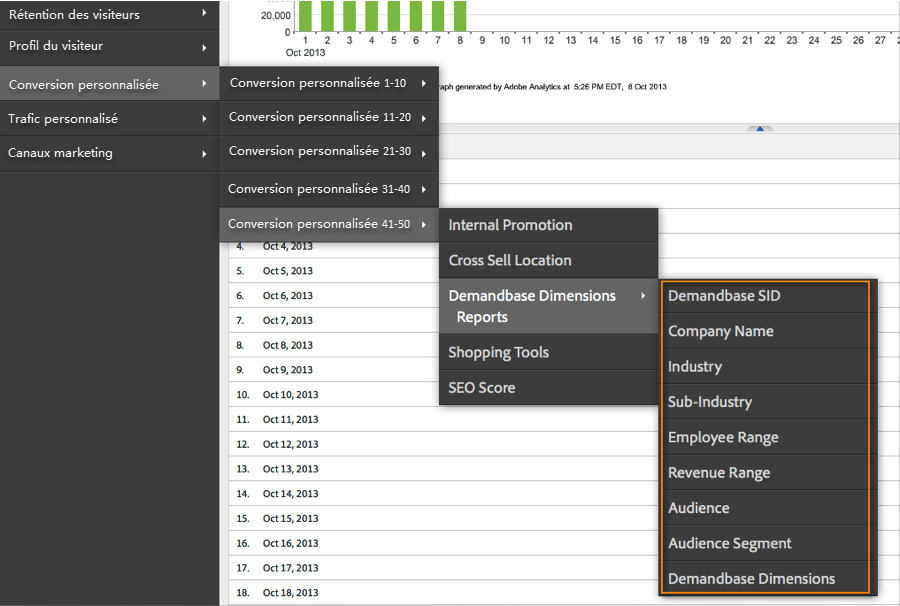
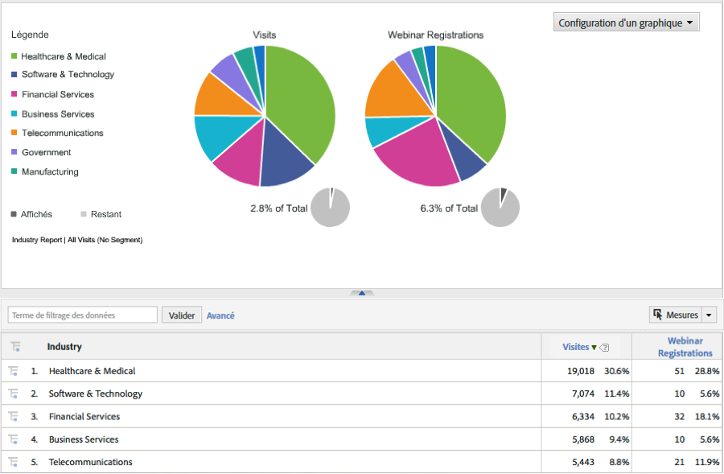

# Déploiement de l’intégration {#deploying-the-integration}

Le déploiement de cette intégration est un processus simple qui nécessite les actions suivantes.

## Finalisation de l’assistant d’intégration Adobe {#completing-the-adobe-integration-wizard}

Pour activer l’intégration, vous devez exécuter l’assistant de configuration dans l’interface des Data Connectors.

1. Accédez à la zone des Data Connectors (anciennement Genesis) dans Adobe Experience Cloud.
1. Lancez l’assistant d’intégration Demandbase 2.0.
1. Choisissez une suite de rapports et attribuez un nom à l’intégration.
1. Renseignez les éléments suivants :

<table id="table_8D60DC7C48C144DC9934749E7F9F65FF"> 
 <thead> 
  <tr> 
   <th colname="col1" class="entry"> Élément </th> 
   <th colname="col2" class="entry"> Description </th> 
  </tr>
 </thead>
 <tbody> 
  <tr> 
   <td colname="col1"> Adresse électronique </td> 
   <td colname="col2"> Adresse électronique du contact principal. </td> 
  </tr> 
  <tr> 
   <td colname="col1"> Description </td> 
   <td colname="col2"> (Facultatif) Description de cette configuration d’intégration. </td> 
  </tr> 
  <tr> 
   <td colname="col1"> Clé d’API Demandbase </td> 
   <td colname="col2"> Vous pouvez obtenir cette information auprès de votre représentant Demandbase. </td> 
  </tr> 
  <tr> 
   <td colname="col1"> Numéro de dimension Demandbase personnalisée </td> 
   <td colname="col2"> Il s’agit des ID des 8 dimensions facultatives. Pour plus d’informations, voir Dimensions personnalisées Demandbase. </td> 
  </tr> 
  <tr> 
   <td colname="col1"> Envoyer à Adobe Target </td> 
   <td colname="col2">Si la valeur est « true », les dimensions Demandbase sont également envoyées à Adobe Target à l’aide d’une mbox masquée. <p>Remarque : un fichier mbox.js configuré doit être implémenté sur la page web pour que les dimensions soient collectées. </p> </td> 
  </tr> 
 </tbody> 
</table>

1. Configurez les éléments de mappage de variables suivants :

   | Élément | Description |
   |---|---|
   | Dimensions Demandbase | Choisissez une variable eVar disponible dans votre suite de rapports. |
   | Dimensions personnalisées Demandbase (facultatif) | Choisissez une variable eVar disponible dans votre suite de rapports. |

1. Configurez les noms de la dimension personnalisée (le cas échéant).

   1. Si vous avez choisi d’inclure des dimensions personnalisées à l’étape 4 et de mapper l’eVar facultative à l’étape 5, vous devez fournir des noms conviviaux pour ces dimensions. Par exemple, si vous avez choisi de saisir « stock_ticker » comme dimension personnalisée 1, vous devez modifier la zone contenant « Dimension 1 » en « Stock Ticker ».
   1. Ne modifiez **PAS** les noms des 8 dimensions standard (c’est-à-dire le code SID Demandbase, le nom de la société, le secteur industriel, etc.).

1. Cochez la case pour que le tableau de bord d’intégration Demandbase soit automatiquement créé (recommandé).
1. Vérifiez tous les éléments de configuration et cliquez sur **[!UICONTROL Activer maintenant]**.

## Déploiement du code d’intégration {#deploying-the-integration-code}

Après avoir exécuté l’assistant d’intégration, vous devez déployer le code d’intégration dans votre code de déploiement Adobe Analytics (s_code).

> [!NOTE] Si vous avez utilisé Adobe TagManager ou Dynamic Tag Management pour déployer Adobe Analytics, vous pouvez facilement ajouter le code d’intégration à l’aide de l’un de ces outils.

1. Accédez à l’onglet **[!UICONTROL Assistance]** et téléchargez puis enregistrez la ressource `integration code v2_0_1` depuis la zone Ressources de l’intégration.

1. Le cas échéant, apportez les modifications nécessaires au code. Pour plus d’informations, voir Modification du code d’intégration (sur cette page).
1. Incluez le module Integrate s’il n’est pas déjà présent dans votre code de déploiement Adobe Analytics.
1. Déployez le code à l’aide de l’une des méthodes suivantes :

   * Utilisez Adobe TagManager ou Dynamic Tag Management pour ajouter le code.
   * Vous pouvez également envoyer le code à la ressource d’organisation responsable de la mise à jour du code de déploiement Adobe Analytics.

>[!IMPORTANT]
>
>Assurez-vous de tester le déploiement de cette intégration dans un environnement de développement/d’évaluation avant de la déployer dans un environnement de production.

## Modification du code d’intégration {#modifying-the-integration-code}

Dans la plupart des cas, vous n’avez pas besoin d’apporter des modifications au code d’intégration généré par l’assistant des connecteurs de données.

Toutefois, si vous devez effectuer des ajustements, certains paramètres de code sont décrits ci-dessous.

<table id="table_5405A73CEFD44466B3C39559F4A037C9"> 
 <thead> 
  <tr> 
   <th colname="col1" class="entry"> Paramètre de code </th> 
   <th colname="col2" class="entry"> Description </th> 
  </tr>
 </thead>
 <tbody> 
  <tr> 
   <td colname="col1"> s.maxDelay </td> 
   <td colname="col2">Nombre maximal de millisecondes pendant lesquelles la demande d’image Adobe Analytics attend les données de Demandbase avant de se déconnecter du serveur de collecte Analytics. <p>Remarque : ce paramètre s’applique à toutes les intégrations qui peuvent être exécutées via le module Integrate. </p> </td> 
  </tr> 
  <tr> 
   <td colname="col1"> _db._key </td> 
   <td colname="col2"> Votre clé d’API Demandbase. </td> 
  </tr> 
  <tr> 
   <td colname="col1"> _db._apiURL </td> 
   <td colname="col2"> Modèle d’URL pour l’API Demandbase. </td> 
  </tr> 
  <tr> 
   <td colname="col1"> _db._delim </td> 
   <td colname="col2"> Délimiteur utilisé pour séparer les valeurs de dimension Demandbase lorsqu’elles sont envoyées à Adobe Analytics. La modification de ce paramètre peut entraîner le mauvais fonctionnement des règles de classification par défaut. </td> 
  </tr> 
  <tr> 
   <td colname="col1"> _db._setTnt </td> 
   <td colname="col2">Si la valeur est true, le code d’intégration tente d’utiliser une mbox masquée pour envoyer les dimensions Demandbase à Adobe Target en tant que paramètres de profil. <p>Remarque : cela implique que le code mbox.js existe sur la page. </p> </td> 
  </tr> 
  <tr> 
   <td colname="col1"> _db._tntVarPrefix </td> 
   <td colname="col2"> Cette chaîne est précédée de chaque nom de dimension Demandbase avant d’être envoyée à Adobe Target. Par exemple, si ce paramètre a la valeur « db_ », la dimension « industry » sera envoyée à Adobe Target sous la forme « db_industry ». </td> 
  </tr> 
  <tr> 
   <td colname="col1"> _db._dimensionsArray </td> 
   <td colname="col2"> Dimensions Demandbase standard envoyées à Adobe Analytics. Il est recommandé de ne pas modifier ce paramètre. La propriété « max_size » correspond au nombre de caractères autorisés pour la dimension avant la troncation. </td> 
  </tr> 
  <tr> 
   <td colname="col1"> _db._dimensionsArrayCustom </td> 
   <td colname="col2"> Dimensions Demandbase personnalisées envoyées à Adobe Analytics. La propriété « max_size » correspond au nombre de caractères autorisés pour la dimension avant la troncation. </td> 
  </tr> 
  <tr> 
   <td colname="col1"> _db._cName </td> 
   <td colname="col2"> Nom du cookie de session utilisé pour conserver l’état de la communication de l’API Demandbase. </td> 
  </tr> 
  <tr> 
   <td colname="col1"> _db._contextName </td> 
   <td colname="col2"> Nom de la variable contextData utilisée pour envoyer les dimensions standard à Adobe Analytics. Il est recommandé de ne pas modifier ce paramètre. </td> 
  </tr> 
  <tr> 
   <td colname="col1"> _db._contextNameCustom </td> 
   <td colname="col2"> Nom de la variable contextData utilisée pour envoyer les dimensions personnalisées à Adobe Analytics. Il est recommandé de ne pas modifier ce paramètre. </td> 
  </tr> 
 </tbody> 
</table>

## Inclusion du module Integrate {#including-the-integrate-module}

Le code d’intégration requiert que le module Integrate existe dans votre déploiement Adobe Analytics.

Si vous ne disposez pas déjà du module Integrate dans le cadre de votre déploiement, procédez comme suit en fonction du type d’implémentation dont vous disposez.

### Pour AppMeasurement v1.0+ {#section-f28d090bf2404cabaae34cd9c66fc575}

1. Décompressez le fichier zip AppMeasurement que vous avez téléchargé depuis **[!UICONTROL Analytics]** > **[!UICONTROL Admin]** > **[!UICONTROL CodeManager]**.

1. Ouvrez le fichier nommé [!DNL AppMeasurement_Module_Integrate.js].
1. Copiez et collez le contenu de ce fichier dans votre fichier principal [!DNL AppMeasurement.js].

   >[!NOTE]
   >
   >Collez-le juste avant le commentaire DO NOT ALTER ANYTHING BELOW THIS LINE dans le fichier.

### Pour le code hérité (H-code) {#section-bba8ad8c715e4f97883e7de3269f681a}

1. Téléchargez le module Integrate à partir de la zone « Resources » de l’interface utilisateur des Data Connectors (sous l’onglet Assistance).

   

1. Copiez et collez le contenu de ce fichier dans votre fichier [!DNL s_code].

   >[!NOTE]
   >
   >Collez-le juste avant le commentaire DO NOT ALTER ANYTHING BELOW THIS LINE dans le fichier.

## Vérification de l’intégration {#verifying-the-integration}

Vérifiez que l’intégration collecte correctement les données en vérifiant le suivi en direct et la création de rapports.

### Suivi en direct {#section-9c20e8ff6b404ae09387ee07d675c9e2}

Utilisez l’outil de débogage DigitalPulse pour vérifier que les données de dimension Demandbase sont envoyées à Adobe Analytics. Après avoir supprimé vos cookies, rechargez une page de votre site web sur laquelle le code d’intégration a été déployé. En supposant que votre adresse IP actuelle correspond à une organisation reconnue par Demandbase, vous devriez voir les résultats semblables à ceux-ci.

**Reports &amp; Analytics (anciennement SiteCatalyst) inclut les deux variables de données contextuelles Demandbase :**


**La mbox Target inclut les paramètres de profil Demandbase :**
Vous ne verrez cela que si Target est implémenté sur la page ET que cette intégration est configurée pour Adobe Target - voir Étape 4 de l’assistant d’intégration Adobe.


### Création de rapports {#section-1792fe75dc3249d0ad063dfd87a89162}

Consultez vos rapports Demandbase dans Adobe Analytics à l’aide du tableau de bord qui a été automatiquement créé pour vous à l’aide de l’assistant d’intégration Adobe (étape 7).

Vous pouvez également accéder à la création de rapports Demandbase dans la structure de menus d’Adobe Analytics - voir copies d’écran ci-dessous.

> [!NOTE] Ces données doivent apparaître dans les 24 à 48 heures suivant le déploiement.





### Questions fréquentes {#section-d926b160a2ef4f07b43ea1bc67ac2a0a}

**Que signifie « [n/a] » ?**

Le connecteur de données Demandbase indique quand un attribut est « Non disponible » en définissant cette valeur par défaut. Il existe deux scénarios courants dans lesquels la valeur par défaut est définie :

* Demandbase détecte que le visiteur provient d’une adresse IP qui n’appartient pas à une entreprise.
* Un attribut de contrôle de compte (commençant par « watch_list ») est utilisé, mais l’entreprise ne figure pas dans votre liste de contrôle de compte.

**Pourquoi « `[n/a]` » apparaît-il plus souvent pour certains attributs ?**

Demandbase classe toutes les adresses IP et fournit les attributs audience et audience_segment même lorsque le visiteur ne provient pas d’une adresse IP d’entreprise. Lorsque l’audience renvoie des valeurs telles que « Résidentiel », « Sans fil » et « Hospitalité », les autres attributs ne sont probablement pas disponibles.

Parfois, l’audience d’un visiteur est « SMB », mais d’autres attributs affichent « `[n/a]` ». Cela signifie que Demandbase peut classer le visiteur comme une petite entreprise, mais le profil complet de l’entreprise n’est pas disponible. Cela se produit généralement pour les plus petites entreprises, lorsque plusieurs petites entreprises utilisent le même fournisseur de services ou bloc d’adresses IP.

### Points à prendre en compte pour les développeurs {#section-d33fff55bc4b4db99f82dee418ef1bc2}

Si vous devez ajuster la valeur par défaut dans votre implémentation, mettez à jour la ligne :

```
_db._nonOrgMatchLabel = "[n/a]";
```
