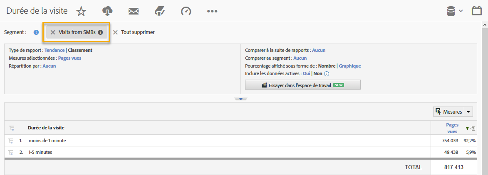

# Utilisation de l’intégration {#using-the-integration}

Une fois l’intégration déployée, vous pouvez commencer à utiliser les fonctionnalités supplémentaires qu’elle fournit.

>[!NOTE] Il peut s’écouler entre 24 et 48 heures avant que certaines données Demandbase ne commencent à apparaître dans les rapports Adobe Analytics.

Voici quelques actions que vous pouvez effectuer pour tirer parti de cette intégration dans Adobe Analytics :

## Affichage des mesures de trafic et de conversion par dimension Demandbase {#viewing-traffic-and-conversion-metrics-by-demandbase-dimension}

Cette intégration fournit de nouvelles dimensions qui sont disponibles sous forme de rapports Adobe Analytics.

Le rapport ci-dessous est un exemple d’analyse des visites et d’une mesure de conversion (abonnements au webinaire) qui ont été ventilées par type d’audience puis par secteur industriel.

## Segmentation par dimensions Demandbase {#segmenting-by-demandbase-dimensions}

L’une des principales fonctionnalités de cette intégration est la possibilité de créer des segments Adobe Analytics en fonction des dimensions Demandbase.

Vous pouvez, par exemple, créer un segment qui inclura uniquement les visites des PME. Vous pouvez appeler ces visites à partir de PME. Sa définition serait la suivante :

L’audience est égale à PME.

Pour plus d’informations sur la création de segments, consultez le [guide de segmentation Analytics](https://docs.adobe.com/content/help/fr-FR/analytics/components/segmentation/seg-home.html).

Ce segment peut ensuite être appliqué à pratiquement n’importe quel rapport. Par exemple, le rapport Durée de la visite est présenté ici : 
