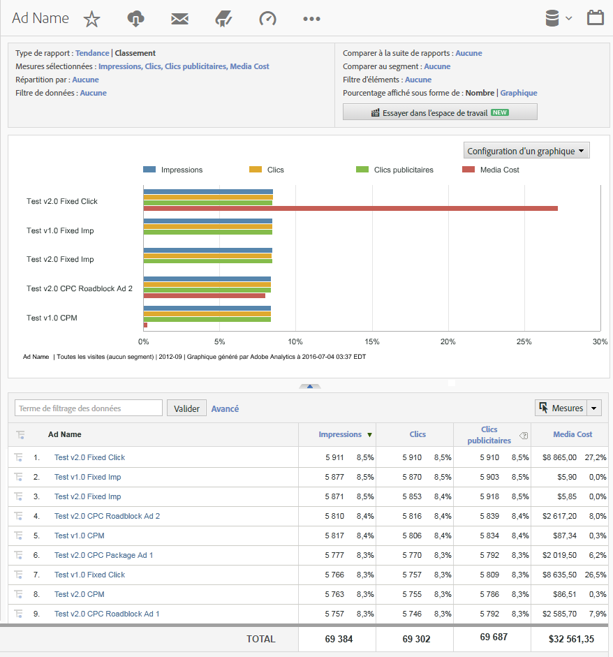

# Rapports Analytics utilisant des données DFA {#analytics-reports-using-dfa-data}

Une fois que les serveurs de collecte DFA et Adobe® communiquent, vous pouvez générer dans la fonctionnalité Reports &amp; Analytics des rapports qui comprennent les données DFA.

Les rapports DFA prédéfinis comprennent ce qui suit :

**Canal** : présente les données en comparant les bannières publicitaires à d’autres options de publicité en ligne, comme la recherche payante ou le publipostage.

**Outil de remise** : présente les données en comparant DoubleClick for Advertisers à d’autres services publicitaires en ligne.

**Nom du site** : présente les données en comparant les sites Web où apparaissent les bannières publicitaires DFA.

**Nom de page** : présente les données en comparant les pages Web individuelles où apparaissent les bannières publicitaires DFA.

**Nom de publicité** : présente les données en comparant des bannières publicitaires DFA spécifiques.

**Campagnes** : présente les données en comparant les différentes campagnes publicitaires DFA.

Pour générer un rapport DFA, procédez comme suit :

1. Connectez-vous à Adobe Experience Cloud.
1. Sélectionnez **[!UICONTROL Analytics]** > **[!UICONTROL Reports &amp; Analytics]**. Vérifiez que vous avez sélectionné la suite de rapports où vous avez installé l’intégration DFA.

1. Dans le volet de navigation de gauche, sélectionnez la variable de conversion qui capture les données de clic publicitaire DFA, puis sélectionnez le rapport DFA souhaité.
1. Cliquez sur **[!UICONTROL Ajouter des mesures]**. La boîte de dialogue Sélecteur de mesure s’ouvre.
1. Vérifiez les mesures Impressions et Clics dans la liste **[!UICONTROL Mesures disponibles]**, puis cliquez sur **[!UICONTROL Appliquer]**.

   Le rapport résultant présente les données sur les impressions, les clics et les recettes, de sorte que vous puissiez observer de quelle façon les services DFA se traduisent en recettes générales.
Par exemple, un rapport de nom de publicité DFA présente les données d’impressions, de clics et de recettes directement attribuables aux bannières publicitaires spécifiques dans votre campagne publicitaire DFA actuelle :

   

Ce rapport a les particularités suivantes :

* L’en-tête du rapport, libellé Rapport Nom de publicité_DFA, indique la période du rapport (février 2009) et qu’il s’agit d’un rapport de classement présenté sous forme de barres horizontales.
* Le graphique lui-même présente trois mesures (impressions, clics et recettes) pour chaque publicité DFA du rapport.
* Le graphique présente les données pour chaque mesure sous forme d’un pourcentage du total des mesures, plutôt qu’en utilisant les chiffres réels de chaque mesure. Vous pouvez modifier ce paramètre dans la boîte de dialogue **[!UICONTROL Configurer le rapport]**.
* Sous le graphique, le rapport Nom de publicité_DFA répertorie les détails du rapport pour chacune des publicités DFA et présente les performances de la publicité sous forme de chiffres et de pourcentages.
* Sélectionnez un nom de publicité DFA spécifique pour ouvrir un menu des options permettant d’obtenir davantage d’informations sur cette publicité DFA particulière.
* Chaque colonne de mesures comprend un code de couleur correspondant à la couleur de la mesure dans le graphique.
* Le rapport est classé selon la mesure Recettes, en commençant par la publicité générant le plus de recettes. Vous pouvez modifier l’ordre du rapport en cliquant sur un autre libellé de colonne (mesure).
