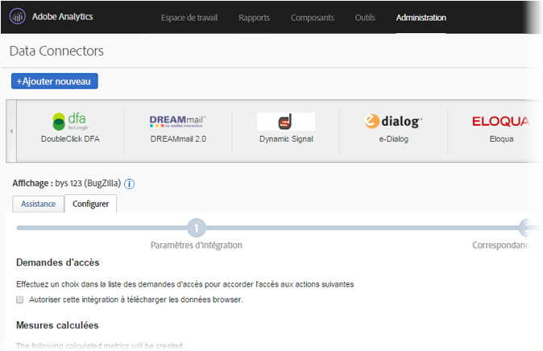
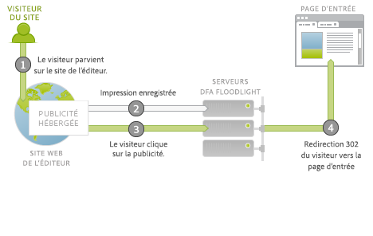
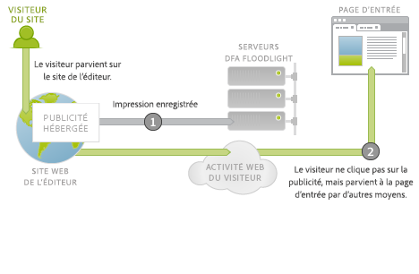
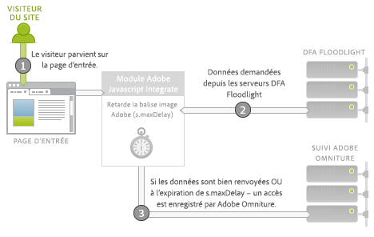
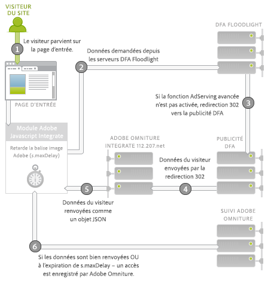

# DFA Connecteur de données pour Adobe Analytics {#dfa-data-connector-for-adobe-analytics}

Sur le marché en ligne actuel, de plus en plus complexe et concurrentiel, les publicitaires et les agences doivent continuellement approfondir leur compréhension de l’environnement marketing en ligne et mieux comprendre leur retour sur les dépenses publicitaires. Les publicitaires, les agences et les éditeurs possèdent tous des outils spécifiques qui les aideront à réaliser ces objectifs. Toutefois, l’agrégation manuelle des données issues de systèmes et de processus de données disparates peut considérablement amoindrir l’efficacité des campagnes marketing en ligne, ce qui se traduit par des performances de la campagne, des données disparates et une certaine confusion.

L’intégration DoubleClick for Advertisers (DFA) résout ce problème en utilisant le composant Data Connectors d’Adobe® afin d’autoriser DoubleClick DFA à transmettre automatiquement des données aux Reports &amp; Analytics.

**[!UICONTROL Analytics]** > **[!UICONTROL Administration]** > **[!UICONTROL Data Connectors]**

## Avantages clés {#key-benefits}

Avantages clés du connecteur de données – L’intégration DFA comprend ce qui suit :

* **Conversion accrue** : profitez de statistiques directionnelles afin d’optimiser le référencement des campagnes publicitaires et la conversion sur site en fonction du comportement et des préférences des visiteurs après leur clic.
* **Emplacement partagé des données** : combinez les données des affichages et clics publicitaires DoubleClick DFA aux Reports &amp; Analytics afin d’améliorer la collaboration à l’échelle de l’entreprise et les capacités de prendre des décisions objectives.
* **Analyse à valeur ajoutée** : grâce à l’intégration automatisée entre DFA et les Reports &amp; Analytics Adobe, les publicitaires et les agences passent moins de temps à compiler les données et peuvent davantage se consacrer à l’analyse des rapports et agir en conséquence.
* **Statistiques plus approfondies sur les clients** : profitez d’informations plus approfondies sur les visiteurs et découvrez d’où ils viennent et ce qu’ils font sur votre site.
* **Mesures de succès de durée de vie** : mesurez l’efficacité de vos campagnes d’acquisition pour tout le cycle de vie du visiteur.
* **Création de rapports intégrés** : synchronisez automatiquement les données entre DFA et les Reports &amp; Analytics afin de bénéficier de processus d’entreprise et de rapports rationalisés.
* **Analyse des visiteurs sur la durée de vie** : mesurez l’efficacité d’une campagne selon plusieurs événements de succès définis par l’utilisateur, pour toute la durée de vie.
* **Mesures de coût** : optimisez le retour sur investissement en comparant dans un seul système les coûts DFA et les recettes générées par ces coûts.

## Présentation de l’intégration AdServing {#ad-serving-integration-overview}

Cette intégration peut capturer les données au sujet du visiteur orienté par une publicité de plusieurs façons. La première consiste à cliquer sur une publicité qui dirige vers une page d’entrée balisée, ce qu’on appelle un clic publicitaire.

Le visiteur est dirigé sur le site d’un éditeur, qui héberge la publicité. Cette publicité porte un identifiant unique, appelé un ID de publicité. Les publicités se composent d’un référencement et d’un attribut créatif, qui décrivent où se trouve la publicité sur le site de l’éditeur et quel contenu était présenté au visiteur. Quand le visiteur récupère cette publicité, le référencement ou le créatif sur les serveurs de contenu DFA, un suivi est effectué de l’impression jusqu’aux serveurs Floodlight DFA pour ce visiteur (1).

Si le visiteur clique sur la publicité (2), le serveur Floodlight est interrogé, ce qui compte comme un clic, puis l’instruction 302 redirige (3) le visiteur vers la page d’entrée. Quand le visiteur parvient à la page d’entrée, il s’agit d’un clic publicitaire. Cette page comprend le code de suivi Adobe, qui interroge les données du serveur Floodlight DFA.

Si le visiteur ne parvient pas sur la page d’entrée alors que le serveur Floodlight a effectué un suivi sur un clic, il ne s’agit pas d’un clic publicitaire. Certaines publicités et mises en œuvre n’obligent pas systématiquement le navigateur du visiteur à obéir à la redirection 302. Pour plus d’informations sur ce sujet, voir [Rapprochement des écarts de mesures](../dfa-data-connector-analytics/dfa-reconciling-metric-discrepancies.md).

La prochaine mesure capturée par cette intégration survient quand le visiteur reçoit l’impression de publicité, ne clique pas, mais parvient tout de même dans un futur proche sur la page d’entrée par un autre moyen.

Ce scénario est alors nommé un affichage publicitaire. Il diffère du scénario du clic publicitaire du fait que le visiteur ne clique pas sur la publicité, mais poursuit d’autres activités avant de parvenir à la page d’entrée (2). Dans le plus simple des cas, le visiteur saisit l’URL de la page d’entrée dans le navigateur. Il arrive aussi que le visiteur poursuive sa navigation mais parvienne ensuite à la page d’entrée en utilisant un moteur de recherche. Dans tous les cas, l’utilisateur parvient à la page d’entrée.

## Intégration Adobe : Collecte de données en temps réel {#adobe-integration-real-time-data-collection}

L’illustration suivante présente le fonctionnement de la collecte des données.

La portion de collecte de données de l’intégration Adobe commence quand le visiteur parvient à la page d’entrée (1). Le code de collecte de données Adobe s’exécutant sur la page d’entrée ne connaît pas l’historique du visiteur eu égard aux publicités diffusées. L’équipe Google DFA a coordonné un service s’exécutant sur le serveur DFA Floodlight afin d’autoriser le code Adobe à interroger les informations publicitaires au sujet du visiteur actuellement sur le site (2). Pour obtenir ces données, la balise image Adobe est temporairement retardée et les données sont demandées auprès du serveur Floodlight.

Une fois les données reçues (ou si cela prend trop de temps), l’accès est déclenché sur les serveurs de suivi Adobe (3).

Le module Integrate est un module Adobe JavaScript principal spécial qui retarde la balise image Adobe, en attendant la demande d’un tiers pendant une durée spécifique (`s.maxDelay`). `s.maxDelay` définit la durée pendant laquelle le module Integrate attend les données du serveur DFA Floodlight avant de déclencher la balise image sur le navigateur du visiteur. Ce comportement est important, de sorte que les données de base du visiteur continuent à être collectées même quand les serveurs DFA Floodlight sont hors service ou lourdement chargés. Si les données Floodlight arrivent avant l’expiration de `s.maxDelay`, les données de suivi Adobe sont immédiatement déclenchées et contiennent les données DFA supplémentaires.

Quand le délai expire, le code de la page peut spécifier un événement Reports &amp; Analytics Adobe, qui sera utilisé comme événement de dépassement de délai. Cet événement est utile pour diagnostiquer les problèmes d’intégration ou lors du réglage de `s.maxDelay`. En cas de dépassements de délai excessifs, augmentez `s.maxDelay`. `s.maxDelay` peut être défini avec une valeur trop élevée. Toutefois, dans ce cas, les visiteurs sont susceptibles de quitter le site avant l’expiration du délai `s.maxDelay`.

Il arrive que le serveur Floodlight réagisse à des erreurs au sujet du visiteur. Ceci survient généralement lorsque le serveur Floodlight ne sait rien au sujet du visiteur, car celui-ci n’a encore vu aucune publicité ou qu’il n’a pas de cookie de visiteur DFA. Le code de page peut spécifier une variable de conversion personnalisée (eVar) qui collectera ces erreurs et peut contribuer à résoudre les problèmes de mise en œuvre ou à signaler les erreurs relatives à la transaction Google. Erreurs les plus courantes : aucun historique, aucun cookie, erreur de requête et désabonnement, comme décrit dans le tableau suivant :

| Erreur | Nom | Description |
|---|---|---|
| nh | Aucun historique | Le visiteur n’a affiché aucune publicité ni cliqué dessus. |
| nc | Aucun cookie | Le visiteur n’a pas de cookie de visiteur DFA. |
| qe | Erreur de requête | Erreur lors de l’interrogation des données pour le serveur Floodlight. |
| oo | Désabonné | Le visiteur a désactivé le suivi des clics et des impressions Google. |

## Intégration Adobe : importation de données de nuit {#adobe-integration-nightly-data-import}

La portion de collecte de données de l’intégration recueille les données de clics publicitaires et d’affichages publicitaires au sujet des visiteurs du site. Afin d’obtenir les mesures de coûts, d’impressions et de clics DFA, un processus de nuit coordonné par Google et Adobe importe ces données supplémentaires dans la suite de rapports intégrée. Ces mesures sont importées par le biais des sources de données, ce qui signifie qu’elles sont disponibles sous forme d’agrégat seulement, et non au niveau de la visite.

## Différences de versions {#version-differences}

Il existe actuellement trois versions de l’intégration DFA : versions 1.0, 1.5 et 2.0.

Le tableau suivant résume les fonctions de chaque version de l’intégration.

| Fonctionnalité | Version 1.0 | Version 1.5 | Version 2.0 |
|---|---|---|---|
| Mesures de nuit de clics et d’impressions DFA | Oui | Oui | Oui |
| Suivi des clics publicitaires et des affichages publicitaires | Oui | Oui | Oui |
| L’intégration reçoit les données à un niveau Advertiser | Non | Oui | Oui |
| L’intégration reçoit les données à un niveau de configuration Floodlight | Non | Non | Oui |
| Mesures de coûts | Non | Non | Oui |
| Mesures de créatifs | Non | Non | Oui |
| Chaînes de requête supérieures à 2 000 octets | Non | Oui | Oui |
| Utilise le module Integrate pour une collecte optimale des données tierces | Non | Oui | Oui |
| Suivi des dépassements de délai et des erreurs | Non | Oui | Oui |
| Identifiant côté client négocié non nécessaire | Non | Non | Oui |

### Version 1.5 {#section-b5a3e967cfa141ea8f740612336181be}

La version 1.5 de l’intégration introduit le module Integrate au code JavaScript de la page d’entrée. Le module Integrate permet d’envoyer des demandes à taille fixe au serveur de publicités DFA (ad.doubleclick.net) qui pallie les limites de demandes à 2 000 octets de l’intégration précédente. Elle comprend également une variable de dépassement de délai configurable, *`s.maxDelay`*, afin de continuer à collecter des données de visiteur Adobe en cas de panne du réseau. Les erreurs et dépassements de délai peuvent également être capturés dans les variables Analytics.

L’illustration suivante présente les interactions réseau sur la page d’entrée de la version 1.5.

Dans la version 1.5, le module Integrate (2) demande les données au serveur Floodlight (3). Le serveur Floodlight redirige la demande vers le serveur de publicités DFA, qui renvoie les données sur le visiteur de la même façon que la version 1.0. Il envoie une instruction de redirection 302 (4) à un service de traduction spécial à l’adresse integrate.112.2o7.net, qui convertit la structure de la réponse en objet JSON. Le module Integrate consomme cet objet JSON et transmet les informations au suivi Adobe (5).

La migration de la version 1.0 de l’intégration à la version 1.5 implique un changement JavaScript. Pour obtenir ce code JavaScript, connectez-vous à votre compte Adobe Online Marketing Suite, choisissez le produit Genesis, cliquez sur Edit (Modifier) dans votre intégration DFA, puis exécutez l’assistant. Si un identifiant de site client a déjà été affecté, vous recevrez immédiatement le nouveau code JavaScript par courrier électronique une fois l’intégration enregistrée. Une fois que vous avez ce code, une nouvelle version du s_code principal est également nécessaire pour le module Integrate. Vous pouvez demander ce code auprès de votre gestionnaire de compte ou de votre conseiller en mise en œuvre.

L’une des fonctions importantes du nouveau code JavaScript réside dans le fait qu’aucun changement de mise en œuvre n’est nécessaire entre la version 1.5 et la version 2.0.

### Version 2.0 {#section-afd56de0c56c4489bb5ddc5798d6709a}

La dernière version de l’intégration DFA procure des données pour une configuration Floodlight entière dans l’intégration. Avant la version 2.0, des intégrations individuelles étaient liées à une seule instance DFA Advertiser. Grâce à ce changement, les mesures de clics, d’impressions et de coûts pour toute la configuration Floodlight seront incluses dans la suite de rapports intégrée. Il est également possible d’effectuer le suivi intersite des affichages publicitaires, quand ces deux sites se trouvent dans la même configuration Floodlight.

Les mesures de coûts de médias sont également disponibles à compter de la version 2.0 de l’intégration. Pour activer les mesures de coûts de médias pour une intégration, vous devez choisir un événement Reports &amp; Analytics pour le coût de médias dans l’assistant Genesis, puis spécifier la devise des chiffres de mesures dans l’interface DFA.

Les dépassements de délai devraient diminuer avec l’intégration 2.0, puisque les redirections 302 ont été éliminées, tandis que la quantité de données pouvant être intégrées devrait augmenter.

Si une configuration Floodlight est une configuration partagée dans DFA, la mise à niveau de la version 1. 5 à la version 2.0 génère des données de conversion pour tous les publicitaires partagés dans la configuration Floodlight à inclure dans la suite de rapports.

### Mise à niveau vers la version 2.0 {#section-f0bf90b9a7a1434ab1540b6c0999f4c7}

Le tableau suivant décrit les propriétaires pour la migration vers les versions plus récentes de l’intégration :

| Migration | Propriétaire | Tâches |
|---|---|---|
| Version 1.0 à 1.5 | Client | Mettre en œuvre le code JavaScript de la version 1.5 avec le module Integrate |
| Version 1.5 à 2.0 | Client | Le client commence la discussion avec Google au sujet des délais de mise à niveau. Après approbation, Google active la fonction AdServing avancée. |
