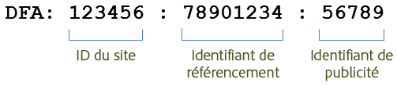
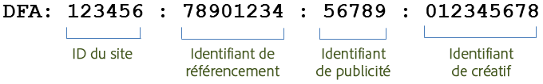

# Fonctions d’intégration {#integration-features}

Une fois activée, l’intégration DFA des Data Connectors fournit les mesures suivantes pour les rapports Adobe Analytics :

* Affichages publicitaires
* Clics DFA
* Impressions
* (Facultatif) Données de coûts DFA
* (Facultatif) Erreurs de requête DFA, dépassements de délai

> [!NOTE] Cette intégration ne propose aucune assistance pour les outils de suivi de clics (anciennement les commandes de clic). Les outils de suivi de clics servent à enregistrer le nombre de clics sur les liens de texte, les liens dans les messages électroniques ou d’autres éléments codés en dur sur un site Web.

L’intégration DFA Data Connectors construit automatiquement les codes de suivi DFA à partir des données renvoyées par DFA. Ces codes de suivi sont construits de façon à identifier de manière unique une publicité ainsi que son référencement et son créatif associés. L’illustration ci-après décrit la structure du code de suivi, selon la version de l’intégration. Version 1.5 :

Version 2.0 :

Ces identifiants agissent comme une clé partagée entre Genesis et DFA afin d’associer les classifications et mesures correctes.

| ID du site | Site tiers sur lequel était hébergée la publicité. La classification du nom de site fournit un nom explicite de cet identifiant de site. |
|---|---|
| Identifiant de publicité | Identifiant du message commercial distribué à un utilisateur. La classification du nom de publicité contient le nom de la publicité comme défini par votre organisation dans le système DFA. Par exemple : `Hybrid Coup Textlink - Build`. |
| Identifiant de référencement | Représentation dans votre compte DFA d’un site web, d’une portion d’un site web ou d’un groupe de sites web où vous avez acheté l’espace publicitaire. |
| ID d’élément créatif | Image, fichier SWF Flash ou autre ressource qui sera présentée au visiteur. La classification de nom de créatif contient le nom que vous avez donné à ce créatif dans l’interface DFA. |

Les deux autres classifications, Delivery Tool (Outil de remise) (DoubleClick for Advertisers) et Canal (bannière publicitaire) ont les mêmes valeurs pour toutes les campagnes DFA et permettent de distinguer les données DFA importées.

## Déduplication SearchCenter {#section-f809b3bb5e5142aa8ff89bcd5f0d0e49}

L’intégration DFA est désormais compatible avec Adobe SearchCenter. En activant la déduplication SearchCenter via l’assistant des Data Connectors, les visiteurs en provenance de moteurs de recherche n’entraîneront pas l’extraction des données du serveur Floodlight de DFA et *`s.campaign`* ne seront pas remplis par la DFA, ce qui permettra à SearchCenter de les renseigner. En outre, DFA et SearchCenter renseignent maintenant les valeurs de déduplication dans les variables de chaque produit.

La liste ci-dessous décrit la logique activée quand la déduplication SearchCenter est activée :

Si l’option **[!UICONTROL DFA]** > **[!UICONTROL Déduplication SearchCenter]** est sélectionnée dans l’assistant :

* Dans le cas d’un clic publicitaire DFA, l’intégration renseignera la chaîne « DFA Clickthrough » (clic publicitaire DFA) avec l’eVar SCM configurée.
* Dans le cas d’un affichage publicitaire DFA, l’intégration renseignera la chaîne « DFA Viewthrough » (affichage publicitaire DFA) avec l’eVar SCM.

Si l’option **[!UICONTROL SearchCenter]** > **[!UICONTROL Déduplication DFA]** est sélectionnée dans l’assistant :

* Dans le cas d’un affichage publicitaire DFA, l’intégration renseignera la chaîne « DFA Viewthrough » (affichage publicitaire DFA) avec l’eVar SCM.

> [!NOTE] Si l’option SearchCenter > Déduplication DFA est activée et que le paramètre de chaîne de requête SearchCenter est défini, la visite n’est pas prise en compte pour le traitement DFA. Ceci signifie que le paramètre de chaîne de requête SearchCenter doit différer du paramètre de clic publicitaire DFA et qu’aucune publicité affichée ne doit définir le paramètre de chaîne de requête SearchCenter.

