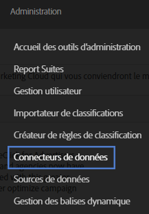
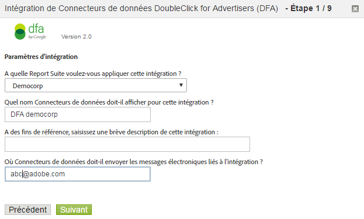

# Intégration DFA {#dfa-integration}

La configuration de l’intégration DFA implique les tâches suivantes :

## Configuration de l’intégration DFA {#configure-the-dfa-integration}

Découvrez les étapes de l’intégration des Data Connectors DFA.

Les pages de configuration présentent un aperçu de l’intégration, ainsi que des liens utiles conduisant vers davantage d’informations. Cette intégration engendre des frais Adobe et DoubleClick. Contactez votre représentant commercial au sujet des deux organisations et veillez à comprendre la structure des frais.

1. Connectez-vous à [!DNL Adobe Analytics].
1. Cliquez sur **[!UICONTROL Administration]** > **[!UICONTROL Data Connectors]**.

   

1. Localisez **[!UICONTROL DoubleClick DFA]**, puis cliquez sur **[!UICONTROL Ajouter]**.

   

   Sur chaque page de l’assistant d’intégration, fournissez les informations requises, puis cliquez sur **[!UICONTROL Suivant]**. Le tableau suivant explique quelles sont les informations nécessaires pour exécuter l’intégration à l’aide de l’assistant.

<table id="table_8F6F7F304C36431DA5FD6E5D54F60FC0"> 
 <thead> 
  <tr> 
   <th colname="col1" class="entry"> N° de page de l’Assistant </th> 
   <th colname="col2" class="entry"> Champ </th> 
   <th colname="col3" class="entry"> Description </th> 
  </tr> 
 </thead>
 <tbody> 
  <tr> 
   <td colname="col1"> 1 </td> 
   <td colname="col2"> Nom d’intégration </td> 
   <td colname="col3"> Nom d’intégration affiché par Genesis dans la liste d’intégration active de la suite de rapports. </td> 
  </tr> 
  <tr> 
   <td colname="col1"> 1 </td> 
   <td colname="col2"> Adresse de courriel d’intégration </td> 
   <td colname="col3"> Adresse électronique qui reçoit toutes les notifications liées à cette intégration. </td> 
  </tr> 
  <tr> 
   <td colname="col1"> 2 </td> 
   <td colname="col2"> Nom d’utilisateur </td> 
   <td colname="col3"> Nom d’utilisateur de l’API DFA à utiliser avec cette intégration. Afin qu’un utilisateur puisse se connecter à l’API, vérifiez l’attribut de cette dernière dans l’interface DFA. Ensuite, un champ de mot de passe s’affiche où vous pouvez spécifier un mot de passe pour l’utilisateur. Ce mot de passe est saisi avec le nom d’utilisateur dans l’assistant pour authentification. </td> 
  </tr> 
  <tr> 
   <td colname="col1"> 2 </td> 
   <td colname="col2"> Mot de passe </td> 
   <td colname="col3"> Mot de passe de l’API DFA. </td> 
  </tr> 
  <tr> 
   <td colname="col1"> 2 </td> 
   <td colname="col2"> Identifiant publicitaire </td> 
   <td colname="col3"> <p>Identifiant de publicitaire DFA ou identifiant de configuration Floodlight parent. La fonctionnalité Data Connectors utilise cet identifiant afin d’identifier le publicitaire DFA à suivre (version 1.5 de l’intégration). Cet identifiant publicitaire n’est pas utilisé dans la version 2.0 de l’intégration ; l’identifiant de configuration Floodlight parent sera recherché et utilisé à la place. Suivez les instructions à l’écran. </p> </td> 
  </tr> 
  <tr> 
   <td colname="col1"> 3 </td> 
   <td colname="col2"> Variable publicitaire DFA </td> 
   <td colname="col3"> eVar Analytics qui reçoit l’attribut de campagne DFA et les données sur les impressions et les clics. Généralement, il s’agit de l’eVar du code de suivi ( <span class="varname"> s.campaign </span>), mais vous pouvez choisir n’importe quelle eVar disponible. Data Connectors ajoute également les classifications DFA suivantes à l’eVar sélectionnée : <p><b>Campagnes</b> : collection des publicités diffusées sur plusieurs sites qui convoient un message commun. </p> <p><b>Nom du site</b> : site où était diffusée la publicité. </p> <p><b>Nom de la publicité</b> : nom de la publicité, comme défini dans votre compte DFA. </p> <p><b>Site Placement Name</b> (Nom de référencement du site) : site web et page où était diffusée la publicité. </p> <p><b>Delivery Tool</b> (Outil de remise) : DoubleClick for Advertisers. </p> <p><b>Canal</b> : bannière publicitaire. </p> <p><b>Cost Structure</b> (Structure de coûts) : coût par million, coût par clic ou coût fixe, selon la structure de coûts de la publicité. </p> <p><b>Creative Name</b> (Nom du créatif) : nom du créatif associé à une publicité, un référencement et un identifiant de créatif. </p> <p><b>DFA &gt; Déduplication SearchCenter</b> : spécifie que DFA référence les valeurs dans les variables SearchCenter en cas de clics ou affichages publicitaires DFA </a> . </p> </td> 
  </tr> 
  <tr> 
   <td colname="col1"> 4 </td> 
   <td colname="col2"> Impressions </td> 
   <td colname="col3"> Événement personnalisé qui reçoit les données des mesures d’impressions DFA. Les impressions indiquent le nombre de fois où la publicité a été diffusée. </td> 
  </tr> 
  <tr> 
   <td colname="col1"> 4 </td> 
   <td colname="col2"> Clics </td> 
   <td colname="col3"> Sélectionnez l’événement personnalisé qui reçoit les données des mesures de clics DFA. Les clics indiquent le nombre de fois où les visiteurs ont cliqué sur la publicité, tel que mesuré par la redirection de DFA. La mesure Clics établit la corrélation avec la mesure de clics publicitaires Analytics. <p>Remarque : les clics DFA et les clics publicitaires Analytics peuvent ne pas correspondre exactement, car les données sont collectées différemment.  </a> </p> </td> 
  </tr> 
  <tr> 
   <td colname="col1"> 5 </td> 
   <td colname="col2"> View-Through Variable (Variable d’affichage publicitaire) </td> 
   <td colname="col3"> <p>eVar Analytics qui reçoit les données d’affichage publicitaire DFA. La variable d’affichage publicitaire permet de savoir de quelle façon les affichages publicitaires affectent les taux de conversion sur votre site. </p> <p>La fonctionnalité Data Connectors ajoute les mêmes classifications liées à DFA pour cette eVar que pour la variable publicitaire DFA (voir ci-dessus). </p> </td> 
  </tr> 
  <tr> 
   <td colname="col1"> 5 </td> 
   <td colname="col2"> Time Since Last View (Durée depuis le dernier affichage) (variable d’intervalle de temps de l’affichage publicitaire) </td> 
   <td colname="col3"> eVar Analytics qui reçoit les données de durée depuis le dernier affichage DFA. La durée depuis le dernier affichage correspond à la durée écoulée depuis le dernier affichage publicitaire. </td> 
  </tr> 
  <tr> 
   <td colname="col1"> 5 </td> 
   <td colname="col2"> Affichages publicitaires </td> 
   <td colname="col3"> Événement personnalisé qui reçoit les données des mesures d’affichages publicitaires DFA. Utilisez l’événement d’affichages publicitaires avec la variable d’affichage publicitaire pour savoir quelles campagnes n’ont pas influencé un affichage publicitaire direct, mais peuvent avoir joué un rôle pour orienter le trafic vers le site à un moment consécutif. <p>La fonctionnalité Data Connectors renomme l’événement personnalisé sélectionné en « affichages publicitaires ». </p> </td> 
  </tr> 
  <tr> 
   <td colname="col1"> 6 </td> 
   <td colname="col2"> Échec de la requête DFA </td> 
   <td colname="col3"> (Facultatif) eVar Analytics qui reçoit les codes de message d’erreur de requête DFA signalés. Codes de message DFA possibles : 
    <ul id="ul_85FC7FB19F7F4ADF83ABCA6DDB44CE19"> 
     <li id="li_0A3181DED5A149588A0D3F1584E2FE8B"><b>nc</b> : aucun cookie DoubleClick. </li> 
     <li id="li_D397AA73AD5E4086A18B87F271E4EC14"><b>oo</b> : l’utilisateur s’est désabonné. </li> 
     <li id="li_5AC1D0C8049340B4AD857D88E275CBD6"><b>nh</b> : aucun historique de campagne. </li> 
     <li id="li_73A8C5E905C54E2BB531A1FCDBC6AA1A"><b>qe</b> : erreur de requête (délai dépassé, serveur en panne, etc.). </li> 
    </ul> </td> 
  </tr> 
  <tr> 
   <td colname="col1"> 6 </td> 
   <td colname="col2"> Événement de dépassement de délai </td> 
   <td colname="col3"> <p>Événement de compteur Analytics qui s’incrémente chaque fois que le délai <span class="varname"> s.maxDelay </span> expire et qu’aucune réponse n’est reçue des serveurs DFA. Utilisez cet événement pour configurer le réglage de la variable <span class="varname"> s.maxDelay </span></a>. </p> </td> 
  </tr> 
 </tbody> 
</table>

## Mises à jour de site web pour l’intégration DFA {#web-site-updates-for-the-dfa-integration}

Une fois que Genesis a configuré la suite de rapports Analytics pour l’intégration DFA, vous devez procéder comme suit pour configurer votre site web et votre environnement DFA dans le cadre de cette intégration :

### Vérification de l’espace de cookie sur le domaine {#verify-cookie-space-on-the-domain}

L’intégration des Data Connectors pour DFA nécessite que vous définissiez un cookie sur le domaine de la page.

Bien que cela soit rare, certains domaines ont atteint la capacité maximale de cookies pour certains navigateurs Web. Afin d’éviter d’affecter l’expérience de navigation d’un visiteur sur votre site web, consultez votre équipe de développement et d’exploitation du réseau ou votre équipe d’ingénieurs afin de vérifier que l’ajout d’un autre cookie au domaine des pages utilisées pour l’intégration DFA n’affecte pas l’expérience de l’utilisateur. Vous devez également sélectionner un nom pour le cookie.

### Mise à jour du paramètre de chaîne de requête DFA {#update-your-dfa-query-string-parameter}

Si vous effectuiez déjà le suivi des campagnes publicitaires avec Adobe Analytics avant l’intégration de DFA, il est possible que toutes les campagnes (publipostage, recherche ou bannière) utilisent le même paramètre de chaîne de requête pour reconnaître l’identifiant de campagne référent sur la page d’entrée.

Afin de comprendre quand demander des données de clics publicitaires et d’affichages publicitaires auprès des données DFA pour vos campagnes publicitaires DFA, les Data Connectors doivent détecter quand un visiteur a cliqué sur une bannière publicitaire d’une campagne DFA. Pour ce faire, vous devez ajouter un paramètre de chaîne de requête différencié à l’URL de page d’entrée de la campagne publicitaire DFA afin que les Data Connectors puissent distinguer les pages de la campagne publicitaire DFA des autres pages de campagne publicitaire qui peuvent apparaître sur votre site web. Le `dfa_overrideParam` dans le plug-in JavaScript utilisé pour DFA.

>[!CAUTION]
>
>La variable Campaign peut être utilisée pour d’autres campagnes. Toutefois, ne l’utilisez pas pour les campagnes DFA. Si vous définissez la variable Campaign sur une page d’entrée de campagne DFA, Adobe ne peut pas lier les impressions et clics aux clics publicitaires de la campagne DFA. Une fois par visite, les serveurs de collecte Adobe vérifient s’il existe un clic ou affichage publicitaire antérieur sur les serveurs DFA. Pour cette raison, n’incluez le code du plug-in DFA que sur les pages d’entrées courantes afin d’éviter des redirections superflues susceptibles de ralentir le temps de chargement des pages, en particulier quand les connexions Internet sont lentes.

## Mise à jour du code de collecte de données de votre site web {#update-your-web-site-s-data-collection-code}

L’intégration Genesis pour DFA met à profit l’identifiant de configuration DFA Floodlight (dfa_SPOTID), qui améliore la cohérence du rapport entre DFA et le système de collecte de données Adobe.

> [!NOTE] Le terme Spotlight a été remplacé par le terme Floodlight dans une version récente de Google DFA. Le paramètre JavaScript `dfa_SPOTID` a été nommé en fonction de la terminologie Spotlight, mais il est utilisé avec les deux versions.

Pour activer l’intégration DFA sur votre site Web, vous devez mettre à jour le code de collecte de données JavaScript en ajoutant ce qui suit :

* Module Integrate pour DFA
* Ajout à votre code de collecte

### Module Integrate pour DFA {#section-fa00e42a732a4e27a4ab3dfcfeae1a5b}

L’intégration DFA met à profit le module Integrate d’Adobe Experience Cloud, qui ajoute la fonctionnalité à votre code de collecte de données JavaScript ( `s_code.js`). Le module Integrate fait partie du fichier .zip lorsque vous téléchargez le code AppMeasurement pour JavaScript depuis le Gestionnaire de code. Contactez votre consultant Adobe uniquement si vous avez besoin d’aide supplémentaire pour le trouver.

Insérez le code du module Integrate dans la section `Modules` du fichier `s_code.js` de votre site web.

### Ajout à votre code de collecte {#section-8f98c727f1ba414fb8b4f02d696b8791}

Selon vos sélections lors de l’activation de l’intégration DFA dans l’assistant d’intégration, les Data Connectors génèrent et vous envoient par courrier électronique un ajout personnalisé pour votre code de collecte de données JavaScript. Insérez ce code dans la section principale du fichier `s_code.js` (et non dans la fonction `doPlugins` ni dans une autre fonction).

L’exemple de code illustré ci-dessous est présenté à seule fin de référence ; utilisez le code qui vous a été envoyé par courrier électronique quand vous aurez exécuté l’assistant d’intégration Data Connectors.

Le code de collecte est constitué des composants suivants :

* Paramètres DFA Integrate
* Modules externes requis pour l’intégration

**Paramètres DFA Integrate**

```
/************************** DFA VARIABLES **************************/ 
var dfaConfig = { 
   CSID:              "1234567", 
   SPOTID:            "29876543", 
   tEvar:             "eVar17", 
   errorEvar:         "eVar59", 
   timeoutEvent:      "event76", 
   requestURL:         "http://fls.doubleclick.net/ 
json?spot=[SPOTID]&src=[CSID]&var=[VAR]&host=integrate.112.2o7.net%2 
Fdfa_echo%3Fvar%3D[VAR]%26AQE%3D1%26A2S%3D1&ord=[RAND]", 
 
   maxDelay:          "1500", 
   visitCookie:       "s_dfa", 
   clickThroughParam: "CID", 
   searchCenterParam: "s_kwcid", 
   newRsidsProp:      undefined 
}; 
/************************ END DFA Variables ************************/ 
```

Le bloc Paramètres DFA Integrate définit les variables requises par l’intégration DFA. Les valeurs pour chacune de ces variables sont issues des sources suivantes :

**CSID** : identifiant du site client. Généré par DFA une fois que vous avez exécuté l’assistant d’intégration. Les Data Connectors prérenseignent cette variable à l’aide de votre identifiant du site client DFA et vous envoient cette valeur dans le courrier électronique de configuration après avoir exécuté l’assistant d’intégration. Cette variable n’est pas requise si la fonction AdServing avancée est activée sur votre compte.

**SPOTID** : configuration Floodlight (précédemment appelée Spotlight ID). Les Data Connectors prérenseignent cette variable à l’aide de votre identifiant de configuration DFA Floodlight, en fonction des informations de compte DFA que vous avez spécifiées dans l’assistant d’intégration.

**tEvar** : variable de transfert. Les Data Connectors prérenseignent cette variable à l’aide du nom de variable Analytics que vous avez spécifié comme variable d’affichage publicitaire dans l’assistant d’intégration. Ne changez pas cette valeur sans en avoir soigneusement discuté avec les services techniques ou les services Adobe Engineering.

**errorEvar** : variable d’erreur. Les Data Connectors prérenseignent cette variable à l’aide du nom de variable Analytics que vous avez spécifié comme variable d’échec de requête DFA dans l’assistant d’intégration.

**timeoutEvent** : événement de dépassement de délai. Les Data Connectors prérenseignent cette variable à l’aide du nom de variable Analytics que vous avez spécifié comme variable d’événement de dépassement de délai dans l’assistant d’intégration.

**requestURL** : hôte DFA à distance auquel demander les informations publicitaires. Ne modifiez pas cette valeur, sauf si Adobe vous a demandé de le faire.

**maxDelay** : spécifie le temps d’attente par le code de collecte de données JavaScript pour obtenir une réponse du serveur DFA Floodlight, en millisecondes. Adobe recommande de faire des essais avec cette valeur afin de rechercher la valeur optimale en fonction du trafic sur votre site. Par exemple, si vous augmentez cette valeur, davantage de données DFA sont généralement collectées, mais vous risquez de perdre des données de base sur le visiteur si celui-ci quitte le site durant la période du délai. Si vous réduisez cette valeur, le risque de perdre des données d’accès est moindre, mais il est possible que moins de données DFA soient envoyées avec les données d’accès Adobe.

**visitCookie** : nom du cookie utilisé pour restreindre les appels DFA à une fois par visite.

**clickThroughParam** : chaîne de requête, généralement incluse sur toutes les publicités, qui avertit le module Integrate qu’un clic vient d’avoir lieu. La présence de ce paramètre dans la chaîne de requête provoque la demande sur les serveurs DFA Floodlight, même si le visiteur a déjà été sondé au cours des 30 dernières minutes.

**newRsidsProp** : (facultatif) valeur mappée à une variable de propriété de trafic non utilisée. L’intégration DFA collecte et stocke cette valeur dans le cookie de visite afin d’identifier les suites de rapports qui ont collecté des données pour un visiteur particulier. Cette propriété est nécessaire seulement pour les mises en œuvre personnalisées avec les services Adobe Engineering.

**Modules externes requis pour l’intégration**

L’ajout du code de collecte incorpore les modules externes supplémentaires qui améliorent le fonctionnement de l’intégration DFA :

* Limite les requêtes DFA à une requête par visite.
* Procure une certaine flexibilité eu égard au nom de cookie. La plupart des organisations utilisent s_dfa, mais vous pouvez utiliser n’importe quel nom de cookie valide pour l’intégration DFA.
* Élimine les redirections superflues. Les données d’affichage publicitaire sont collectées en temps réel ; pour cette raison, les serveurs de collecte Adobe et les serveurs DFA peuvent éventuellement échanger des données sur chaque page vue. Le module externe bloque ces échanges de données quand les informations ne sont pas nécessaires.

>[!CAUTION]
>
>L’un des mécanismes appliqués par le plug-in consiste à utiliser un cookie de visite basé sur un domaine pour éliminer les requêtes DFA superflues. Une suite de rapports d’intégration qui s’étend sur plusieurs domaines gonfle les données de clics et affichages publicitaires quand les visiteurs traversent les domaines après un affichage ou clic publicitaire influencé par DFA.

## Confirmation d’une intégration DFA réussie {#confirming-a-successful-dfa-integration}

Après avoir effectué toutes les mises à jour de site web nécessaires, utilisez une visionneuse de trafic réseau, telle que Charles*, Chrome Developer Tools ou Firebug*, pour confirmer que DFA communique avec les serveurs de collecte Adobe.

Après avoir déployé le fichier DFA `s_code.js`, utilisez la visionneuse de trafic réseau pour afficher les demandes entre DFA et les serveurs de collecte de données Adobe, en recherchant ce qui suit :

* Une demande au service `fls.doubleclick.net/json` de DFA. Ce service peut répondre différemment selon la version de DFA que vous utilisez. Avec l’intégration de DFA version 1.5 :

   * Une redirection HTTP 302 vers [!DNL ad.doubleclick.net]. Envoie une balise d’emplacement dans la réponse qui contient des informations sur le visiteur de la publicité.
   * Cette balise d’emplacement provoque une redirection vers [!DNL integrate.112.2o7.net/dfa_echo]. Ce service traduit les informations au sujet du visiteur de la publicité dans la chaîne codée JSON (JavaScript Object Notati on). Ces données sont renvoyées avec une réponse HTTP 200 OK.

* Avec l’intégration de DFA version 2.0 (fonction AdServing avancée activée) :

   * [!DNL fls.doubleclick.net] répond directement avec une réponse 200 OK.

Dans les deux cas, une demande réussie engendre une demande aux serveurs de collecte de données Adobe qui contient le paramètre vX, où X est votre numéro d’eVar d’affichage publicitaire. Cette valeur de paramètre prend la forme : DFA-XXXX-XXXX- XXXX-XXXX-XXXX-XXXX-XXXX-XXXX-XXXX. Cette chaîne contient les données au sujet du dernier clic et de la dernière impression pour le visiteur actuel.

## Réglage de s.maxDelay {#tuning-s-maxdelay}

Une mise en œuvre réussie de DFA implique d’optimiser s.maxDelay pour votre site.

En règle générale, la décision d’augmenter ou de diminuer *`s.maxDelay`* implique un compromis entre l’obtention de davantage de données sur les visiteurs DFA et la mise en danger de la collecte de données sur les visiteurs Adobe. Augmenter *`s.maxDelay`* permet d’obtenir plus de données sur les visiteurs DFA, mais (si cette valeur est très élevée) cela risque de compromettre la collecte des données sur les visiteurs d’Adobe. Si vous réduisez s.maxDelay, la collecte des données sur les visiteurs d’Adobe est garantie, mais des données sur les visiteurs de DFA risquent d’être omises.

*`s.maxDelay`* ne se contente pas d’encapsuler le temps pris par les communications réseau pour contacter DFA ; il représente également les délais qui s’écoulent avant que le navigateur ne déclenche et n’évalue le code JavaScript sur lequel reposent ces communications. En effet, le module Integrate commence le minuteur *`s.maxDelay`* après avoir inséré l’élément HTML dans le modèle DOM qui extrait les données du serveur DFA Floodlight. Le temps pris par le navigateur pour réellement initier la demande HTTP d’après ce nouvel élément HTML varie en fonction des autres images ou des fichiers JavaScript qui se chargent simultanément, de la vitesse de l’ordinateur des visiteurs et des mises en œuvre de navigateur spécifiques. En outre, lorsque les données JSON sont récupérées auprès du serveur DFA Floodlight, le code JavaScript doit être évalué par le navigateur. Ceci dépend entièrement du navigateur et peut être retardé si la quantité de code JavaScript s’exécutant simultanément est conséquente ou s’il y a plusieurs demandes JavaScript asynchrones.

Ainsi, *`s.maxDelay`* doit être défini en fonction de la complexité de la page d’entrée et du délai réseau avec DFA. Sur certains sites, l’une des manières possibles de réduire la complexité de la page consiste à déclencher le code de collecte Adobe au début du chargement de la page, de sorte que le navigateur soit moins occupé au moment où le serveur Floodlight est appelé.

La variable de dépassement de délai est obligatoire lors du réglage de *`s.maxDelay`*, car elle est incrémentée chaque fois que le dépassement de délai s.maxDelay est atteint. Lorsque vous aurez décidé d’augmenter ou de diminuer *`s.maxDelay`*, nous vous recommandons de suivre cette procédure :

1. Collectez plusieurs jours de données à l’aide de *`s.maxDelay`* définit sur une valeur particulière.
1. Exécutez un [!DNL Daily Unique Visitors Report] (rapport Visiteurs uniques par jour) pour la période.
1. Exécutez le [!DNL Timeout Event Report] (rapport Événement de dépassement de délai) pour vérifier le nombre de dépassements de délai qui ont eu lieu. N’oubliez pas qu’un dépassement de délai est collecté une seule fois par visiteur.

Avec les chiffres dont vous disposez, calculez :

```
Timeout Percentage = [Step 3] / [Step 2] * 100
```

Le pourcentage de dépassement de délai prend actuellement en compte tous les visiteurs sur le site. Certains de ces visiteurs peuvent en fait n’avoir aucune connexion avec DFA ; le dépassement de délai est donc trompeur. Pour améliorer ce calcul, une autre analyse consiste à prendre en compte seulement les visiteurs uniques sur les pages avec le paramètre `clickThroughParam` défini (par exemple, `?CID=1`). Les résultats seront ainsi plus précis.

Si le pourcentage de dépassement de délai est très faible, envisagez de réduire *`s.maxDelay`*. S’il est très élevé, augmentez *`s.maxDelay`*. Lorsque vous diminuez *`s.maxDelay`*, envisagez d’exécuter à nouveau le [!DNL Timeout Report] (rapport Dépassement de délai) afin de vous assurer que les dépassements de délai n’ont pas considérablement augmenté. Lorsque vous augmentez *`s.maxDelay`*, vous souhaiterez exécuter un [!DNL Page Views Report] (rapport Pages vues) pour vous assurer que les pages vues ne tombent pas en panne en raison de données perdues. À chaque fois que *`s.maxDelay`* est modifiée, observez les données pendant plusieurs jours afin de vous assurer que les données représentent une tendance et pas simplement une fluctuation au jour le jour.

Le paramètre optimal pour *`s.maxDelay`* est le point auquel le pourcentage de dépassement de délai est réduit tandis que les pages vues ne baissent pas.

Les dépassements de délai devraient normalement diminuer quand vous passerez à la version 2.0 de l’intégration, en raison de l’élimination des redirections 302. Les premières conclusions obtenues des utilisateurs de la version bêta ont démontré une réduction constante des dépassements de délai ; davantage de données DFA sont ainsi collectées.
