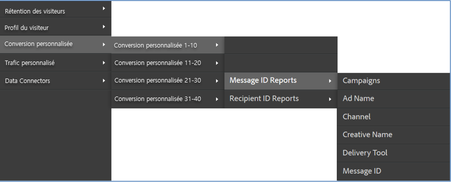
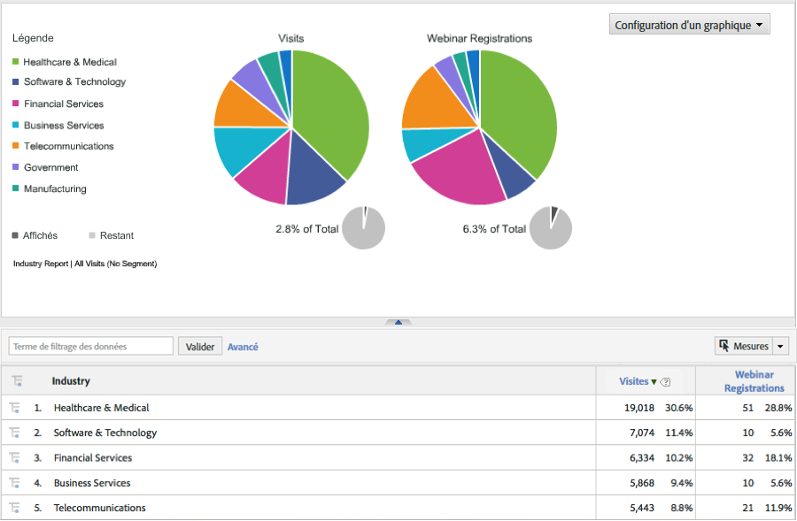

# Déploiement de l’intégration {#deploying-the-integration}

Le déploiement de cette intégration est un processus simple consistant à exécuter l’assistant d’intégration Adobe et à vérifier l’intégration.

## Finalisation de l’assistant d’intégration Adobe {#completing-the-adobe-integration-wizard}

Procédure à suivre pour exécuter l’assistant d’intégration dans l’interface des Data Connectors.

1. Accédez à la zone des Data Connectors (anciennement Genesis) dans Adobe Experience Cloud.
1. Lancez l’assistant d’intégration Dynamic Signal.
1. Choisissez une suite de rapports et attribuez un nom à l’intégration.
1. Renseignez les éléments suivants :

   | Élément | Description |
   |---|---|
   | Adresse électronique | Adresse électronique du contact principal. |
   | Description | (Facultatif) Description de cette configuration d’intégration. |
   | ID de communauté | Vous pouvez obtenir cet identifiant auprès de votre représentant Dynamic Signal. |

1. Configurez les éléments de **[!UICONTROL mappage de variables]** suivants :

   | Élément | Description |
   |---|---|
   | Code de suivi | Sélectionnez une variable eVar disponible dans votre suite de rapports. |

1. Examinez les classifications qui seront créées pour cette intégration.
1. Cochez la case pour créer le tableau de bord de l’intégration Dynamic Signal (facultatif, mais vivement recommandé).
1. Vérifiez tous les éléments de configuration et cliquez sur **[!UICONTROL Activer maintenant]**.
1. **Important** : une fois que vous avez terminé les étapes de l’assistant, vous devez en informer votre représentant Dynamic Signal afin qu’il puisse activer l’intégration sur la plateforme VoiceStorm.

## Vérification de l’intégration {#verifying-the-integration}

Étapes d’affichage de la configuration de l’intégration VoiceStorm de Dynamic Signal dans Adobe Experience Cloud

1. Affichez la configuration de l’intégration Dynamic Signal dans le journal des activités d’intégration.
   1. Dans Adobe Experience Cloud, accédez à **[!UICONTROL Assistance]** > **[!UICONTROL Journal d’activité d’intégration]**.

      

   1. Recherchez les entrées telles que **[!UICONTROL Données de classification importées avec succès]**. Ces entrées doivent apparaître dans les 24 heures suivant le déploiement.
1. Consultez vos rapports Dynamic Signal dans Adobe Analytics à l’aide du tableau de bord automatiquement créé pour vous à l’aide de l’assistant d’intégration Adobe (étape 7). Vous pouvez également accéder au reporting Dynamic Signal dans la structure de menu d’Adobe Analytics ; reportez-vous aux captures d’écran suivantes.

   **Remarque** : ces données doivent apparaître dans les 24 à 48 heures suivant le déploiement.

   

   
