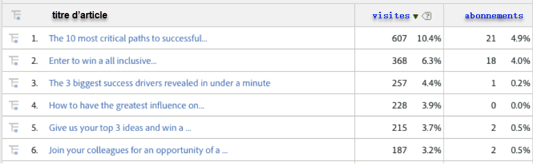
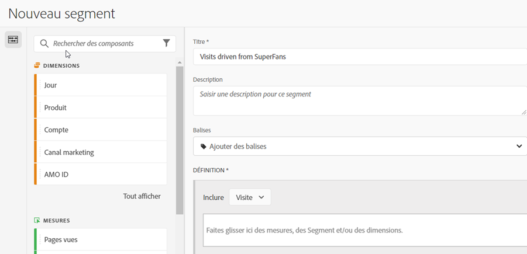
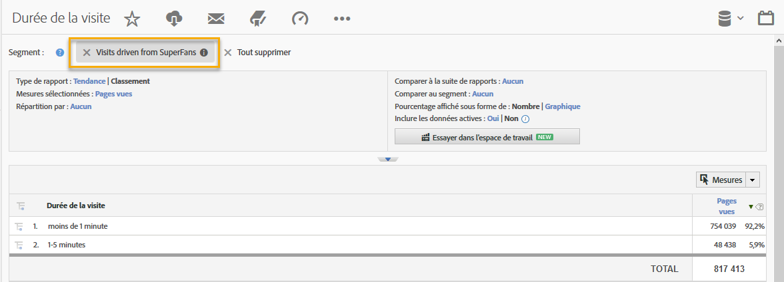

# Utilisation de l’intégration{#using-the-integration}

Une fois déployé, vous pouvez commencer à utiliser les fonctionnalités supplémentaires fournies par cette intégration.

**Remarque**: Il peut s’écouler entre 24 et 48 heures avant de commencer à voir certaines données de signal dynamique dans vos rapports Adobe Analytics.

Les actions suivantes apportent une valeur ajoutée à cette intégration dans Adobe Analytics.

## Affichage des mesures de trafic et de conversion par dimensions de signal dynamique{#viewing-traffic-and-conversion-metrics-by-dynamic-signal-dimensions}

Exemple de rapport dans Adobe Analytics.

Cette intégration fournit de nouvelles dimensions qui deviennent disponibles sous forme de rapports Adobe Analytics. Le rapport ci-dessous est un exemple d’analyse des visites et d’une mesure de conversion (abonnements) qui ont été ventilés par titre d’article.

## Segmentation par dimensions de signal dynamique{#segmenting-by-dynamic-signal-dimensions}

Exemples de segments basés sur des dimensions de signal dynamique.

L’une des principales fonctionnalités de cette intégration est la possibilité de créer des segments Adobe Analytics en fonction des dimensions de création de rapports intégrées. Par exemple, vous pouvez créer un segment qui inclut uniquement les visites provenant d’une communauté VoiceStorm spécifique. Vous pouvez appeler cela "Visites effectuées à partir de SuperFans". Cette définition de segment peut se présenter comme suit.

## Dimensions de création de rapports intégrées{#integrated-reporting-dimensions}

Répertorie les dimensions de rapport Signal dynamique incluses dans cette intégration.

| Dimension | Description |
|---|---|
| Type de canal | Réseau social (ou plateforme de blogs) sur lequel l’utilisateur a partagé une publication de la communauté. Les utilisateurs peuvent partager une publication sur plusieurs canaux. Les clics et autres activités sont segmentés par canal. Ce champ affiche Facebook, Twitter, etc. afin que vous puissiez voir quel type de canal déclenche l’activité. |
| ID d’article | L’ID d’article identifie de manière unique chaque élément de contenu de la communauté de signaux dynamiques. |
| Type de source | Ce champ indique si la publication a été créée par un membre ou une marque. Notez que dans les deux cas, le contenu peut être créé manuellement dans l’application ou importé à partir d’un flux externe. |
| Nom d’utilisateur | Utilisateur qui a partagé une publication sur son ou ses réseaux sociaux, générant des clics publicitaires vers votre site. |
| ID Source | L’ID source identifie de manière unique le créateur (ou l’auteur) de la publication partagée. Il s’agit le plus souvent d’un membre particulier ou d’un flux externe. |
| Identifiant utilisateur | L’ID utilisateur identifie de manière unique un utilisateur (c.-à-d. un membre) de la communauté du signal dynamique. Dans ce cas, l’utilisateur est le responsable du partage de la publication sur son ou ses réseaux sociaux. |
| Nom de la source | La source est le créateur (ou l’auteur) de la publication partagée. Dans la plupart des cas, il s’agit d’un membre de la communauté ou d’un flux externe. |
| Titre de l’article | Titre de la publication partagée qui a généré des clics vers votre site. |
| Nom de la communauté | Nom de votre communauté de signaux dynamiques. |

