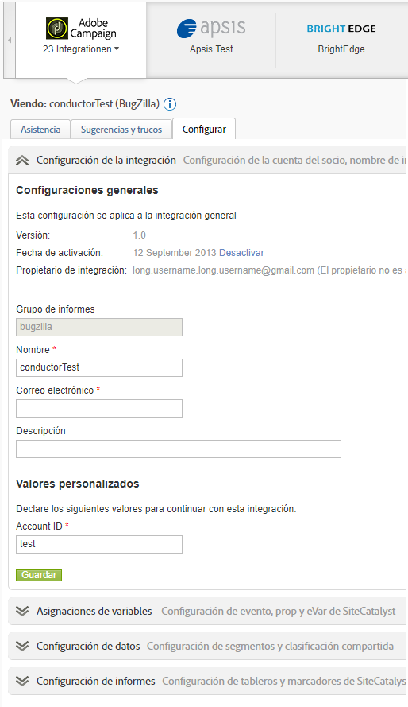

# Présentation des connecteurs de données

Adobe fournit aux entreprises des informations exploitables en temps réel sur leurs stratégies numériques et leurs initiatives marketing. Les connecteurs de données vous permettent d’importer des données de suivi à partir d’applications tierces dans Analytics, de sorte que vous puissiez collecter et utiliser des données à partir d’un emplacement central. Si vous utilisez l’un des produits partenaires, vous pouvez créer une intégration qui importe les données de l’application dans les rapports marketing. Une fois intégré, vous pouvez générer des rapports qui incluent des données issues de votre application.

Par exemple, une intégration de courrier électronique peut vouloir utiliser un partenaire de courrier électronique pour distribuer une campagne par courrier électronique. Lorsque des visiteurs se rendent sur votre site Web, vous voulez savoir quels sont ceux qui sont venus en réponse à votre campagne par courrier électronique. Les connecteurs de données intègrent les données de votre partenaire de messagerie dans les rapports marketing afin que vous puissiez déterminer ces informations pour évaluer l’efficacité de votre campagne par courrier électronique.

**Configuration requise**

Les connecteurs de données doivent s’intégrer de manière appropriée aux navigateurs Web les plus populaires. Toutefois, l’aspect et le fonctionnement des rapports sont optimisés sur les systèmes qui satisfont aux recommandations suivantes :

* Navigateur : Microsoft Internet Explorer version 6 et ultérieure
* Cookies : Obligatoire
* JavaScript : Activé
* Système d’exploitation : Windows
* Macromedia Flash Player : version 6 ou ultérieure
* Résolution de l&#39;écran : 1 024 x 768 (800 x 600 fonctionne)
* Profondeur de couleur : 16 bits ou plus

En outre, la collecte de données est plus performante lorsque JavaScript est activé dans le navigateur des utilisateurs.

**Conditions préalables**

Avant de configurer une intégration des connecteurs de données pour votre produit, procédez comme suit :

* Posséder les informations d’identification nécessaires pour accéder au compte de produit partenaire, avec les autorisations d’accès à toutes les données à intégrer aux rapports marketing. Vous pouvez créer un compte de messagerie spécial pour les distributeurs de rapports et pour la notification concernant les opérations intégrées.
* Identifier les variables personnalisées qui contiennent les informations sur votre campagne. On parle généralement de code de suivi de campagne, mais votre entreprise peut utiliser une autre terminologie.
* Déterminer les événements pour lesquels vous souhaitez recevoir des données d’impression et de clic. Vous pouvez renommer le  en conséquence.
* Placer le code approprié sur votre page d’entrée, afin qu’Analytics puisse procéder à la modélisation appropriée avec les données issues du produit partenaire. Vous trouverez des instructions spécifiques à chaque produit partenaire dans la Présentation des Data Connectors sous l’onglet Ressources.

## Ajout d’une intégration

Vous devez disposer d’un compte actif pour accéder à la page d’entrée [!UICONTROL Data Connectors] (console). Il est également conseillé de connaître Adobe Analytics.

1. Connectez-vous à Adobe Experience Cloud.
1. Cliquez sur **[!UICONTROL Analytics]** > **[!UICONTROL Admin]** > **[!UICONTROL Data Connectors]**.
1. Cliquez sur **[!UICONTROL Add New]**.
1. Parcourez l&#39; **[!UICONTROL Add Integration]** interface.

   Selon l’intégration du produit individuel, il vous faudra peut-être fournir des informations spécifiques sur la configuration, dans le cadre du processus d’intégration.

   Une fois l’intégration terminée, l’icône du produit partenaire s’affiche sur la page du réseau des Data Connectors ; elle est alors accessible dans les menus.

## Console des Data Connectors

Une fois une intégration activée, elle s’affiche sur la page [!UICONTROL Data Connectors]. Vous pouvez afficher les détails et modifier la configuration sur la console. Vous pouvez afficher les intégrations actives et celles liées à toutes les suites de rapports de votre société. Vous pouvez également  un journal  de l’, définir une intégration en tant que, configurer une intégration et trouver de l’aide.



## Segments de remarketing dans les connecteurs de données

Les segments de remarketing sont des fichiers de données crées selon les variables utilisées dans une intégration des connecteurs de données.

Adobe Analytics vous les envoie via Data Warehouse dans des fichiers quotidiens distincts à un serveur FTP créé par Adobe pour le tiers. Le tiers distribue ensuite ces fichiers au client. Les entreprises utilisent couramment ces fichiers pour les revendre à des personnes qui ont peut-être visité leur site et regardé un produit sans l’acheter. (Par exemple, vous communiquez avec un client qui offre une remise sur un produit qu’il a consulté, mais qui n’a pas fini par l’acheter).

**Segments**

* [!UICONTROL Cart Abandonment]: Le pourcentage de a ajouté un article à leur panier mais ne l’a pas acheté. Techniquement, il s’agit d’une mesure calculée composée des commandes divisées par les ajouts au panier.
* [!UICONTROL Purchases]: ID de (ou ID de) ayant effectué des achats en fonction de l’ID de message dans un produit spécifique.
* [!UICONTROL Product Views]: Tout comme [!UICONTROL Cart Abandonment], il s’agit également d’une mesure calculée. It reports [!UICONTROL Product Views] divided by Orders, because customers&#39; viewing the product shows some interest.

**Exemples de mise en œuvre**

Pour implémenter correctement les segments de remarketing, les conditions suivantes doivent être remplies :

* Un contrat de connecteurs de données a été établi et votre entreprise a terminé la phase de mise en oeuvre avec un consultant Adobe.
* La  correspondante est déclenchée au même moment que la variable products :
   * Abandon du panier : événement `scAdd`
   * Achats : événement `purchase`
   * Consultations produits : événement `prodView`

>[!NOTE] Si le produit est défini sans événement associé, l’événement prodView se déclenche automatiquement. Si les conditions ci-dessus ne sont pas remplies, les segments de remarketing correspondant ne sont pas signalés correctement.

[!UICONTROL Cart Abandonment]: se déclenche après l’ajout d’un produit au panier :

```
s.products=";cat";
s.events="scAdd";
```

[!UICONTROL Purchases]: se déclenche sur la page de confirmation d’achat :

```
s.products=";
cat;1;50";
s.events="purchase";
//Note: Though optional, adding the purchaseID variable increases accuracy by preventing duplicate purchases
```

**Problèmes courants**

| Problème | Description |
| -----------| ---------- |  
| Aucune information d’ID de produit ne s’affiche dans le fichier de segment de remarketing. | Ce problème se produit lorsque l’événement correct se déclenche et qu’aucune variable de produit ne figure dans la même demande d’image. Pour corriger ce problème, assurez-vous que la variable products et le  de correspondant se déclenchent sur la même page, comme indiqué dans les exemples d’implémentation ci-dessus. |
| Les fichiers de segment de remarketing ne sont pas reçus. | Si vous ne recevez pas vos fichiers, demandez à l’un des utilisateurs de votre entreprise ayant souscrit un plan d’assistance dédié de contacter ClientCare afin d’examiner la cause du problème de réception des rapports. |


>[!IMPORTANT] Les consultants configurent couramment une demande Data Warehouse en tant que rapport planifié quotidien, en plus du fichier de segment de remarketing de l’intégration des connecteurs de données. Cette demande d’entrepôt de données contient les variables des connecteurs de données ainsi que des variables de connecteurs autres que de données. La demande peut être planifiée selon les besoins spécifiques de votre entreprise. Pour éviter toute confusion lors du dépannage, indiquez si le fichier en question est le fichier de segment de remarketing réel ou une requête d’entrepôt de données contenant des variables non Genesis.
