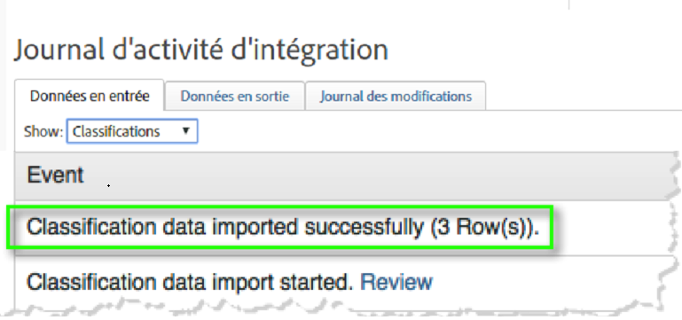
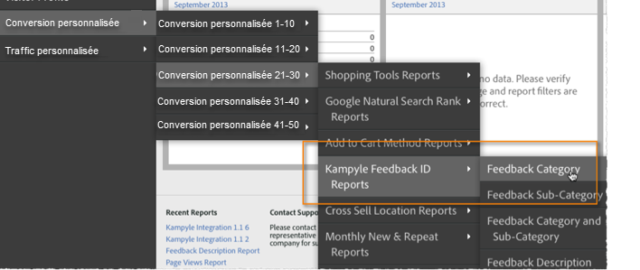

# Déploiement de l’intégration{#deploying-the-integration}

Le déploiement de cette intégration consiste à exécuter l’assistant d’intégration Adobe, à déployer le code du module externe (javascript) et à vérifier l’intégration.

## Fin de l’assistant d’intégration Adobe{#complete-the-adobe-integration-wizard}

Pour activer l’intégration, vous devez exécuter l’assistant de configuration dans l’interface des connecteurs de données.

1. Connectez-vous à Adobe Experience Cloud.
1. Accédez à Connecteurs **[!UICONTROL de]**données (anciennement Genesis).
1. Lancez l’assistant d’intégration Kampyle.
1. Sélectionnez une suite de rapports et attribuez un nom à l’intégration.
1. Configurez les éléments suivants :
   1. **[!UICONTROL Adresse]**électronique : adresse électronique du contact principal.
   1. **[!UICONTROL Description]**- Description (facultative) pour cette configuration d&#39;intégration.
   1. **[!UICONTROL Clé]**Kampyle - Trouvez cette clé dans l&#39;application Kampyle sous Formulaire**[!UICONTROL  de]** rétroaction > Personnalisation **[!UICONTROL du formulaire de]**rétroaction.
   1. **[!UICONTROL Serveur]**de suivi : paramètre du serveur de suivi (domaine) que vous utilisez pour effectuer le suivi des données Adobe Analytics.
   1. **[!UICONTROL Serveur de suivi sécurisé]**: si votre serveur de suivi est différent pour le trafic sécurisé/https, indiquez ce paramètre ici.
1. Configurez les éléments **[!UICONTROL de mappage]**de variables suivants :
   1. **[!UICONTROL Identifiant]**de commentaires Kampyle : sélectionnez une variable eVar disponible dans votre suite de rapports.
   1. **[!UICONTROL Note]**de commentaire : sélectionnez un événement de réussite disponible (type &quot;compteur&quot;) dans votre suite de rapports.
   1. **[!UICONTROL Commentaires]**: sélectionnez un événement de réussite disponible (type &quot;compteur&quot;) dans votre suite de rapports.
   1. **[!UICONTROL Commentaires avec note]**: sélectionnez un événement de réussite disponible (type &quot;compteur&quot;) dans votre suite de rapports.
1. Cochez la case pour que le tableau de bord d&#39;intégration Kampyle soit automatiquement créé (recommandé).
1. Vérifiez tous les éléments de configuration et cliquez sur **[!UICONTROL Activer maintenant]**.

## Déploiement de l’objet de configuration d’intégration{#deploy-the-integration-configuration-object}

Après avoir exécuté l’assistant d’intégration, vous devez déployer l’objet de configuration de l’intégration sur votre propriété Web.

Dans de nombreux cas, le moyen le plus simple de déployer l’objet de configuration de l’intégration consiste à l’inclure dans votre code de déploiement Adobe Analytics.

> [!NOTE] Si vous utilisez Adobe TagManager ou la gestion dynamique des balises pour déployer Adobe Analytics, vous pouvez facilement ajouter l’objet de configuration d’intégration via cet outil.

1. Accédez à l’onglet **[!UICONTROL Ressources]**>**[!UICONTROL  Assistance]** de l’intégration.
1. Téléchargez et enregistrez la ressource Code d’intégration **[!UICONTROL Kampyle (JS)]**. Le code ressemble à ceci :

   ```
   /* Kampyle:  Integration configuration settings */
     window.k_sc_param = { "version":1.1 }
   ```

1. Déployez le code à l’aide de l’une des méthodes suivantes :
| **Utilisez Adobe TagManager ou la gestion dynamique des balises.** | Utilisez l’interface de gestion des balises pour ajouter le code.  ||—|—|| **Dans tous les autres cas** | Envoyez le code à la ressource d’organisation responsable de la mise à jour de votre code de déploiement Adobe Analytics.  |

## Vérification de l’intégration{#verify-the-integration}

Vérifiez que l’intégration transfère correctement les données en effectuant quelques vérifications.

### Journal d’activité d’intégration {#section-0472df9180db4f218db5f6040cab07af}

Affichez votre configuration de l’intégration Kampyle dans Adobe Experience Cloud en accédant à **[!UICONTROL Support]**> Journal**[!UICONTROL  d’activité]**d’intégration. Sous l’onglet **[!UICONTROL Données dans]**, des entrées indiquent que les données de classification ont bien été importées.

> [!NOTE] Les entrées de journal doivent apparaître dans les 24 heures suivant le déploiement.



### Données Adobe Reporting {#section-1ae9f0a5e6bc40988478ff55aefd56ac}

Affichez vos rapports de commentaires Kampyle avec Adobe Analytics en accédant aux rapports Kampyle dans la structure de menus appropriée.

> [!NOTE] Les données de création de rapports doivent apparaître dans les 24 à 48 heures suivant le déploiement réussi, en supposant que les formulaires de rétroaction intégrés reçoivent activement des soumissions.



