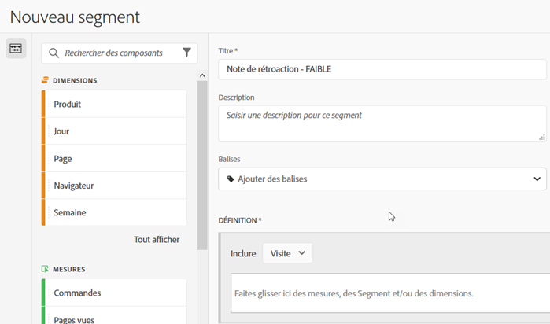
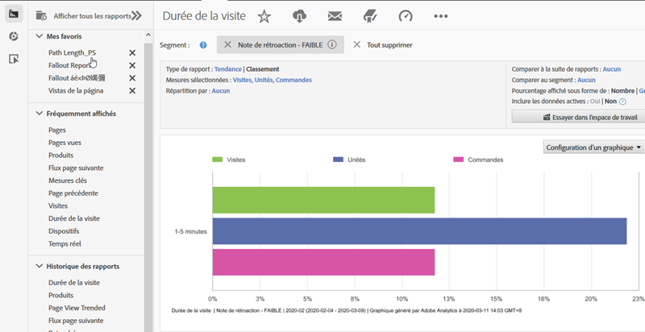

# Utilisation de l’intégration {#using-the-integration}

Une fois déployé, vous pouvez commencer à utiliser les fonctionnalités supplémentaires fournies par cette intégration. Voici quelques actions que vous pouvez effectuer pour tirer parti de cette intégration dans Adobe Analytics.

> [!NOTE] Il peut s’écouler entre 24 et 48 heures avant que certaines données de réponse Kampyle ne commencent à apparaître dans vos rapports Adobe Analytics.

## Combiner les retours et les données de comportement sur site {#mix-feedback-and-onsite-behavior-data}

Vous pouvez ventiler les rapports Reports &amp; Analytics par dimensions de retour.

À l’aide de Reports &amp; Analytics d’Adobe, vous pouvez analyser les nombreuses dimensions de retour disponibles dans les rapports. Le rapport ci-dessous est un exemple d’exploration vers une catégorie spécifique de retour, puis de ventilation en fonction de la description des retours. Les mesures de Reports &amp; Analytics (visites et demandes de renseignements du service clientèle) et de Kampyle (note moyenne des retours) sont présentées côte à côte pour une analyse facile.

## Segment par dimension de retour {#segment-by-feedback-dimension}

Vous pouvez créer des segments en fonction des dimensions de retour.

L’une des principales fonctionnalités de cette intégration est la possibilité de créer des segments Adobe Analytics en fonction des dimensions de retour Kampyle. Par exemple, vous pouvez créer un segment qui inclura uniquement les visites pour lesquelles une note de 1 ou 2 a été donnée. Vous pouvez appeler cela « Note de retour - FAIBLE ». La définition de ce segment se présente comme suit :

Ce segment peut ensuite être appliqué à pratiquement n’importe quel rapport. Par exemple, le rapport Durée de la visite est présenté ici.

