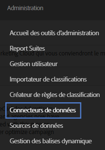
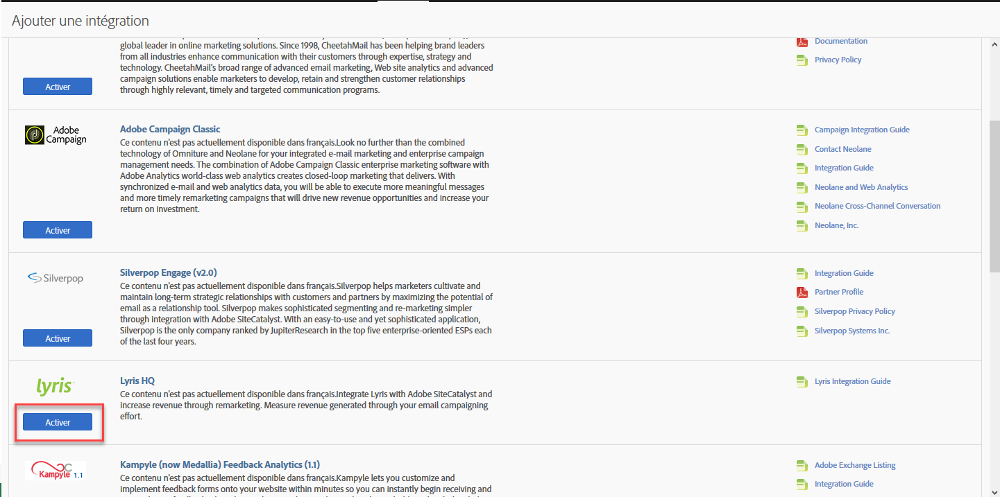
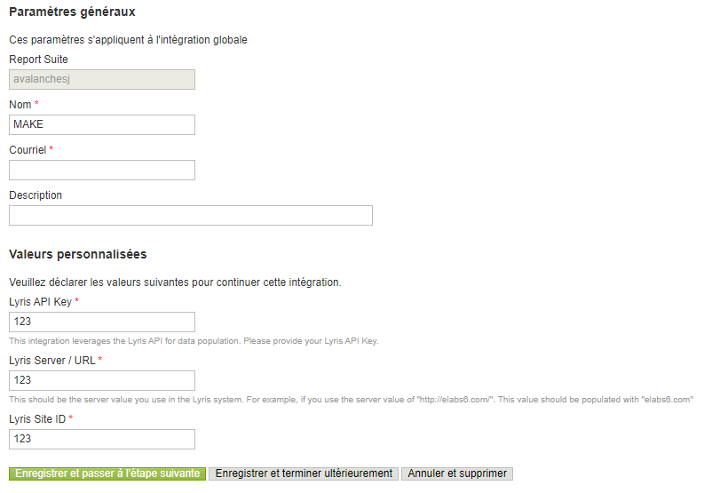
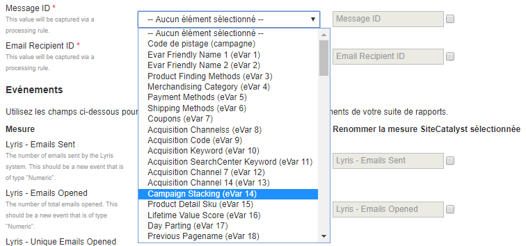
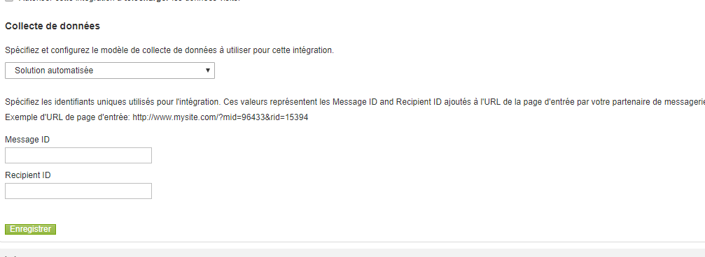
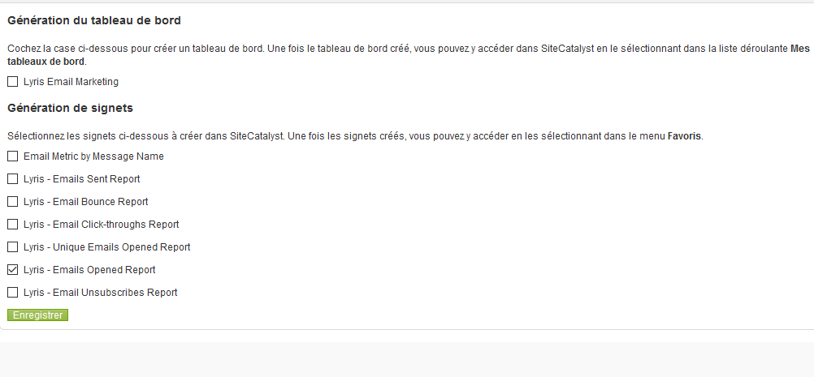
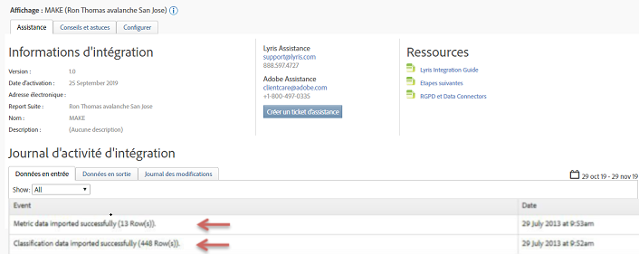

# Déploiement de l’intégration {#deploying-the-integration}

Décrit le processus de déploiement en trois étapes.

Le déploiement de cette intégration est un processus simple qui nécessite les actions suivantes :

## Finalisation de l’assistant d’intégration {#completing-the-integration-wizard}

Procédure d’utilisation de l’assistant d’intégration.

Pour activer l’intégration, vous devez exécuter l’assistant de configuration Lyris dans l’interface des Data Connectors.

1. Accédez à la zone des Data Connectors (anciennement Genesis) dans Adobe Experience Cloud.

   

1. Sous **[!UICONTROL Ajouter une intégration]**, sous Lyris HQ, cliquez sur **[!UICONTROL Activer]**.

   

1. Sous **[!UICONTROL Paramètres généraux]**, choisissez une suite de rapports et attribuez un nom à l’intégration.
1. Renseignez toutes les informations relatives à votre compte Lyris sous **[!UICONTROL Valeurs personnalisées]**.

   

1. Sélectionnez les eVars et événements réservés appropriés dans les menus déroulants.

   

1. Vous pouvez choisir vos propres segments sous **[!UICONTROL Vos segments]**, à l’exception des trois segments de partenaire automatisés.
1. Cette intégration peut nécessiter le téléchargement de quelques points de données vers votre compte Lyris. Vous pouvez choisir d’autoriser cet accès sous **[!UICONTROL Demande d’accès]**.
1. Sous **[!UICONTROL Collecte de données]**, vous pouvez choisir une solution automatisée ou manuelle (plug-in JavaScript) pour collecter les paramètres de chaîne de requête à partir de l’URL de la page d’entrée. Si vous optez pour une solution automatisée, saisissez le paramètre de chaîne de requête pour l’ID de message et l’ID de destinataire. Pour un plug-in JavaScript, contactez votre consultant Adobe.

   

1. Vous pouvez choisir de générer automatiquement le tableau de bord et les signets Lyris.

   

1. Passez en revue le résumé de l’intégration et cliquez sur **[!UICONTROL Activer]**.

## Configuration dans les EmailLabs de Lyris {#configuration-within-the-lyris-emaillabs}

Cette section décrit les étapes à configurer dans Lyris une fois l’assistant terminé.

1. Après avoir terminé l’assistant d’intégration, vous devez travailler avec l’équipe de Lyris Professional pour terminer l’intégration à votre compte Lyris HQ et faciliter les tests.
1. Ajouter des paramètres de chaîne de requête d’URL : Vérifiez que la chaîne d’ajout d’URL est correctement saisie dans les zones Paramètres de l’organisation de l’interface utilisateur. Elle doit contenir l’ID de niveau campagne (hq_m) et l’ID de niveau destinataire (hq_v).

   Exemple d’identifiant de chaîne :

   ```
   hq_lid=149&hq_m=96843&hq_l=23&hq_v=7703a51905
   ```

   >[!NOTE]
   >
   >Si vous appliquez l’outil d’analyse natif de Lyris, le *suivi des clics* balise toutes les variables requises qui sont ajoutées.

## Vérification de l’intégration {#verifying-the-integration}

Procédure à suivre pour vérifier que l’intégration de Lyris/Adobe Analytics a réussi.

Une fois toutes les étapes du déploiement terminées, vous pouvez vérifier que l’intégration transfère des données avec succès.

> [!NOTE] Quelques jours sont nécessaires pour que l’échange de données commence. Assurez-vous de contacter Lyris après avoir activé l’intégration.

1. Accédez à votre intégration Lyris dans les Data Connectors. Sous l’onglet **[!UICONTROL Assistance]** > **[!UICONTROL Journal d’activité d’intégration]**, vous devriez voir des événements tels que les **[!UICONTROL données de mesure importées avec succès]** et/ou les **[!UICONTROL données de classification importées avec succès]** :

   

1. Affichez maintenant vos rapports de messages Lyris avec les mesures appropriées. Dans Adobe Experience Cloud, sélectionnez **[!UICONTROL Reports &amp; Analytics]**.
1. Sélectionnez la suite de rapports appropriée.
1. Sous **[!UICONTROL Conversions personnalisées]**, sélectionnez **[!UICONTROL Rapports d’ID de message]** et choisissez **[!UICONTROL ID/Nom du message]**.

## Code du plug-in de paramètre de chaîne de requête {#query-string-param-plug-in-code}

Affiche le code du plug-in Lyris à utiliser avec Adobe Analytics.

> [!NOTE] Veillez à réserver les eVars nécessaires dans l’outil d’administration d’Adobe Analytics avant de travailler avec le code ci-dessous. Une fois que vous avez identifié les eVars réservées, remplacez eVarN par l’eVar appropriée. eVar10, par exemple.

```
/* 
  * Plugin: getQueryParam 2.3 
  */ 
s.getQueryParam=new Function("p","d","u","" 
+"var s=this,v='',i,t;d=d?d:'';u=u?u:(s.pageURL?s.pageURL:s.wd.locati" 
+"on);if(u=='f')u=s.gtfs().location;while(p){i=p.indexOf(',');i=i<0?p" 
+".length:i;t=s.p_gpv(p.substring(0,i),u+'');if(t){t=t.indexOf('#')>-" 
+"1?t.substring(0,t.indexOf('#')):t;}if(t)v+=v?d+t:t;p=p.substring(i=" 
+"=p.length?i:i+1)}return v"); 
s.p_gpv=new Function("k","u","" 
+"var s=this,v='',i=u.indexOf('?'),q;if(k&&i>-1){q=u.substring(i+1);v" 
+"=s.pt(q,'&','p_gvf',k)}return v"); 
s.p_gvf=new Function("t","k","" 
+"if(t){var s=this,i=t.indexOf('='),p=i<0?t:t.substring(0,i),v=i<0?'T" 
+"rue':t.substring(i+1);if(p.toLowerCase()==k.toLowerCase())return s." 
+"epa(v)}return ''"); 
 
/*in the s_doPlugins function - Replace N with actual eVar number*/ 
s.eVarN=s.getQueryParam("<insert Lyris QS Param>");  
//places query param value from Message ID in eVarN variable s.eVarN=s.getQueryParam("<insert Lyris QS Param>");  
//places query param value from Recepient ID in eVarN variable 
```
