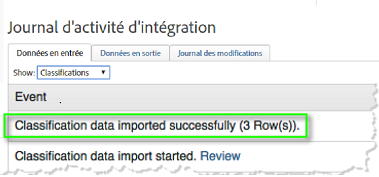
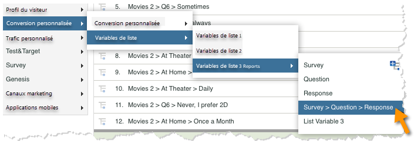

# Déploiement de l’intégration{#deploying-the-integration}

Le déploiement de cette intégration est un processus simple qui nécessite les actions suivantes.

## Fin de l’assistant d’intégration Adobe{#completing-the-adobe-integration-wizard}

Pour activer l’intégration, vous devez exécuter l’assistant d’intégration Qualtrics dans l’interface des connecteurs de données.

1. Accédez aux connecteurs de données et lancez l’assistant d’intégration Qualtrics.
1. Sélectionnez la suite de rapports que vous souhaitez utiliser pour cette intégration et attribuez un nom.

   Renseignez l’assistant d’intégration en fournissant les informations décrites dans les étapes suivantes. 1. **Assistant Étape 1**

   | Email Address | Adresse électronique principale du contact. |
   |---|---|
   | Description | (Facultatif) Description de cette configuration d’intégration. |
   | ID d’organisation Qualtrics | [Recherche de votre ID d’organisation Qualtrics](../qualtrics-overview/qualtrics-org-id.md) |
   | Jeton Adobe SiteCatalyst | [Génération de votre jeton Qualtrics Adobe Analytics](../qualtrics-overview/qualtrics-token.md) |

1. **Assistant Étape 2 - Correspondances** de variables| Liste des réponses Qualtrics| Sélectionnez une variable de liste disponible dans votre suite de rapports. (Vous devrez peut-être activer une nouvelle variable listVar dans le Gestionnaire de Report Suites.)  ||—|—|| ID de réponse Qualtrics| Sélectionnez une eVar ou une prop disponible dans votre suite de rapports. (Vous devrez peut-être activer une nouvelle variable listVar dans le Gestionnaire de Report Suites.)  || Serveur de suivi|Indiquez le paramètre du serveur de suivi (domaine) que vous utilisez pour effectuer le suivi des données Adobe Analytics. Utilisez le serveur de `trackingServerSecure` suivi s’il diffère du paramètre de serveur de suivi standard.  || Envois d'enquête Qualtrics| Sélectionnez un événement disponible dans votre suite de rapports (vous devrez peut-être activer un nouvel événement dans le Gestionnaire de Report Suites).  |

1. **Assistant Étape 3**: Rien n'est requis, information seulement.

   Résultat de l’étape 1. **Assistant Étape 4 - Paramètres d’exportation**

   | eVar | Sélectionnez jusqu’à cinq de vos eVars à exposer pour l’exportation vers Qualtrics. |
   |---|---|
   | Événements | Sélectionnez jusqu’à cinq de vos événements personnalisés à exposer pour l’exportation vers Qualtrics. |
   | Propriétés | Sélectionnez jusqu’à cinq de vos props à exposer pour l’exportation vers Qualtrics. |
   | Demandes d’accès | Cochez la case correspondant aux mesures et dimensions standard que vous souhaitez exporter vers Qualtrics. L’exportation `visitor_id` est requise pour fonctionner correctement. |

1. **Assistant Étape 5**: Vérifiez la configuration, puis cliquez sur **[!UICONTROL Activer maintenant]**.

## Activation de l’intégration dans Qualtrics Research Suite{#enabling-the-integration-in-qualtrics-research-suite}

Après avoir exécuté l'assistant d'intégration, vous devez activer l'intégration pour chaque enquête Qualtrics à connecter.

1. Connectez-vous à Qualtrics Research Suite.
1. Dans l'onglet **[!UICONTROL Mes enquêtes]** , cliquez sur le bouton **[!UICONTROL Modifier]** de l'enquête à intégrer.
1. Cliquez sur le menu Options **** avancées et sélectionnez **[!UICONTROL Adobe Analytics]**. (si vous ne voyez pas cette option, demandez à votre administrateur de vous octroyer les autorisations requises).

   

1. Sélectionnez la configuration d’Adobe Analytics, puis cliquez sur **[!UICONTROL Enregistrer]**. Si aucune configuration n’est disponible, il est probable que vous n’ayez pas encore terminé l’assistant d’intégration Adobe.
   1. La case à cocher **[!UICONTROL Inclure les réponses]** partielles permet d’indiquer que vous souhaitez capturer des données dans Adobe Analytics une fois chaque écran d’enquête partiel terminé. Si elle n'est pas cochée, les données sont transférées uniquement pour les enquêtes entièrement terminées.
   1. La case à cocher **[!UICONTROL Envoyer l’horodatage avec balise]** ne doit être utilisée que lors de l’intégration à une suite de rapports configurée pour recevoir des données horodatées (ce qui n’est pas courant).
   

## Vérification de l’intégration{#verifying-the-integration}

Une fois toutes les étapes de déploiement terminées, vous pouvez vérifier que l’intégration réussit à transférer des données.

1. **Journal** des activités d’intégration : Dans l’interface utilisateur des connecteurs de données, affichez l’onglet **[!UICONTROL Assistance]** sur l’intégration de Qualtrics. Sous l’en-tête Journal **[!UICONTROL d’activité]** d’intégration, vous devriez voir les entrées indiquant que les données de classification importées ont réussi.

   >[!NOTE]
   >
   >Ces entrées doivent apparaître dans l’heure suivant le déploiement.

   

1. **Données** de création de rapports : Affichez vos rapports d'enquête Qualtrics avec l'interface utilisateur des rapports et analyses marketing en accédant aux rapports d'enquête Qualtrics (sous Variables **[!UICONTROL de]** liste).

   >[!NOTE]
   >
   >Ces données doivent apparaître dans les 24 à 48 heures suivant le déploiement, en supposant que l'enquête intégrée reçoive activement des réponses.

    

