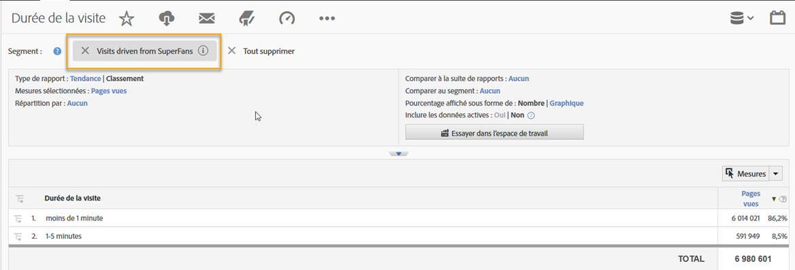
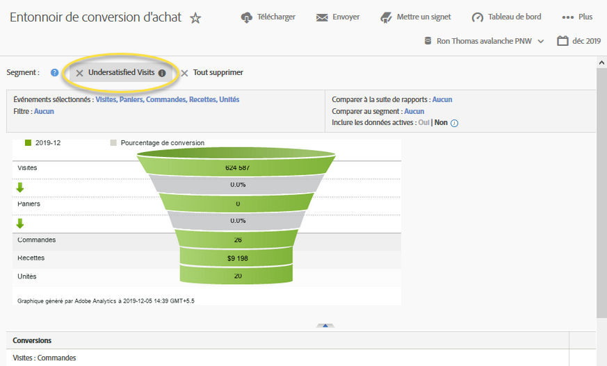

# Utilisation de l’intégration{#using-the-integration}

Une fois le déploiement terminé, vous pouvez commencer à utiliser les fonctionnalités supplémentaires fournies par cette intégration.

> [!NOTE] Il peut s’écouler entre 24 et 48 heures pour commencer à voir les données de réponse Qualtrics dans vos rapports Adobe Analytics.

Vous trouverez ci-dessous les actions à entreprendre pour tirer parti de cette intégration dans Adobe Analytics.

1. Créez un segment à l'aide des données de réponse à l'enquête (voir [Création d'un segment](https://docs.adobe.com/content/help/en/analytics/components/segmentation/seg-home.html)).
1. Appliquez le segment aux rapports clés.

## Exemple {#section-07051d0d60a44408a4e108034586c42f}

voici comment un analyste peut définir un segment Adobe Analytics à l’aide des données de réponse à une enquête. Dans ce cas, une question d'enquête du type "Êtes-vous satisfait de votre visite aujourd'hui ?" est posée. Cette question permet de créer un segment afin d’identifier les visiteurs "insatisfaits". Un tel segment peut être utilisé pour analyser n’importe quel rapport Adobe Analytics, tel que l’entonnoir de conversion d’achat, comme illustré ci-dessous.

 

