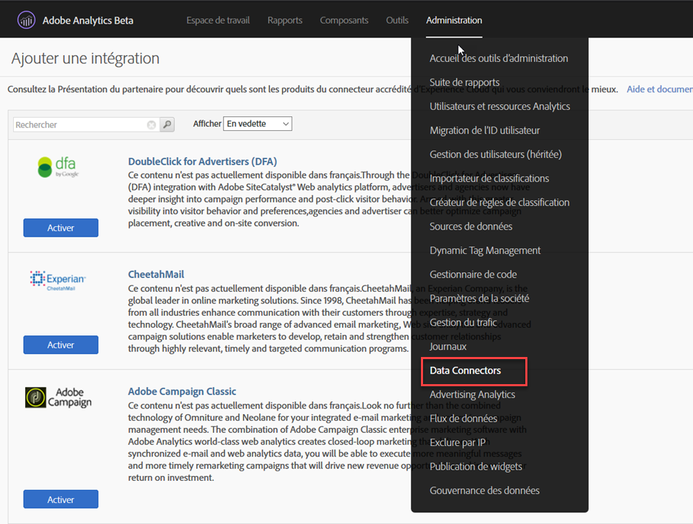
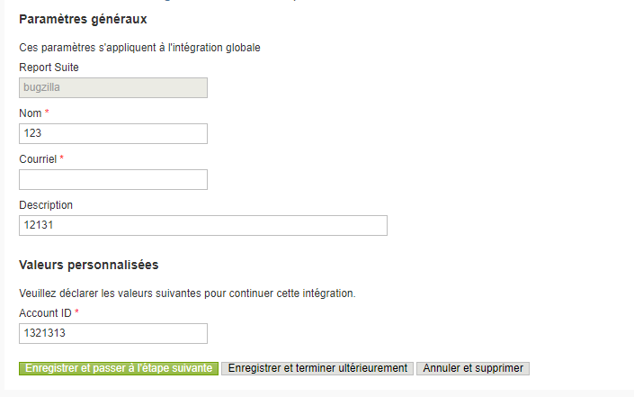
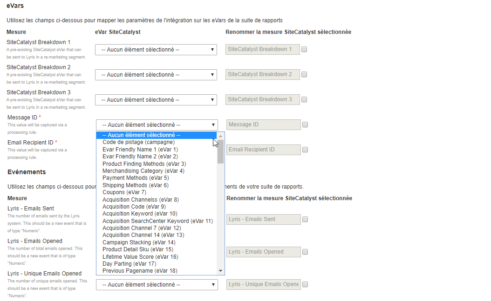
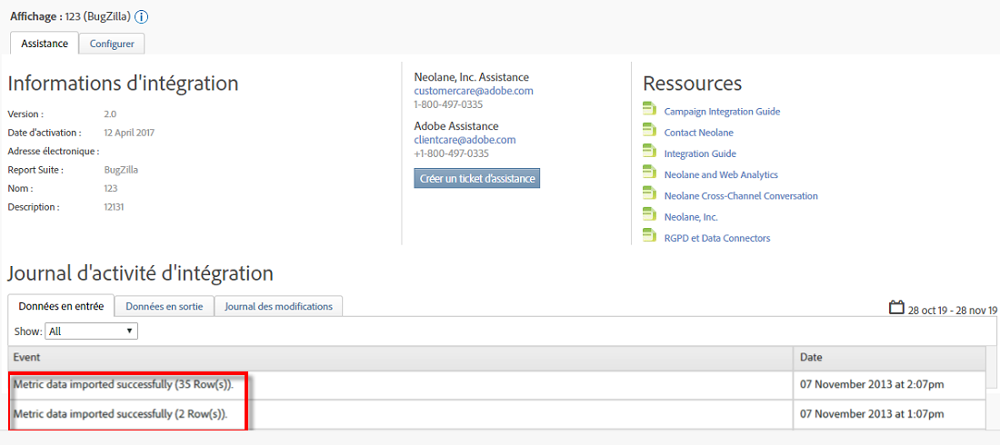

# Déploiement de l’intégration {#deploying-the-integration}

Le déploiement de cette intégration est un processus simple composé de trois étapes.

## Finalisation de l’assistant d’intégration {#completing-the-integration-wizard}

Pour activer l’intégration, vous devez exécuter l’assistant d’intégration Selligent dans l’interface des Data Connectors.

1. Accédez à la zone des Data Connectors dans Adobe Experience Cloud.

   

1. Sous **[!UICONTROL Ajouter des intégrations]**, glissez et déposez le plug-in Selligent dans Adobe Experience Cloud.

   

   Cela ouvrira l’intégration des connecteurs de données Selligent.

1. **Paramètres d’intégration** : sélectionnez une suite de rapports et attribuez un nom à l’intégration sous **[!UICONTROL Paramètres d’intégration]**.

1. Sous **[!UICONTROL Valeurs personnalisées]**, renseignez toutes les informations liées à votre compte Selligent.

   

1. **Correspondance variable** : sélectionnez les eVars et les événements réservés nécessaires dans les menus déroulants :

   

1. **Paramètres des données** : vous pouvez choisir vos propres segments sous **[!UICONTROL Vos segments]**, à l’exception des trois segments **[!UICONTROL Partenaire]** automatisés.

1. Cette intégration peut nécessiter le téléchargement de points de données sur votre compte Selligent. Vous pouvez choisir d’autoriser l’accès de ces derniers sous **[!UICONTROL Demande d’accès]**.
1. Sous **[!UICONTROL Collecte de données]**, sélectionnez une solution automatisée ou manuelle (plug-in JavaScript) pour collecter les paramètres de chaîne de requête à partir de l’URL de la page d’entrée. Si vous sélectionnez une solution automatisée, saisissez votre paramètre de chaîne de requête pour l’ID de message et l’ID de destinataire, respectivement MID et RID. Pour le plug-in JavaScript, contactez votre consultant Adobe.
1. **Paramètres du rapport** : sous **[!UICONTROL Génération de tableau de bord]**, cochez la case de façon à ce que le tableau de bord Selligent soit généré automatiquement.

   

1. Passez en revue le résumé de l’intégration et cliquez sur **[!UICONTROL Activer]**.

## Configuration dans Selligent {#configuration-within-selligent}

Dès que l’intégration est activée dans Adobe Analytics, une configuration automatique est activée dans Selligent.

Un outil de suivi a été créé pour effectuer le suivi de chaque e-mail. Si vous souhaitez le limiter à un certain domaine, veuillez mettre à jour la configuration de l’outil de suivi.

Nous vous recommandons vivement de déplacer le paramètre de suivi pour Adobe Analytics dans l’URL vers l’avant. Cela permet de s’assurer que les règles de traitement d’Adobe sélectionnent les paramètres de l’URL de la page d’entrée. Activez le suivi en cochant la case comme illustré ci-dessous.

## Vérification de l’intégration {#verifying-the-integration}

Une fois toutes les étapes de déploiement terminées, vous pouvez vérifier que l’intégration transfère bien des données.

L’échange de données ne commencera que quelques jours plus tard. Assurez-vous de contacter Selligent après avoir activé l’intégration.

### Journal d’activité d’intégration {#section-927e270495db479fba9578915d9ae9c9}

Accédez à votre intégration Selligent dans les Data Connectors. Sous l’onglet **[!UICONTROL Assistance]**, vous devriez voir des événements tels que Données de mesure importées et/ou Données de classification importées :

### Données de création de rapports {#section-ebd481a162324e66bd6dc8cb4b8d2424}

Consultez vos rapports de messages Selligent qui présentent les mesures pertinentes.

1. Accédez à Report &amp; Analytics sous Adobe Experience Cloud.
1. Sélectionnez la suite de rapports appropriée.
1. Sous **[!UICONTROL Conversion personnalisée]**, sélectionnez les **[!UICONTROL Rapports d’ID de message]** et choisissez **[!UICONTROL ID de message/Nom du message]**.
