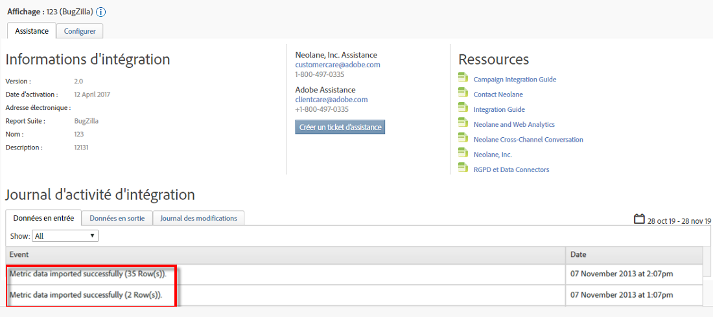

# Vérification de l’intégration{#verifying-the-integration}

Une fois toutes les étapes du déploiement terminées, vous pouvez vérifier que l’intégration réussit à transférer des données.

L'échange de données prendra quelques jours. Assurez-vous de contacter Selligent après avoir activé l’intégration.

## Journal d’activité d’intégration {#section-927e270495db479fba9578915d9ae9c9}

Accédez à votre intégration sélective dans les connecteurs de données. Sous l’onglet **[!UICONTROL Assistance]** , vous devriez voir des événements tels que Données de mesure importées et/ou Données de classification importées avec succès :

## Données de création de rapports {#section-ebd481a162324e66bd6dc8cb4b8d2424}

Affichez vos rapports de messages intelligents avec les mesures appropriées.

1. Accédez à Rapports et analyses sous Adobe Experience Cloud.
1. Sélectionnez la suite de rapports appropriée.
1. Sous Conversion **** personnalisée, sélectionnez les rapports **[!UICONTROL d’ID de]** message et choisissez ID de **[!UICONTROL message/Nom]** du message.

