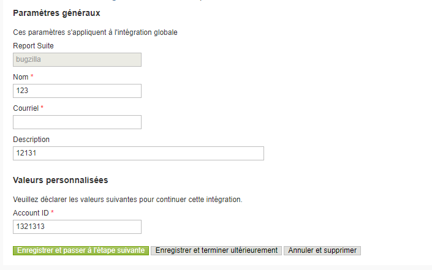
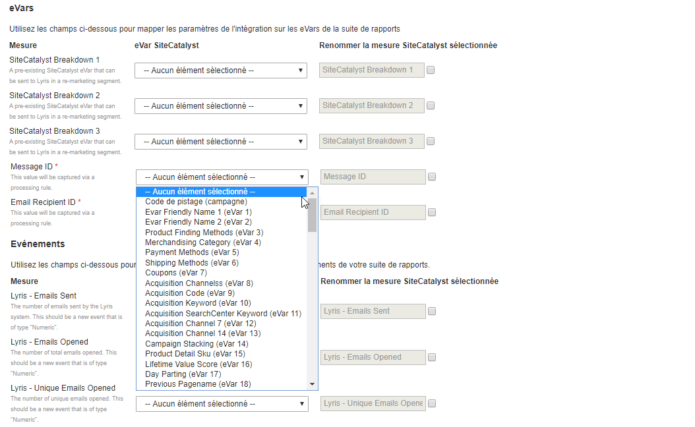

# Fin de l'Assistant d'intégration{#completing-the-integration-wizard}

Pour activer l’intégration, vous devez exécuter l’assistant d’intégration sélective dans l’interface des connecteurs de données.

1. Accédez à la zone Connecteurs de données dans Adobe Experience Cloud.

   

1. Sous **[!UICONTROL Ajouter des intégrations]**, faites glisser et déposez le module externe sélectif dans Adobe Experience Cloud.

   

   Cela ouvrira l’intégration du connecteur de données sélectif.

1. **Paramètres** d’intégration : Choisissez une suite de rapports et nommez l’intégration sous Paramètres **[!UICONTROL d’]** intégration.

1. Sous Valeurs **** personnalisées, renseignez toutes les informations relatives [à votre compte](../../selligent-overview/selligent-activation/selligent-prereqs-seligent.md#concept-071c594b1bcc465cbce7a6fda3f1d829)sélectif.

   

1. **Mappage** de variables : Sélectionnez les eVars et événements  réservés appropriés dans les menus déroulants :

   

1. **Paramètres** des données : Vous pouvez choisir vos propres segments sous **[!UICONTROL Vos segments]** , à l’exception des trois segments automatisés **[!UICONTROL du partenaire]** .

1. Cette intégration peut nécessiter le téléchargement de quelques points de données vers votre compte sélectif. Vous pouvez choisir d’autoriser l’accès pour la même personne sous Demande **[!UICONTROL d’]** accès.
1. Sous Collecte **[!UICONTROL de]** données, choisissez une solution automatisée ou manuelle (module externe JavaScript) pour collecter les paramètres de chaîne de requête à partir de l’URL de la page d’entrée. Si vous choisissez une solution automatisée, entrez le paramètre de chaîne de requête pour l’ID de message et l’ID de destinataire, respectivement MID et RID. Pour le module externe JavaScript, contactez votre consultant Adobe.
1. **Paramètres** du rapport : Sous Génération **[!UICONTROL de]** tableau de bord, cochez la case pour que le tableau de bord Sigligent soit automatiquement généré.

   

1. Passez en revue le résumé de l’intégration et cliquez sur **[!UICONTROL Activer]**.

