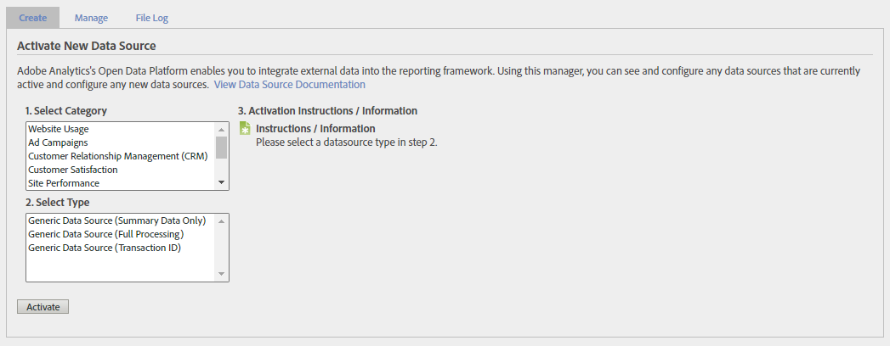
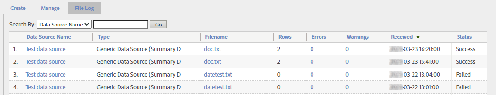

# Gestion des sources de données

Utilisez le gestionnaire des sources de données pour créer, modifier ou désactiver des sources de données. Vous pouvez également utiliser cette interface pour effectuer le suivi de l’état des fichiers transférés vers des sources de données à des emplacements FTP.

**[!UICONTROL Administration]** > **[!UICONTROL Tous les administrateurs]** > **[!UICONTROL Sources de données]**

Utilisez le sélecteur de suite de rapports dans la partie supérieure droite pour basculer entre les suites de rapports de votre entreprise.

Cette interface comporte trois onglets principaux : **[!UICONTROL Gérer]**, **[!UICONTROL Créer]**, et **[!UICONTROL Journal des fichiers]**.

## Gérer

Le **[!UICONTROL Gérer]** Cet onglet gère toutes les sources de données que votre organisation a créées. Vous pouvez afficher des informations sur le FTP, apporter des modifications aux variables utilisées dans les fichiers de modèle ou désactiver entièrement les sources de données.

La source de données la plus élevée est toujours [!UICONTROL Balise Web]. Cette source de données est ce que vous utilisez pour la collecte de données classique par AppMeasurement. Il ne peut pas être modifié ni désactivé.

Chaque source de données dispose des options suivantes :

* **[!UICONTROL Redémarrer le traitement]**: Redémarre le traitement de la source de données qui s’était précédemment arrêté en raison d’erreurs. Le traitement se poursuit jusqu’à la prochaine erreur. La fonctionnalité Sources de données interrompt le traitement d’un fichier de source de données uniquement lorsque vous sélectionnez **[!UICONTROL Arrêter le traitement des erreurs]**.
* **[!UICONTROL Terminer le traitement]**: N’est plus utilisé : ce bouton n’était utilisé que pour [Sources de données à traitement complet](full-processing-eol.md).
* **[!UICONTROL Arrêter le traitement des erreurs]**: Case à cocher indiquant au serveur de traitement de s’arrêter lorsqu’il rencontre une erreur. Le traitement de la source de données ne reprend que lorsque vous sélectionnez **[!UICONTROL Redémarrer le traitement]**. Lorsqu’une source de données rencontre une erreur de fichier, elle vous en informe. Adobe déplace le fichier contenant l’erreur dans un dossier appelé `files_with_errors` sur le serveur FTP. Une fois le problème résolu, renvoyez le fichier pour traitement.
* **[!UICONTROL Configurer]**: Lien qui vous guide tout au long de l’assistant de création de sources de données pour cette source de données. Cet assistant vous permet de renommer la source de données ou de reconfigurer automatiquement les variables incluses lors du téléchargement d’un fichier de modèle.
* **[!UICONTROL Infos FTP]**: Lien permettant d’accéder à la dernière étape de l’assistant de création de sources de données dans lequel les informations d’identification FTP s’affichent.

Une fois qu’une source de données reçoit des données, un tableau s’affiche contenant plusieurs colonnes pour les fichiers chargés.

* **[!UICONTROL Fichiers Dans La File D’Attente De Traitement]**: Nom du fichier.
* **[!UICONTROL Lignes]**: Nombre total de lignes dans le fichier.
* **[!UICONTROL Erreurs]**: Le nombre de lignes qui contenaient des erreurs et qui ne pouvaient pas être ingérées.
* **[!UICONTROL Avertissements]**: Nombre de lignes contenant des avertissements.
* **[!UICONTROL Reçu]**: Horodatage de réception du fichier dans le fuseau horaire de la suite de rapports.
* **[!UICONTROL État]**: État du fichier (`Success` ou `Failed`).

## Créer

Le **[!UICONTROL Créer]** Cet onglet vous donne un point de départ pour l’assistant de création de sources de données .

La catégorie et le type de source de données étaient plus précieux dans les versions précédentes d’Adobe Analytics. Toutefois, leur utilisation reste limitée :

* Le type de source de données s’affiche sur la page [Gérer](#manage) pour la source de données elle-même, et la variable [Journal des fichiers](#file-log) pour chaque fichier.
* Certains types de sources de données incluent automatiquement des variables lors du téléchargement du fichier de modèle. Cependant, vous pouvez inclure n’importe quelle dimension ou mesure disponible tant qu’elle respecte la variable [Format du fichier](file-format.md).

Au-delà de ces raisons, toutes les catégories et tous les types de sources de données que vous pouvez sélectionner sont effectivement identiques. Sélectionnez la catégorie et le type qui représentent le mieux votre objectif d’utilisation des sources de données.

Avec la retraite de [Sources de données à traitement complet](full-processing-eol.md), plusieurs catégories et types ne peuvent pas être sélectionnés. Si vous sélectionnez un type de source de données à traitement complet, la variable **[!UICONTROL Activer]** est grisé.

## Journal des fichiers

Le **[!UICONTROL Journal des fichiers]** donne une vue globale de tous les fichiers de source de données chargés pour la suite de rapports donnée.

Une barre de recherche vous aide à localiser une source de données spécifique. Le tableau présente les colonnes suivantes :

* **[!UICONTROL Nom de la source de données]**: Nom de la source de données.
* **[!UICONTROL Type]**: Type de la source de données.
* **[!UICONTROL Nom du fichier]**: Nom du fichier qui a été chargé.
* **[!UICONTROL Lignes]**: Nombre total de lignes dans le fichier.
* **[!UICONTROL Erreurs]**: Nombre de lignes contenant des erreurs.
* **[!UICONTROL Avertissements]**: N’est plus utilisé. Nombre de lignes contenant des avertissements.
* **[!UICONTROL Reçu]**: Date et heure auxquelles l’Adobe a commencé à traiter le fichier.
* **[!UICONTROL État]**: État du fichier (`Success` ou `Failed`).
