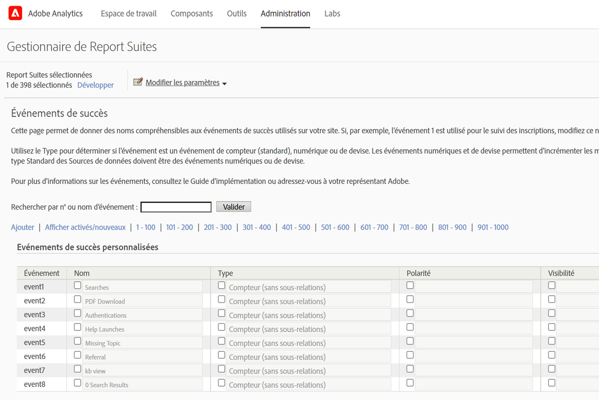
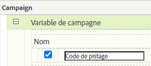

# Importer des mesures de [!UICONTROL référencement payant] à lʼaide des [!UICONTROL sources de données]

Pour de nombreuses entreprises marketing, le référencement payant est l’un des moyens les plus précieux et les plus fiables pour atteindre de nouveaux clients et conserver les clients existants. La fonctionnalité [!UICONTROL Sources de données] d’Adobe Analytics facilite l’importation de données de référencement payant avancées à partir de plateformes publicitaires numériques telles que Google AdWords. Vous pouvez l’intégrer au reste de vos données marketing, ainsi qu’aux données comportementales et d’attributs du client sur site, afin de vous permettre d’obtenir de meilleures informations sur les efforts de référencement payant de votre entreprise.

Ces étapes vous montrent comment configurer une intégration à AdWords pour importer des données de mots-clés, ainsi que des mesures telles que les impressions, les clics, le coût par clic et plus encore.

Les étapes expliquent comment configurer une importation unique des données de paiement par clic. Cependant, la fonctionnalité [!UICONTROL Sources de données] permet l’importation continue des données à l’aide du format de fichier décrit ici. Selon votre plateforme de référencement payant, vous pouvez planifier des exportations périodiques (quotidiennes, mensuelles, etc.), configurer des processus automatisés pour transformer ces exportations en format de fichier requis par Adobe Analytics et charger ces fichiers dans Adobe Analytics afin de générer des rapports d’intégration de référencement payant.

## Conditions préalables

* Vous avez implémenté la détection de référencement payant.
* Vous capturez des données de code de suivi.
* Vous disposez de codes de suivi uniques pour chaque groupe publicitaire.

## Configurer des [!UICONTROL événements de succès]

Notre première étape consiste à préparer Adobe Analytics à recevoir les mesures. Pour ce faire, vous devez configurer certains événements de succès.

[!UICONTROL Les événements de succès] sont des actions qui peuvent être suivies. Il vous appartient de déterminer ce qu’est un [!UICONTROL événement de succès]. À des fins de suivi des mesures de [!UICONTROL référencement payant], nous voulons configurer les [!UICONTROL événements de succès] sur [!UICONTROL clics], [!UICONTROL impressions], [!UICONTROL coût total] et activer les [!UICONTROL codes de suivi].

1. Sélectionnez **[!UICONTROL Adobe Analytics > Admin > Suitesde rapport]**.
1. Sélectionnez une suite de rapports.
1. Cliquez sur **[!UICONTROL Modifier les paramètres > Conversion > Événements de succès]**.

   

1. Sous Événements de succès personnalisés, utilisez **[!UICONTROL Ajouter nouveau]** pour créer trois événements de succès personnalisés : [!UICONTROL Clics] (Compteur), [!UICONTROL Impressions] (Compteur) et [!UICONTROL Coût total] (Devise).

   

1. Cliquez sur Enregistrer.
Vous devriez recevoir un message indiquant que vos enregistrements ont été approuvés.
1. Accédez à **[!UICONTROL Admin > Suites de rapports > Modifier les paramètres > Conversion > Variables de conversion]**.
1. Activez les codes de suivi en cochant la case en regard de **[!UICONTROL Code de suivi]** sous **[!UICONTROL Campagne > Variable de campagne]**.

   

## Configurer les sources de données

Les [!UICONTROL sources de données] vous permettent de partager des données hors parcours de navigation avec Adobe Analytics. Dans ce cas, nous utilisons Adobe Analytics pour effectuer le suivi des mesures de référencement payant. Nous utilisons le code de suivi comme clé pour lier les deux éléments de données (mesures de référencement payant et mesures Adobe Analytics).

1. Accédez à **[!UICONTROL Adobe Analytics > Admin > Tous les administrateurs > Sources de données]**.
1. Sélectionnez l’onglet **[!UICONTROL Créer]** pour commencer à activer de nouvelles sources de données.
1. Sous **[!UICONTROL Sélectionner une catégorie]**, sélectionnez **[!UICONTROL Campagne publicitaire]**.

   

1. Sous **[!UICONTROL Sélectionner un type]**, sélectionnez **[!UICONTROL Service de paiement par clic générique]**.
1. Cliquez sur **[!UICONTROL Activer]**.
L’[!UICONTROL Assistant d’activation des sources de données] affiche :

   

1. Cliquez sur **[!UICONTROL Suivant]** et attribuez un nom à votre source de données. Ce nom figurera dans le Gestionnaire de sources de données.
1. Acceptez le contrat de service et cliquez sur **[!UICONTROL Suivant]**.
1. Sélectionnez les trois mesures standard : [!UICONTROL Impressions], [!UICONTROL Clics] et [!UICONTROL Coût total] et cliquez sur **[!UICONTROL Suivant]**.
1. À présent, « mappez » cette nouvelle source de données aux événements personnalisés que nous avons créés dans [Configurer les événements de succès](/help/admin/admin/c-manage-report-suites/c-edit-report-suites/conversion-var-admin/c-success-events/t-success-events.md).

   

1. Choisir les dimensions de données
Cochez la case en regard de Codes de suivi et cliquez sur **[!UICONTROL Suivant]**.
1. Faites correspondre la portée des données.
Mappez la dimension de données importée (attribut) à l’attribut Adobe Analytics dans lequel vous souhaitez la stocker. Il peut s’agir d’une dimension standard ou d’une eVar. Après avoir cliqué sur **[!UICONTROL Suivant]**, les mappages résultants sont affichés dans le résumé :

   

1. Cliquez sur **[!UICONTROL Enregistrer]**.
1. Cliquez sur **[!UICONTROL Télécharger]** pour télécharger le fichier de modèle pour cette source de données.
Le nom du fichier correspond au type de source de données que vous avez initialement spécifié./ Dans ce cas, le nom du fichier est « Modèle de service de paiement par clic générique.txt ».
1. Ouvrez le modèle dans votre éditeur de texte préféré.
Le fichier est déjà renseigné avec les mesures, les dimensions, ainsi que leurs mappages.

## Exporter les données PPC et les télécharger sur Analytics

Des étapes similaires à celles-ci fonctionnent pour Google Adwords, MSN, Yahoo et dʼautres comptes PPC.

### Exporter les données

1. Connectez-vous à votre compte PPC et créez un rapport ou une exportation.
Assurez-vous que l’exportation comprend les champs suivants : date, URL de destination (page de destination), impressions, clics et coûts. Lʼexportation peut inclure dʼautres champs, mais vous devrez les supprimer lors des étapes suivantes.
1. Si possible, enregistrez le rapport en tant que fichier `.csv` ou fichier délimité par des tabulations. La suite de la procédure en sera facilitée.
1. Ouvrez le fichier dans Microsoft Excel.

### Modifier le fichier dans Microsoft Excel

1. Dans Microsoft Excel, supprimez toutes les colonnes autres que celles mentionnées ci-dessus.
1. Supprimez toutes les lignes supplémentaires en haut.
1. Pour isoler les codes de suivi des URL de destination, procédez comme suit :
a. Copiez et collez les données de toutes les colonnes.
b. Cliquez sur **[!UICONTROL Données > Texte en colonnes]**.
c. À l’étape 1 de l’assistant, assurez-vous que **[!UICONTROL Délimité]** est sélectionné, puis cliquez sur **[!UICONTROL Suivant]**.
d. À l’étape 2 de l’assistant, spécifiez le délimiteur en fonction de la façon dont vous avez créé vos URL (soit ? ou &amp;), puis cliquez sur **[!UICONTROL Suivant]**.
e. À l’étape 3 de l’assistant, prévisualisez vos données et vérifiez que l’une des colonnes est « trackingcodename=trackingcode ». Si vous disposez de variables supplémentaires, répétez ces étapes (utilisez &amp; comme délimiteur).
f. Supprimez toutes les colonnes, à lʼexception des codes de suivi, des impressions, des clics et des coûts. Ajoutez une nouvelle colonne intitulée Date et organisez vos colonnes dans l’ordre suivant : Date :: Code de suivi :: Impressions :: Clics :: Coûts.
1. Ajoutez ces données au modèle téléchargé dans la section « Configurer les sources de données » ci-dessus.
Vous êtes maintenant prêt à télécharger le fichier.

### Télécharger le fichier vers Adobe Analytics par FTP

Revenez à l’assistant de source de données pour obtenir des instructions et téléchargez le fichier par FTP :

## Créer des mesures calculées

Lʼajout de mesures calculées sʼavèrera précieux lors de la prise de décisions concernant le paiement par clic.

Vous pouvez, par exemple, ajouter ces [mesures calculées](https://experienceleague.adobe.com/docs/analytics/components/calculated-metrics/calcmetric-workflow/cm-build-metrics.html?lang=fr#calculated-metrics) :

| Nom | Formule | Type de mesure | Description |
| --- | --- | --- | --- |
| Pages vues par visite | Pages vues / Visites | Numérique | Lorsqu’elle est appliquée au niveau d’un site, indique le nombre moyen de pages par visite. Lorsqu’elle est appliquée dans le rapport Pages les plus populaires, indique le nombre moyen de fois où une page particulière a été affichée par visite. |
| Valeur de commande moyenne | Recettes / Commandes | Devise | Indique les recettes moyennes par commande. |
| Recettes par visite | Chiffre dʼaffaires/Visite | Devise | Indique le chiffre dʼaffaires moyen par visite. |
| Taux de clic publicitaire (CTR) | Clics/Impressions | Numérique | Mesurez le rapport clics/impressions d’une publicité en ligne ou d’une campagne marketing par e-mail. |
| Profits | Chiffre dʼaffaires - Coûts | Devise | Affiche le chiffre dʼaffaires d’une campagne moins les coûts. |
| Profit par impression (PPI) | (Chiffre dʼaffaires - Coût)/Impression | Devise | Indique le montant du chiffre dʼaffaires généré à chaque fois quʼune publicité sʼaffiche, en tenant compte du coût. |
| Retour sur dépenses publicitaires (ROAS) | Montant des ventes/dépenses publicitaires | Devise | (ROI) Représente les euros gagnés pour chaque euro dépensé, pour la publicité correspondante. |

## Configurer et exécuter des rapports

Lʼétape finale consiste à ajouter les mesures de la source de données ainsi que toutes les mesures calculées au rapport sur le code de suivi, puis à analyser en profondeur une campagne. Vous pouvez ainsi juger immédiatement des performances de chaque groupe publicitaire.

1. Dans **[!UICONTROL Adobe Analytics > Rapports]**, sélectionnez la suite de rapports dans laquelle vous avez importé les sources de données.
1. Accédez à **[!UICONTROL Rapports > Campagnes > Code de suivi > Code de suivi]**.
1. Sélectionnez la période.
1. Cliquez sur **[!UICONTROL Mesures > Ajouter]** et ajoutez vos mesures de source de données (clics, impressions, coût total) dans la liste des mesures standard.
1. Répétez lʼopération pour toutes les mesures calculées que vous avez ajoutées. Le rapport est mis à jour au fur et à mesure que vous ajoutez des mesures.
