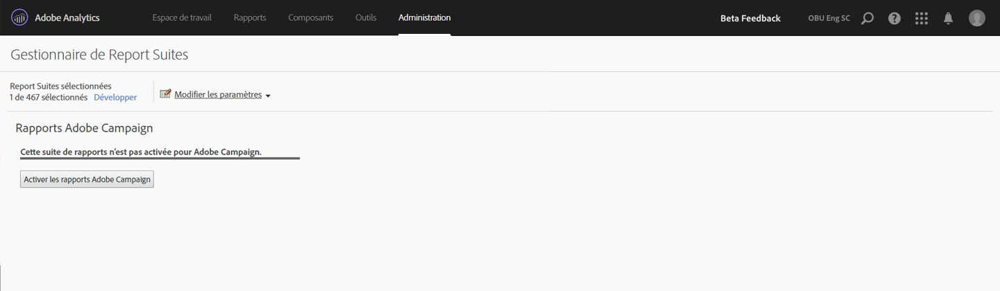

# Rapports Adobe Campaign

Pour plus d’informations sur la configuration de cette intégration, aller à la [documentation d’Adobe Campaign](https://helpx.adobe.com/fr/campaign/standard/integrating/using/about-campaign-analytics-integration.html).

Cette intégration entre Adobe Analytics et Adobe Campaign

* permet de partager vos données IPC (Indicateur de performance clé) provenant d’Adobe Campaign Standard avec Adobe Analytics ;
* enrichit les formules de suivi avec les paramètres d’Adobe Analytics ;
* ajoute un nouveau rapport sous **[!UICONTROL Analytics]** > **[!UICONTROL Rapports]** > **[!UICONTROL Adobe Campaign.]**
* ajoute 5 nouvelles classifications Adobe Campaign ;
* ajoute 10 nouvelles mesures Adobe Campaign ;
* ajoute 6 nouvelles dimensions Adobe Campaign ;
* synchronise les données avec Analytics toutes les 15 minutes.

## Étape 1. Activation des rapports Adobe Campaign {#section_C685EF10505045708A6536BB13F6CD58}

Pour afficher les données de Campaign dans Analytics, vous devez d’abord activer les rapports Campaign.

1. Accédez à **[!UICONTROL Analytics]** > **[!UICONTROL Admin]** > **[!UICONTROL Suites de rapports]** > **[!UICONTROL <select report suite>]** > **[!UICONTROL Modifier les paramètres]** > **[!UICONTROL Adobe Campaign]** > **[!UICONTROL Rapports Adobe Campaign]** .
1. Cliquez sur **[!UICONTROL Activer les rapports Adobe Campaign]**.

   

## Étape 2. Affichage des rapports Adobe Campaign {#section_9C18A29F3CC54BD4AC5EA96417F17B33}

L’intégration entre Adobe Campaign Standard et Adobe Analytics ajoute le rapport suivant sous **[!UICONTROL Analytics]** > **[!UICONTROL Rapports]**

<table id="table_3627F40DC90646A7B5E217A88B6FD630"> 
 <thead> 
  <tr> 
   <th colname="col1" class="entry"> Rapport </th> 
   <th colname="col2" class="entry"> Définition </th> 
  </tr> 
 </thead>
 <tbody> 
  <tr> 
   <td colname="col1"> 
Adobe Campaign Identifiant Diffusion exécutée 
 </td> 
   <td colname="col2"> 
Affiche les données importées depuis Adobe Campaign relatives à des e-mails envoyés depuis Adobe Campaign. 
 </td> 
  </tr> 
 </tbody> 
</table>

## Étape 3. Utilisation des classifications Adobe Campaign {#section_74A28AF3F4CA4091943789DE4D8B2B63}

**[!UICONTROL Analytics]** > **[!UICONTROL Admin]** > **[!UICONTROL Suites de rapports]** > **[!UICONTROL <select report suite>]** > **[!UICONTROL Modifier les paramètres]** > **[!UICONTROL Adobe Campaign]** > **[!UICONTROL Classifications Adobe Campaign]**

Une fois votre suite de rapports activée pour Adobe Campaign, les classifications suivantes sont disponibles :

* Identifiant de la diffusion (nom de la diffusion interne que vous voyez dans Campaign)
* Libellé de la diffusion (diffusion dans Campaign : diffusion individuelle/diffusion récurrente/diffusion de transactions)
* ID de campagne (nom de la campagne interne que vous voyez dans Campaign)
* Libellé de la campagne (campagne dans Adobe Campaign)
* Libellé de la diffusion exécutée (liste des diffusions individuelles exécutées)

## Dimensions et mesures Adobe Campaign disponibles dans Adobe Analytics  {#section_F33385C9660644AF84172EC39601469B}

Les **mesures** suivantes sont disponibles depuis Campaign dans les suites de rapports d’Adobe Analytics :

* Adobe Campaign Envoyés
* Adobe Campaign Ouverts
* Adobe Campaign Cliqués
* Adobe Campaign Traités
* Adobe Campaign Délivrés
* Adobe Campaign Ouvertures uniques
* Adobe Campaign Clics uniques
* Adobe Campaign Désinscriptions
* Adobe Campaign Bounces total
* Adobe Campaign Instances Identifiant Diffusion exécutée

Les **dimensions** suivantes sont disponibles depuis Campaign dans les suites de rapports d’Adobe Analytics :

| Nom de la dimension | Définition |
|--- |--- |
| ID de campagne | ID de toutes les campagnes pour lesquelles des IPC ont été envoyés pendant la durée |
| Libellé de la campagne | Libellés des ID de campagne |
| Identifiant de la diffusion | Identifiant de toutes les diffusions pour lesquelles des IPC ont été envoyés pendant la durée. Inclut également les identifiants des diffusions maîtres de la diffusion récurrente et de la diffusion des transactions. Exemple : une diffusion récurrente DM1 était planifiée et DM2, DM3, DM4 et DM5 étaient des diffusions enfants de la diffusion récurrente.  L’identifiant de la diffusion affiche les résultats pour toutes les diffusions, de DM1 à DM5. |
| Libellé de la diffusion | Libellés des identifiants de diffusion |
| Libellé de la diffusion exécutée | Identifiants des diffusions exécutées uniquement. Aucun identifiant de diffusion maître récurrente/de transactions. Exemple : une diffusion récurrente DM1 était planifiée et DM2, DM3, DM4 et DM5 étaient des diffusions enfants de la diffusion récurrente. L’identifiant Diffusion exécutée affiche les résultats pour toutes les diffusions, de DM2 à DM5, c’est-à-dire les diffusions qui ont été effectivement exécutées. |
| Libellé de la diffusion exécutée | Libellés des identifiants Diffusion exécutée |
