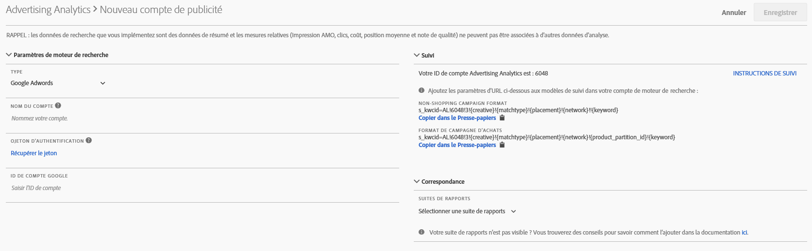

# Configuration d’un compte Advertising

Les administrateurs d’Adobe Analytics peuvent créer de nouveaux comptes publicitaires et mapper plusieurs comptes à plusieurs suites de rapports (1:1, 1:Many, Many:Many).

Les administrateurs peuvent également [accorder l’accès aux non-administrateurs](/help/integrate/c-advertising-analytics/overview.md#section_FCC58EB635954A32990D4E67B52B4369) pour la configuration de comptes publicitaires.

1. Dans Adobe Analytics, accédez à **[!UICONTROL Admin]** > **[!UICONTROL Advertising Accounts]**.
1. (Première utilisation uniquement) Acceptez les termes du contrat de licence de l’utilisateur final.
1. Cliquez sur **[!UICONTROL + Add]**.
1. La [!UICONTROL New Search Engine Account] boîte de dialogue s’affiche :

   

1. Renseignez les **[!UICONTROL Search Engine Settings]** lignes directrices suivantes :

   <table id="table_B3BE66B7D4C54766B8FFD2C6DCD657AF"> 
    <thead> 
      <tr> 
      <th colname="col1" class="entry"> Paramètre </th> 
      <th colname="col2" class="entry"> Description </th> 
      </tr>
    </thead>
    <tbody> 
      <tr> 
      <td colname="col1"> 
Type 
 </td> 
      <td colname="col2"> 
Vous disposez de deux options : Google AdWords et Microsoft Bing Ads. 
 
Remarque : Yahoo Gemini a été absorbé par Microsoft Bing le 31 mars 2019. Par conséquent, l’option de compte publicitaire Yahoo Gemini n’est plus disponible.  
 </td> 
      </tr> 
      <tr> 
      <td colname="col1"> 
Nom du compte 
 </td> 
      <td colname="col2"> 
Vous pouvez choisir de définir ce nom de compte sur n’importe quel nom qui vous convient. Il s’agit du nom convivial du compte qui apparaîtra dans l’interface utilisateur. 
 </td> 
      </tr> 
      <tr> 
      <td colname="col1"> 
Jeton OAuth 
 </td> 
      <td colname="col2"> 
Remarque : OAuth est un protocole libre de délégation d’accès, utilisé généralement afin d’autoriser des sites web ou des applications à accéder à leurs informations à partir d’autres sites web sans leur donner les mots de passe. 
 
Remarque : vous serez redirigé vers une URL tierce (efrontier.com). Adobe utilise efrontier pour faire fonctionner le processus d’authentification OAuth pour les trois moteurs de recherche. 
 
Remarque : si vous utilisez Internet Explorer 11 (ou une version antérieure), vous ne parviendrez pas à récupérer le jeton OAuth pour aucun des trois moteurs de recherche. Utilisez plutôt d’autres navigateurs Web. 
 
Cliquez sur Récupérer le jeton pour lancer le processus d’authentification OAuth2. Cela signifie que vous serez invité à vous connecter à votre compte de recherche Google/Bing à l’aide de vos informations d’identification. Selon le moteur de recherche choisi, le processus est légèrement différent : 
 
        <ul id="ul_FC9B5612F6554495B04C357CB0AB72EB"> 
        <li id="li_CD54231BFF134F83B3B5B14B34A0E1D2">Google Adwords : Indiquez un ID de compte Google. </li> 
        <li id="li_89B9D54BAA914E5DB2959B193489582E">Microsoft Bing : Indiquez l’ID de compte Bing et l’ID de client Bing. </li> 
        </ul> 
Refer to <a href="/help/integrate/c-advertising-analytics/c-adanalytics-workflow/aa-locate-account-id.md"  > Locate your Account ID</a> for information on these IDs. 
 
Une fois connecté, le champ du jeton OAuth affichera 
        <systemoutput>
          Récupéré
        </systemoutput>. 
 </td> 
      </tr> 
    </tbody> 
    </table>

1. In the **[!UICONTROL Tracking]** section, you provide information on how the Search Engine data is tracked by your Adobe Analytics implementation. Cette étape est requise pour ajouter correctement les données du moteur de recherche aux données d’Adobe Analytics.
Renseignez les **[!UICONTROL Tracking Settings]** lignes directrices suivantes :

   <table id="table_1AB4E31456E84ABF8209B02058259C4D"> 
    <thead> 
      <tr> 
      <th colname="col1" class="entry"> Paramètre </th> 
      <th colname="col2" class="entry"> Description </th> 
      </tr>
    </thead>
    <tbody> 
      <tr> 
      <td colname="col1"> 
Type 
 </td> 
      <td colname="col2"> 
        <ul id="ul_1C5A0502A4984E57A08417A91CCD6FFE"> 
        <li id="li_5736E38286FF494ABDDC6E85281D7F2A">  Automatique : laisse le moteur Advertising Cloud décider comment les paramètres de suivi sont ajoutés aux modèles de suivi/URL de destination du moteur de recherche. Il s’agit de l’approche la plus simple, même si elle ne produit pas toujours le meilleur jeu de données intégré. 
Important : pour configurer un compte de moteur de recherche en « mode automatique », vous devez prendre les mesures suivantes : 
          <ul id="ul_4FF9D1E3CC4E452BA339E0A725D29FEE"> 
            <li id="li_6F3A6D6259C0420CB7E6FD2C26A1B6E0">Le paramètre et la valeur "s_kwcid" seront ajoutés aux modèles de suivi de compte ou aux URL de  du compte ajouté. Cette information sera insérée à la fin de l’URL. Par conséquent, une action supplémentaire peut être requise de votre part si votre serveur Web requiert une paire clé=valeur à la fin de l’URL OU une mise à jour pour prendre en charge toute nouvelle paire clé=valeur dans l’URL. </li> 
            <li id="li_A04D4AA31A934392808639E46C86573F">En outre, les mots-clés peuvent être insérés dans l’URL d’entrée dans le cadre de la valeur "s_kwcid". Par conséquent, s’ils contiennent des caractères ou des symboles spéciaux, veuillez confirmer que votre serveur Web peut les prendre en charge (par exemple, "+" est utilisé dans les mots-clés "Correspondance large modifiée"). </li> 
          </ul> 
 </li> 
        <li id="li_EAA7A7CA1E584854A7EC1E43E13B63FE"> Manuel : permet de gérer la façon dont les paramètres de suivi sont ajoutés aux modèles de suivi/URL de destination du moteur de recherche. <a href="/help/integrate/c-advertising-analytics/c-adanalytics-workflow/aa-manual-vs-automatic-tracking.md"  > Consultez ces exemples de suivi manuel pour chaque moteur de recherche</a>. </li> 
        </ul> </td> 
      </tr> 
    </tbody> 
    </table>

1. Dans la **[!UICONTROL Mapping]** section, vous choisissez la ou les suites de rapports à lier à ce compte de moteur de recherche. Vous devez fournir au moins une suite de rapports avant de pouvoir enregistrer le compte de publicité. Vous pouvez mapper plusieurs comptes à plusieurs suites de rapports (1:1, 1:Many, Many:Many). Notez que les données extraites par AMO du moteur de recherche sont simplement copiées dans une suite de rapports mappée, de sorte qu’il n’y a pas de division des données.

   >[!IMPORTANT]
   >
   >Seules les suites de rapports qui ont été [mappées à une organisation Experience Cloud](https://marketing.adobe.com/resources/help/en_US/mcloud/map-report-suite.html) pourront être sélectionnées. Si la suite de rapports ne figure pas dans la liste, consultez la [résolution des problèmes d’Advertising Analytics](/help/integrate/c-advertising-analytics/c-adanalytics-workflow/aa-troubleshooting.md).

   Pour les **[!UICONTROL Mapping Settings]** lignes directrices suivantes :

   <table id="table_AF876DC40F97403882C0AA528BD204FF"> 
    <thead> 
      <tr> 
      <th colname="col1" class="entry"> Paramètre </th> 
      <th colname="col2" class="entry"> Description </th> 
      </tr>
    </thead>
    <tbody> 
      <tr> 
      <td colname="col1"> 
Suite de rapports Correspondance 
 </td> 
      <td colname="col2"> 
Le mappage des suites de rapports détermine la suite de rapports qui est liée à ce compte de moteur de recherche. En d'autres termes, il détermine dans quelle(s) suite(s) de rapports les données du moteur de recherche sont envoyées. 
 
Si la suite de rapports ne figure pas dans la liste, vous pouvez <a href="https://marketing.adobe.com/resources/help/en_US/mcloud/map-report-suite.html"  >mapper votre suite de rapports à une organisation Experience Cloud</a> en utilisant cet outil. 
 </td> 
      </tr> 
    </tbody> 
    </table>

1. Cliquez sur **[!UICONTROL Save]**.
1. Une fois enregistrée, une clause de rejet de responsabilité affiche un de mises en garde. Nous vous demandons de confirmer que vous avez lu et que vous comprenez cet accord. Click the checkbox, then click **[!UICONTROL OK]**.

   Vous êtes maintenant dirigé vers l’interface utilisateur [de](/help/integrate/c-advertising-analytics/c-adanalytics-workflow/aa-manage-ad-accounts.md)gestion des comptes publicitaires, où votre compte nouvellement créé doit être répertorié.

>[!NOTE] Patientez 24 heures au moins avant que les données du moteur de recherche ne commencent à apparaître dans vos rapports Analytics.

