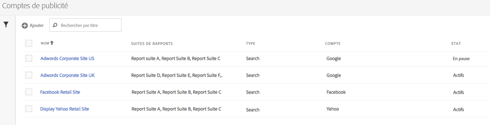

# Configuration d’un compte Advertising

Les administrateurs Adobe Analytics peuvent créer des comptes publicitaires et mapper plusieurs suites de rapports (1 : 1, 1 : plusieurs, plusieurs : plusieurs).

Les administrateurs peuvent également [accorder l’accès à des non-administrateurs](/help/integrate/c-advertising-analytics/overview.md#section_FCC58EB635954A32990D4E67B52B4369) pour configurer des comptes publicitaires.

<!--

-->

1. Dans Adobe Analytics, accédez à **[!UICONTROL Admin]** > **[!UICONTROL Comptes Advertising]**.
1. Acceptez les conditions du contrat de licence de l’utilisateur final (uniquement lors de la première utilisation).
1. Sélectionner **[!UICONTROL + Ajouter]**.
1. La variable [!UICONTROL Nouveau paramètre de moteur de recherche] s’affiche.

   

1. Renseignez les **[!UICONTROL Paramètres du moteur de recherche]** suivez ces instructions :

   | Paramètre | Description |
   | --- | --- |
   | **[!UICONTROL Type]** | Vous disposez de deux options : **[!UICONTROL Google Adwords]** et **[!UICONTROL Publicités Bing]**.  Remarque : Yahoo Gemini a été absorbé par Microsoft Bing le 31 mars 2019. Par conséquent, l’option de compte publicitaire Yahoo Gemini n’est plus disponible. |
   | Nom du compte | Vous pouvez choisir de définir ce nom de compte sur n’importe quel nom qui vous convient.  Nom du compte est le nom convivial du compte qui s’affiche dans l’interface utilisateur. |
   | Jeton OAuth | **Remarque**: OAuth est une norme ouverte pour la délégation des accès, généralement utilisée comme un moyen d’accorder aux sites web ou aux applications l’accès aux informations des sites web, mais sans fournir de mots de passe. Vous remarquerez que vous êtes acheminé vers une URL tierce (efrontier.com). Adobe utilise Adobe Media Optimizer pour alimenter le processus d’authentification OAuth pour les trois moteurs de recherche. Si vous utilisez Internet Explorer 11 (ou une version antérieure), vous ne pouvez pas récupérer le jeton Oauth pour l’un des trois moteurs de recherche. Utilisez d’autres navigateurs web en remplacement.
Sélectionner **[!UICONTROL Récupération du jeton]** pour lancer le processus d’authentification OAuth2. Vous êtes invité à vous connecter à votre compte de recherche Google/Bing à l’aide de vos informations d’identification. Selon le choix que vous choisissez, le processus est légèrement différent : <ul><li>Google AdWords : utilisez votre numéro de compte Google</li><li>Microsoft Bing : utilisez vos ID de compte Bing et vos ID de client Bing.</li></ul>Voir [Localisation de votre ID de compte](/help/integrate/c-advertising-analytics/c-adanalytics-workflow/aa-locate-account-id.md) pour plus d’informations sur ces identifiants. Une fois votre connexion effectuée, le champ du **[!UICONTROL jeton OAuth]** affichera **[!UICONTROL Récupéré]**. |

1. Dans le **[!UICONTROL Tracking]** , vous fournissez des informations sur la manière de suivre les données à l’aide de votre mise en oeuvre Adobe Analytics. Le suivi est une étape requise pour augmenter correctement les données Adobe Analytics avec les données du moteur de recherche.
Définissez les **[!UICONTROL Paramètres du suivi]** en procédant comme suit :

   | Paramètre | Description |
   | --- | --- |
   | Type | <ul><li>**Auto**: permet au moteur Advertising Cloud de décider comment les paramètres de suivi sont ajoutés aux modèles de suivi/URL de destination de . [!UICONTROL Suivi automatique des types] est l’approche la plus simple, mais peut ne pas générer le meilleur jeu de données intégré. **Important :** Pour configurer un compte de moteur de recherche avec [!UICONTROL Suivi automatique des types], vous êtes responsable des actions suivantes :<ul><li>La variable `s_kwcid` Les paramètres et valeurs sont ajoutés aux modèles de suivi de compte ou aux URL de page d’entrée dans le compte ajouté. Le paramètre et la valeur sont insérés à la fin de l’URL. Une action supplémentaire peut être nécessaire si votre serveur web requiert un `key=value` à la fin de l’URL. Ou une mise à jour pour prendre en charge toute nouvelle `key=value` est requise dans l’URL. **Remarque**: découvrez si vous devez ajouter ce paramètre à votre [Stratégie de sécurité du contenu](https://experienceleague.adobe.com/en/docs/id-service/using/reference/csp).</li><li>De plus, les mots-clés peuvent être insérés dans l’URL d’entrée avec la valeur `s_kwcid`. Si les mots-clés contiennent des caractères spéciaux ou des symboles, veuillez vérifier que votre serveur web prend en charge ces caractères. Exemple de caractères spéciaux courants : `+`, qui est utilisé dans les mots-clés &quot;En correspondance large modifiée&quot;.</li></ul></li><li>**Manuel**: vous permet de gérer la manière dont les paramètres de suivi sont ajoutés aux modèles de suivi/URL de destination du moteur de recherche. [Consultez ces exemples de suivi manuel pour chaque moteur de recherche](/help/integrate/c-advertising-analytics/c-adanalytics-workflow/aa-manual-vs-automatic-tracking.md).</li></ul> |

1. Dans le **[!UICONTROL Mappage]** , vous sélectionnez une ou plusieurs suites de rapports à lier à ce compte de moteur de recherche. Vous devez fournir au moins une suite de rapports pour pouvoir enregistrer votre compte Advertising. Vous pouvez mapper plusieurs comptes à plusieurs suites de rapports (1 : 1 : 1 : plusieurs, plusieurs : plusieurs). Notez que les données que Adobe Media Optimizer extrait du moteur de recherche sont simplement copiées dans n’importe quelle suite de rapports mappée. Il n’y a donc pas de fractionnement des données.

   >[!IMPORTANT]
   >
   >Seules les suites de rapports qui sont mappées à une organisation Experience Cloud peuvent être sélectionnées. Si la suite de rapports ne figure pas dans la liste, consultez la [résolution des problèmes d’Advertising Analytics](/help/integrate/c-advertising-analytics/c-adanalytics-workflow/aa-troubleshooting.md).

   Définissez les **[!UICONTROL Paramètres du mappage]** en procédant comme suit :

   | Paramètre | Description |
   | --- | --- |
   | Mappage de suites de rapports | Le mappage de suites de rapports détermine la suite de rapports qui sera liée à ce compte de moteur de recherche. Autrement dit, il détermine dans quelles suites de rapports seront envoyées les données du moteur de recherche. |

1. Sélectionnez **[!UICONTROL Enregistrer]**.
1. Une clause de non-responsabilité affiche une liste d’avertissements. Confirmez que vous avez lu et compris cet accord. Cochez la case, puis sélectionnez **[!UICONTROL OK]**.

   Vous êtes maintenant dirigé vers l’[interface utilisateur de gestion](/help/integrate/c-advertising-analytics/c-adanalytics-workflow/aa-manage-ad-accounts.md) des comptes Advertising, où le nouveau compte doit apparaître.

>[!NOTE]
>
>Patientez 24 heures au moins avant que les données du moteur de recherche ne commencent à apparaître dans vos rapports Analytics.
