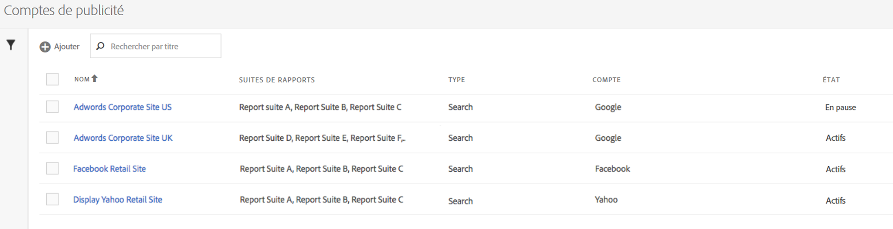
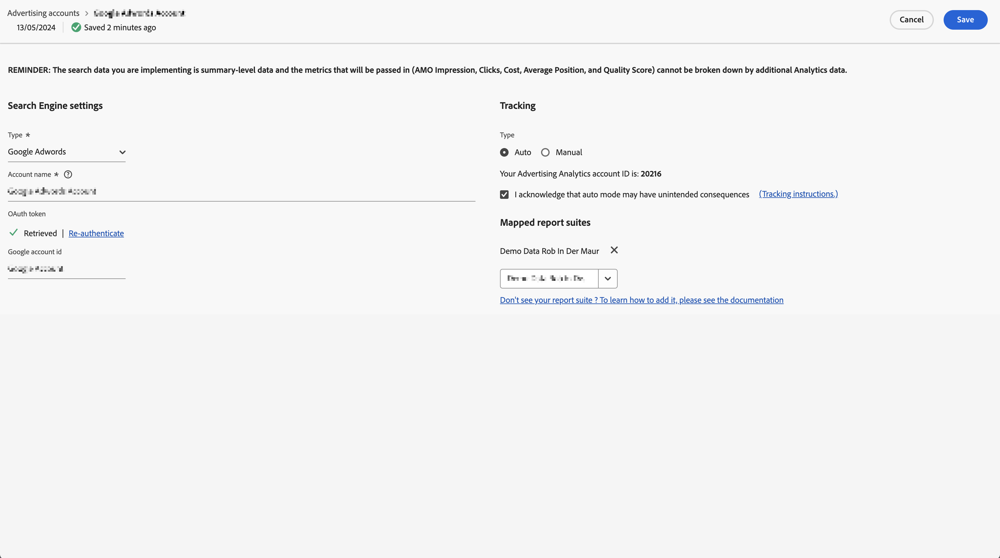

# Configuration d’un compte Advertising

Les administrateurs d’Adobe Analytics peuvent créer des comptes publicitaires et mapper plusieurs comptes à plusieurs suites de rapports (1 : 1, 1 : plusieurs, plusieurs : plusieurs).

Les administrateurs peuvent également [accorder l’accès à des non-administrateurs](/help/integrate/c-advertising-analytics/overview.md#section_FCC58EB635954A32990D4E67B52B4369) pour configurer des comptes publicitaires.

<!--

-->

1. Dans Adobe Analytics, accédez à **[!UICONTROL Admin]** > **[!UICONTROL Comptes Advertising]**.
1. Acceptez les conditions du contrat de licence de l’utilisateur final (uniquement lors de la première utilisation).
1. Sélectionnez **[!UICONTROL + Ajouter]**.
1. La boîte de dialogue [!UICONTROL Nouveau paramètre du moteur de recherche] s’affiche.

   

1. Renseignez les **[!UICONTROL paramètres du moteur de recherche]** en suivant ces instructions :

   | Paramètre | Description |
   | --- | --- |
   | **[!UICONTROL Type]** | Vous disposez de 2 options : **[!UICONTROL Google Adwords]** et **[!UICONTROL Bing Ads]**. Remarque : Yahoo Gemini a été absorbé par Microsoft le 31 mars 2019. Par conséquent, l’option de compte publicitaire Yahoo Gemini n’est plus disponible. |
   | Nom du compte | Vous pouvez choisir de définir ce nom de compte sur n’importe quel nom qui vous convient.  Nom du compte est le nom convivial du compte qui s’affiche dans l’interface utilisateur. |
   | Jeton OAuth | **Remarque** : OAuth est une norme ouverte pour la délégation d’accès, généralement utilisée comme moyen d’accorder aux sites web ou aux applications l’accès aux informations des sites web sans fournir de mots de passe. Vous remarquerez que vous êtes acheminé vers une URL tierce (efrontier.com). Adobe utilise Adobe Media Optimizer pour alimenter le processus d’authentification OAuth pour les trois moteurs de recherche. Si vous utilisez Internet Explorer 11 (ou une version antérieure), vous ne pouvez pas récupérer le jeton Oauth pour l’un des trois moteurs de recherche. Utilisez d’autres navigateurs web en remplacement.
Sélectionnez **[!UICONTROL Récupérer le jeton]** pour lancer le processus d’authentification OAuth2. Vous êtes invité à vous connecter à votre compte de recherche Google Ads ou Microsoft Advertising à l’aide de vos informations d’identification. Selon le choix effectué, le processus est légèrement différent : <ul><li>Google Ads : indiquez l’identifiant du compte Google</li><li>Microsoft Advertising : indiquez votre ID de compte et l’ID de compte du responsable.</li></ul>Pour plus d’informations sur ces identifiants, voir la section [Rechercher votre ID de compte](aa-locate-account-id.md). Une fois votre connexion effectuée, le champ du **[!UICONTROL jeton OAuth]** affichera **[!UICONTROL Récupéré]**. |

1. Dans la section **[!UICONTROL Tracking]**, vous fournissez des informations sur la manière de suivre les données à l’aide de votre implémentation Adobe Analytics. Le suivi est une étape requise pour compléter correctement les données Adobe Analytics avec les données du moteur de recherche.
Définissez les **[!UICONTROL Paramètres du suivi]** en procédant comme suit :

   | Paramètre | Description |
   | --- | --- |
   | Type | <ul><li>**Auto** : permet au moteur Adobe Advertising de décider comment les paramètres de tracking sont ajoutés aux modèles de tracking/URL de destination du . [!UICONTROL Suivi automatique de saisie] est l’approche la plus simple, mais peut ne pas aboutir au jeu de données le mieux intégré. **Important :** pour configurer un compte de moteur de recherche avec [!UICONTROL Suivi automatique de saisie], vous devez effectuer les opérations suivantes :<ul><li>Le paramètre et la valeur `s_kwcid` sont ajoutés aux modèles de suivi de compte ou aux URL de page de destination dans le compte en cours d’ajout. Le paramètre et la valeur sont insérés à la fin de l’URL. Une action supplémentaire peut être requise si votre serveur web requiert une certaine paire de `key=value` à la fin de l’URL. Ou une mise à jour pour prendre en charge toute nouvelle paire de `key=value` dans l’URL est requise. **Remarque** : en savoir plus sur l’ajout de ce paramètre à votre [politique de sécurité du contenu](https://experienceleague.adobe.com/fr/docs/id-service/using/reference/csp).</li><li>De plus, les mots-clés peuvent être insérés dans l’URL d’entrée avec la valeur `s_kwcid`. Si les mots-clés contiennent des caractères spéciaux ou des symboles, veuillez confirmer que votre serveur web peut prendre en charge ces caractères. Un exemple de caractères spéciaux courants est `+`, qui est utilisé dans les mots-clés « Modification de la correspondance large ».</li></ul></li><li>**Manuel** : permet de gérer la manière dont les paramètres de tracking sont ajoutés aux modèles de tracking/URL de destination du moteur de recherche. [Consultez ces exemples de suivi manuel pour chaque moteur de recherche](/help/integrate/c-advertising-analytics/c-adanalytics-workflow/aa-manual-vs-automatic-tracking.md).</li></ul> |

1. Sélectionnez **[!UICONTROL Enregistrer]**.
1. Une clause de non-responsabilité affiche une liste d’avertissements. Confirmez que vous avez lu et compris cet accord. Cochez la case, puis sélectionnez **[!UICONTROL OK]**.

   Vous êtes maintenant dirigé vers l’[interface utilisateur de gestion](/help/integrate/c-advertising-analytics/c-adanalytics-workflow/aa-manage-ad-accounts.md) des comptes Advertising, où le nouveau compte doit apparaître.

>[!NOTE]
>
>Patientez au moins 24 heures avant que les données du moteur de recherche ne commencent à remplir vos rapports Analytics.
