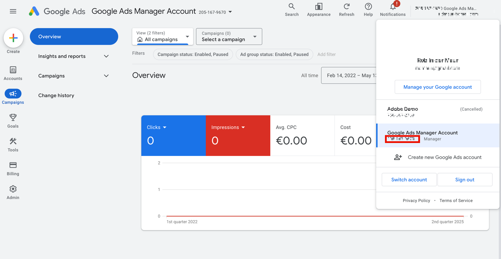

# Localisation des identifiants de compte {#locate-your-account-ids}

Découvrez comment localiser vos identifiants de compte pour Google Ads et Microsoft Advertising.

## Google Ads (AdWords) {#google}

>[!IMPORTANT]
>
>Google Ads utilise deux types de comptes :
>
>- un compte MCC (My Client Center), et
>- Compte Standard.
>
>Pour cette intégration à Adobe Analytics, **vous devez utiliser un identifiant de connexion de compte standard** et non un identifiant de connexion de compte MCC. En effet, un compte MCC agit comme un compte « parapluie » qui peut accéder à plusieurs comptes Google Ads avec une seule connexion, tandis que la connexion au compte standard ne peut accéder qu’à un seul compte par connexion. Bien que Google prenne en charge la liaison d’une adresse e-mail pour la gestion de 5 comptes, Advertising Analytics ne prend pas encore en charge cette fonctionnalité. Un seul e-mail peut être lié à un seul compte Google Ads.

Cliquez sur l’icône Compte en haut à droite pour afficher le numéro de compte Google Ads (ID de client).

## Microsoft Advertising (Bing) {#microsoft}

>[!NOTE]
>
>Si votre compte Microsoft Advertising (anciennement appelé Bing) utilise la fonction d’importation Google, veillez à mettre à jour la chaîne de suivi appropriée. La chaîne de suivi n’est pas automatiquement mise à jour de la version de Google vers la chaîne de suivi Microsoft Advertising appropriée et peut entraîner des données non spécifiées. Pour plus d’informations, voir [Éléments importés de Google Ads](https://help.ads.microsoft.com/apex/index/3/fr/50851/) dans l’aide de Microsoft Advertising.

Les **[!UICONTROL ID de compte]** et **[!UICONTROL ID de compte Manager]** sont tous deux requis.

- Le **[!UICONTROL ID de compte]** se trouve sous **[!UICONTROL Paramètres]** > **[!UICONTROL Paramètres du compte]** > **[!UICONTROL ID de compte]**. Assurez-vous d’utiliser [!UICONTROL Identifiant du compte] et NON [!UICONTROL Numéro de compte].
- L’**[!UICONTROL ID de compte Manager]** se trouve sous **[!UICONTROL Paramètres]** > **[!UICONTROL Paramètres du compte Manager]** > **[!UICONTROL ID de compte Manager]**. Assurez-vous d’utiliser [!UICONTROL ID de compte Manager] et NON [!UICONTROL Numéro de compte Manager].

>[!CONTEXTUALHELP]
>id="adanalytics_ma_account_id"
>title="ID de compte"
>abstract="L’« ID de compte » est une valeur numérique située dans l’interface de Microsoft Advertising. Vous pouvez le localiser en accédant à Paramètres > Paramètres du compte > ID de compte."

>[!CONTEXTUALHELP]
>id="adanalytics_ma_manager_account_id"
>title="ID de compte gestionnaire"
>abstract="L’« ID de compte gestionnaire » est une valeur numérique située dans l’interface de Microsoft Advertising. Vous pouvez le localiser en accédant à Paramètres > Paramètres du compte gestionnaire > ID de compte gestionnaire."
