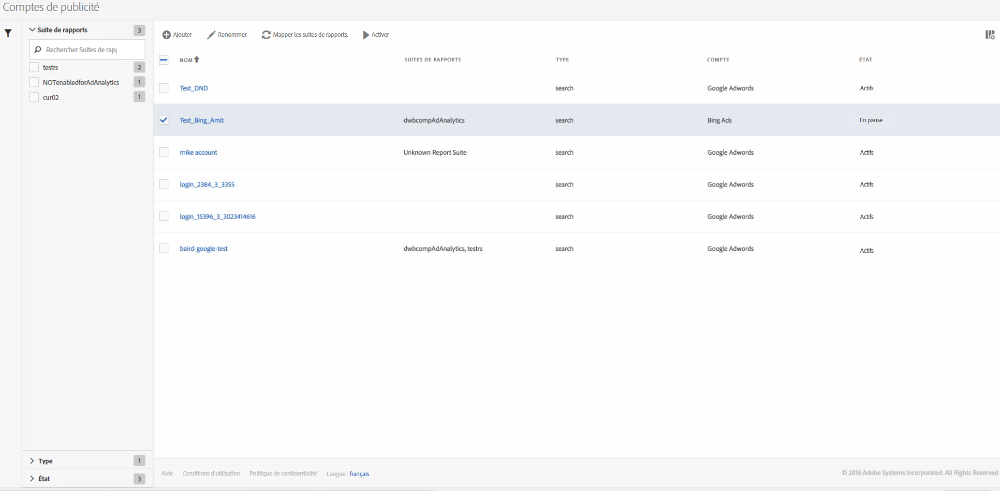

# Gestion des comptes Advertising

Vous pouvez accéder à l’interface utilisateur de gestion en vous rendant dans **[!UICONTROL Admin]** > **[!UICONTROL Comptes Advertising]**.

<table id="table_BE318026CF024E94A885EED86AA7077F"> 
 <thead> 
  <tr> 
   <th colname="col1" class="entry"> Élément </th> 
   <th colname="col2" class="entry"> Définition </th> 
  </tr>
 </thead>
 <tbody> 
  <tr> 
   <td colname="col1"> 
<b>Actions</b> 
 </td> 
   <td colname="col2"> 
<b>Remarque : les actions ne s’affichent que si vous avez sélectionné au moins un compte publicitaire. </b> 
 </td> 
  </tr> 
  <tr> 
   <td colname="col1"> 
+ Ajouter 
 </td> 
   <td colname="col2"> 
Vous dirige vers l’interface utilisateur <a href="/help/integrate/c-advertising-analytics/c-adanalytics-workflow/aa-create-ad-account.md" >Configurer un compte Advertising</a>. 
 </td> 
  </tr> 
  <tr> 
   <td colname="col1"> 
Renommer 
 </td> 
   <td colname="col2"> 
Renomme ce compte dans toutes les suites de rapports auxquelles il est mappé. 
 </td> 
  </tr> 
  <tr> 
   <td colname="col1"> 
Mapper les suites de rapports 
 </td> 
   <td colname="col2"> 
Permet de modifier les mappages des suites de rapports. 
 </td> 
  </tr> 
  <tr> 
   <td colname="col1"> 
Pause 
 </td> 
   <td colname="col2"> 
Désactive le compte. Pour l’activer à nouveau, sélectionnez Activer. 
 </td> 
  </tr> 
  <tr> 
   <td colname="col1"> 
<b>En-têtes des colonnes</b> 
 </td> 
   <td colname="col2"> </td> 
  </tr> 
  <tr> 
   <td colname="col1"> 
Nom 
 </td> 
   <td colname="col2"> 
Nom que vous avez donné au compte publicitaire. 
 </td> 
  </tr> 
  <tr> 
   <td colname="col1"> 
Suites de rapports 
 </td> 
   <td colname="col2"> 
Suites de rapports mappées à ce compte publicitaire. 
 </td> 
  </tr> 
  <tr> 
   <td colname="col1"> 
Type 
 </td> 
   <td colname="col2"> 
Un seul type est pris en charge : Recherche. 
 </td> 
  </tr> 
  <tr> 
   <td colname="col1"> 
Compte 
 </td> 
   <td colname="col2"> 
Répertorie l’un des 2 types de compte pris en charge : Google AdWords ou Bing Ads. 
 </td> 
  </tr> 
  <tr> 
   <td colname="col1"> 
État 
 </td> 
   <td colname="col2"> 
Il y a deux indicateurs d’état : 
 
    <ul id="ul_376263DEF6EE44B48564D272D3CBFCBC"> 
     <li id="li_75E329B68B4D4E929E227E717C993082"><b>Actif</b> : le compte extrait activement les données de recherche. </li> 
     <li id="li_5E2DF98B22D34437A2A2C93F996C1EA2"><b>En pause</b> : le compte est actuellement désactivé et n’extrait pas de données de recherche. </li> 
    </ul> </td> 
  </tr> 
  <tr> 
   <td colname="col1"> 
<b>Filtres</b> 
 </td> 
   <td colname="col2"> 
(Marge de gauche) Vous pouvez filtrer des comptes publicitaires par Suite de rapports, Type et État. 
 </td> 
  </tr> 
 </tbody> 
</table>
