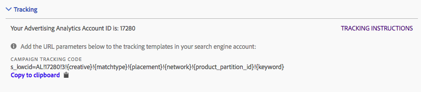

# Suivi : mode manuel et mode automatique

Le suivi détermine la façon dont les données du moteur de recherche sont suivies par votre implémentation Adobe Analytics. Cette étape est requise pour ajouter correctement les données du moteur de recherche aux données d’Adobe Analytics.

Deux modes de suivi sont pris en charge : le mode automatique et le mode manuel.

## Suivi en mode automatique {#concept_C4C6107838C947CFBB7F4E0CB94264F0}

En mode automatique, vous laissez le moteur Advertising Cloud décider comment gérer les données du moteur de recherche. Il s’agit de l’approche la plus simple, même si elle ne produit pas toujours le meilleur jeu de données intégré.

C’est pourquoi vous devez cocher une case de confirmation quand vous sélectionnez le mode automatique avant de pouvoir sauvegarder la configuration du compte.


Notez que pour configurer un compte de moteur de recherche en mode automatique, vous êtes chargé de prendre les actions suivantes :

* Le paramètre et la valeur « s_kwcid » seront ajoutés aux modèles de suivi de comptes ou aux URL de pages d’entrée dans le compte ajouté. Ils seront alors insérés à la fin de l’URL. Vous devrez peut-être prendre une mesure supplémentaire si votre serveur web requiert une certaine paire clé=valeur à la fin de l’URL OU une mise à jour pour prendre en charge n’importe quelle nouvelle paire clé=valeur dans l’URL. **Il vous appartient de vous assurer que les paramètres d’URL ajoutés demeurent correctement à la dernière page d’entrée.**
* De plus, les mots-clés peuvent être insérés dans l’URL d’entrée avec la valeur « s_kwcid ». S’ils contiennent des caractères spéciaux ou des symboles, veuillez vérifier que votre serveur web prend en charge ces caractères. Exemple : le « + » est un caractère spécial courant utilisé dans les mots-clés en « requête large modifiée ».

## Suivi en mode manuel {#concept_87B28BA9E7F84BA5972F69E6F3482A33}

En mode manuel, vous devez spécifier la façon dont les données du moteur de recherche doivent être traitées par le processus d’intégration des données Advertising Analytics.

### Ajout d’un suivi manuel à un compte Google {#section_41C1EB1AEB034544A5BC291F53C05C67}

La chaîne qui doit être ajoutée au compte Google est affichée ci-dessous. Vous devez ajouter la chaîne à tous vos modèles de suivi utilisés dans l’ensemble de vos comptes.

>[!IMPORTANT]
>
>The `<Advertising Analytics ID>` value (in **bold** below) is generic and **must be replaced with your specific account ID string**. Vous pouvez récupérer la chaîne spécifique à votre ID de compte à partir de l’écran de configuration de votre compte sous la section « Suivi ».

**Chaîne de suivi pour les campagnes :**

```
s_kwcid=AL! 
<b><Advertising Analytics ID></b>!3!{creative}!{matchtype}!{placement}!{network}!{product_partition_id}!{keyword}
```



Exemples de codes de suivi dans divers formats de modèles de suivi :

**`{lpurl}`**

```
{lpurl}?s_kwcid=AL!9999!3!{creative}!{matchtype}!{placement}!network}!{product_partition_id}!{keyword}
```

**`{lpurl}`avec un paramètre d'URL supplémentaire**

```
{lpurl}?campaign=PPC&s_kwcid=AL!9999!3!{creative}!{matchtype}!{placement}!network}!{product_partition_id}!{keyword}
```

**Tiers (doubleclick)`{unescapedlpurl}`**

```
https://clickserve.dartsearch.net/link/click?{_dssagcrid}&{_dssftfiid}&ds_e_adid={creative}&ds_e_matchtype={ifsearch:search}{ifcontent:content}&ds_e_device={device}&ds_e_network={network}&{ifpla:ds_e_product_group_id={product_partition_id}&ds_e_product_id={product_id}&ds_e_product_merchant_id={merchant_id}&ds_e_product_country={product_country}&ds_e_product_language={product_language}&ds_e_product_channel={product_channel}&ds_e_product_store_id={product_store_id}}&ds_url_v=2&ds_dest_url={unescapedlpurl}?s_kwcid=AL!9999!3!{creative}!{matchtype}!{placement}!{network}!{product_partition_id}!{keyword}
```

**Tiers (doubleclick)`{lpurl}`**

Si l’URL passe par une redirection et n’utilise pas une valeur « unescapedlpurl », vous devez encoder la chaîne autant de fois que nécessaire pour qu’elle persiste via la redirection vers l’URL de la dernière page d’entrée.

```
https://clickserve.dartsearch.net/link/click?{_dssagcrid}&{_dssftfiid}&ds_e_adid={creative}&ds_e_matchtype={ifsearch:search}{ifcontent:content}&ds_e_device={device}&ds_e_network={network}&{ifpla:ds_e_product_group_id={product_partition_id}&ds_e_product_id={product_id}&ds_e_product_merchant_id={merchant_id}&ds_e_product_country={product_country}&ds_e_product_language={product_language}&ds_e_product_channel={product_channel}&ds_e_product_store_id={product_store_id}}&ds_url_v=2&ds_dest_url={lpurl}?s_kwcid%3DAL!9999!3!{creative}!{matchtype}!{placement}!{network}!{product_partition_id}!{keyword}
```

### Ajout d’un suivi manuel à un compte Bing {#section_094F8ACA493C4D65B1F54A695558EBF2}

La chaîne qui doit être ajoutée au compte Bing est affichée ci-dessous. Vous devez ajouter la chaîne à tous vos modèles de suivi utilisés dans l’ensemble de vos comptes.

>[!IMPORTANT]
>
>The `<Advertising Analytics ID>` value (in **bold** below) is generic and **must be replaced with your specific account ID string**. Vous pouvez récupérer la chaîne spécifique à votre ID de compte à partir de l’écran de configuration de votre compte sous la section « Suivi ».

**Chaîne de suivi pour les campagnes :**

```
s_kwcid=AL!<Advertising Analytics ID>!10!{AdId}!{OrderItemId} 
```


Exemples de codes de suivi dans divers formats de modèles de suivi :

**{lpurl}**

```
{lpurl}?s_kwcid=AL!9999!10!{AdId}!{OrderItemId}`
```

**`{lpurl}`avec un paramètre d'URL supplémentaire**

```
{lpurl}?campaign=PPC&
s_kwcid=AL!9999!10!{AdId}!{OrderItemId}
```

**Tiers (doubleclick) {unescapedlpurl}**

```https://clickserve.dartsearch.net/link/click?{_dssagcrid}&{_dssftfiid}&ds_e_adid={creative}&ds_e_matchtype={ifsearch:search}{ifcontent:content}&ds_e_device={device}&ds_e_network={network}&{ifpla:ds_e_product_group_id={product_partition_id}&ds_e_product_id={product_id}&ds_e_product_merchant_id={merchant_id}&ds_e_product_country={product_country}&ds_e_product_language={product_language}&ds_e_product_channel={product_channel}&ds_e_product_store_id={product_store_id}}&ds_url_v=2&ds_dest_url={unescapedlpurl}?s_kwcid=AL!9999!10!{AdId}!{OrderItemId}

```

**Tiers (doubleclick)`{lpurl}`**

Si l’URL passe par une redirection et n’utilise pas une valeur « unescapedlpurl », vous devez encoder la chaîne autant de fois que nécessaire pour qu’elle persiste via la redirection vers l’URL de la dernière page d’entrée.

```
https://clickserve.dartsearch.net/link/click?{_dssagcrid}&{_dssftfiid}&ds_e_adid={creative}&ds_e_matchtype={ifsearch:search}{ifcontent:content}&ds_e_device={device}&ds_e_network={network}&{ifpla:ds_e_product_group_id={product_partition_id}&ds_e_product_id={product_id}&ds_e_product_merchant_id={merchant_id}&ds_e_product_country={product_country}&ds_e_product_language={product_language}&ds_e_product_channel={product_channel}&ds_e_product_store_id={product_store_id}}&ds_url_v=2&ds_dest_url={lpurl}?s_kwcid%3DAL!9999!10!{AdId}!{OrderItemId}
```
