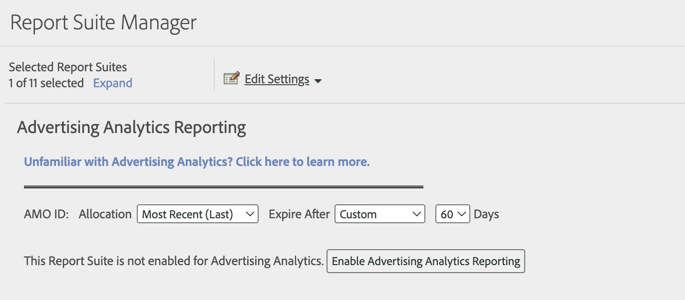

# Activation de la suite de rapports pour Advertising Analytics

Pour afficher les données de recherche Advertising Analytics dans Analytics, vous devez configurer chaque suite de rapports mappée sur un Experience Cloud pour la création de rapports Advertising Analytics.

1. Accédez à **[!UICONTROL Admin]** > **[!UICONTROL Suites de rapports]**.

1. Sélectionnez la suite de rapports qui est mappée à votre organisation Experience Cloud.
1. Cliquez sur **[!UICONTROL Modifier les paramètres]** > **[!UICONTROL Configuration Advertising Analytics]**.

   

   >[!IMPORTANT]
   >
   >AMO ID fait référence à la variable Adobe Advertising Cloud (également appelée Adobe Media Optimizer) dans laquelle les données de recherche vont être insérées.

1. Sélectionner **[!UICONTROL Vous ne connaissez pas Advertising Analytics ? Cliquez ici pour en savoir plus]** pour plus d’informations sur Advertising Analytics.

1. Définissez l’attribution et l’expiration de la variable que vous souhaitez que la variable AMO ID utilise. Les variables de conversion (eVars) permettent à Adobe Analytics d’affecter des événements de succès à des valeurs de variables spécifiques. Parfois, les variables rencontrent plusieurs valeurs avant d’accéder à un événement de succès. Dans ce cas, l’affectation détermine la valeur de variable qui obtient un crédit pour l’événement.

   | Paramètre | Définition |
   |--- |--- |
   | **[!UICONTROL Attribution]** | Sélectionnez entre :  **[!UICONTROL Valeur d’origine (première)]**: la première valeur vue obtient un crédit d’attribution complet, quelles que soient les valeurs suivantes de cette variable.  **[!UICONTROL Le plus récent (Dernier)]**: la dernière valeur vue obtient un crédit d’attribution complet pour l’événement de succès, quelles que soient les variables qui ont été déclenchées avant elle. |
   | **[!UICONTROL Expire après]** | Permet de spécifier une période, ou un événement, à l’issue de laquelle (ou duquel) la valeur eVar arrive à expiration (c’est-à-dire qu’elle ne reçoit plus de crédit pour les événements de succès).  Si un événement de succès se produit après l’expiration de l’eVar, la valeur Aucun reçoit le crédit pour l’événement (aucune valeur eVar n’était active). |

1. Cliquez sur **[!UICONTROL Activer la création de rapports Advertising Analytics]** (la première fois) ou sur **[!UICONTROL Mise à jour de la création de rapports Advertising Analytics]** (les fois suivantes). La suite de rapports est maintenant prête à recevoir des données de recherche Advertising Analytics. Vous êtes maintenant prêt à [création de comptes Advertising](/help/integrate/c-advertising-analytics/c-adanalytics-workflow/aa-create-ad-account.md).
