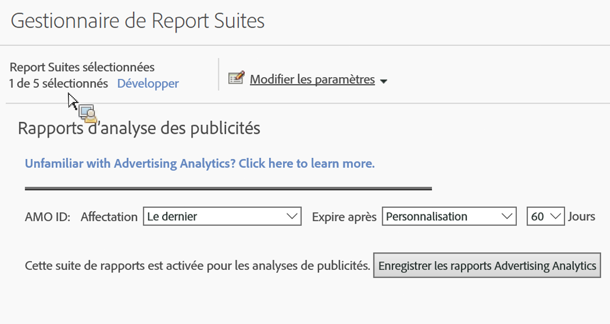

# Activer la suite de rapports pour la publication d'Analytics

Pour afficher les données de recherche de la publicité Analytics dans Analytics, vous devez configurer chaque suite de rapports Experience Cloud mappée pour la création de rapports Analytics.

1. [Mappez votre suite de rapports à une organisation](https://marketing.adobe.com/resources/help/en_US/mcloud/map-report-suite.html).
1. Navigate to **[!UICONTROL Admin]** &gt; **[!UICONTROL Report Suites]**.

1. Select the report suite that is [mapped to your Experience Cloud organization](https://marketing.adobe.com/resources/help/en_US/mcloud/map-report-suite.html).
1. Click **[!UICONTROL Edit Settings]** &gt; **[!UICONTROL Advertising Analytics Configuration]**.

   

   >[!IMPORTANT]
   >
   >L'ID AMO fait référence à la variable Adobe Advertizing Cloud dans laquelle les données de recherche vont être insérées.

1. Définissez la variable d’attribution et d’expiration que la variable AMO ID doit utiliser. Les variables de conversion (eVars) permettent à Adobe Analytics d’affecter des événements de succès à des valeurs de variables spécifiques. Parfois, les variables rencontrent plusieurs valeurs avant d’accéder à un événement de succès. Dans ce cas, l’affectation détermine la valeur de variable qui obtient un crédit pour l’événement.

   | Paramètre | Définition |
   |--- |--- |
   | Valeur d’origine (première) | La première valeur vue obtient un crédit complet, quelles que soient les valeurs suivantes de cette variable. |
   | La plus récente (dernière) | La dernière valeur vue obtient un crédit complet pour l’événement de succès, quelles que soient les variables lancées avant elle. |
   | Expire après | Permet d’indiquer une période, ou un événement, à l’issue de laquelle (ou duquel) la valeur eVar arrive à expiration (c.-à-d. elle ne reçoit plus de crédit pour les événements de succès).  Si un événement de succès se produit après l’expiration de l’eVar, la valeur Aucun reçoit le crédit pour l’événement (aucune valeur eVar n’était active). |

1. Click **[!UICONTROL Enable Advertising Analytics Reporting]** (first time), or **[!UICONTROL Update Advertising Analytics Reporting]** (subsequent times). La suite de rapports est maintenant prête à recevoir des données de recherche Advertising Analytics. Vous pouvez maintenant [créer des comptes Advertising](../../../integrate/c-advertising-analytics/c-adanalytics-workflow/aa-create-ad-account.md#concept_1958E8C15C334E8B9DC510EC8D5DCA7C).

