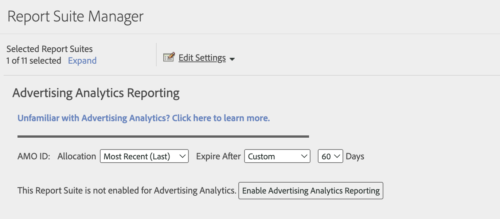

# Activation de la suite de rapports pour Advertising Analytics

Pour afficher des données de recherche Advertising Analytics dans Analytics, vous devez configurer chaque suite de rapports CX mappée aux entreprises pour la création de rapports Advertising Analytics.

1. Accédez à **[!UICONTROL Admin]** > **[!UICONTROL Suites de rapports]**.

1. Sélectionnez la suite de rapports mappée à votre organisation CX Enterprise.
1. Cliquez sur **[!UICONTROL Modifier les paramètres]** > **[!UICONTROL Configuration Advertising Analytics]**.

   

1. Sélectionnez **[!UICONTROL Vous ne connaissez pas Advertising Analytics ? Cliquez ici pour en savoir plus]** pour plus d’informations sur Advertising Analytics.

1. Définissez l’attribution et l’expiration de la variable que la variable AMO ID doit utiliser. Les variables de conversion (eVars) permettent à Adobe Analytics d’attribuer des événements de succès à des valeurs de variable spécifiques. Parfois, les variables rencontrent plusieurs valeurs avant d’atteindre un événement de succès. Dans ce cas, l’affectation détermine la valeur de variable qui obtient le crédit pour l’événement.

   | Paramètre | Définition |
   |--- |--- |
   | **[!UICONTROL Attribution]** | Sélectionner entre:  **[!UICONTROL Valeur d’origine (première)]** : la première valeur vue obtient le crédit d’affectation complet, quelles que soient les valeurs suivantes pour cette variable.  **[!UICONTROL La plus récente (dernière)]**: la dernière valeur vue obtient le crédit d’affectation complet pour l’événement de succès, quelles que soient les variables déclenchées avant. |
   | **[!UICONTROL Expire après]** | Permet de définir une période, ou un événement, à l’issue de laquelle ou duquel la valeur eVar expire (c’est-à-dire sans recevoir de crédit pour les événements de succès).  Si un événement de succès se produit après l’expiration de l’eVar, la valeur Aucun reçoit le crédit pour l’événement (aucune valeur eVar n’était active). |

1. Cliquez sur **[!UICONTROL Activer le reporting Advertising Analytics]** (première fois) ou **[!UICONTROL Mettre à jour le reporting Advertising Analytics]** (fois suivantes). Votre suite de rapports est maintenant prête à recevoir les données de recherche Advertising Analytics. Vous êtes maintenant prêt à [créer des comptes Advertising](/help/integrate/c-advertising-analytics/c-adanalytics-workflow/aa-create-ad-account.md).
